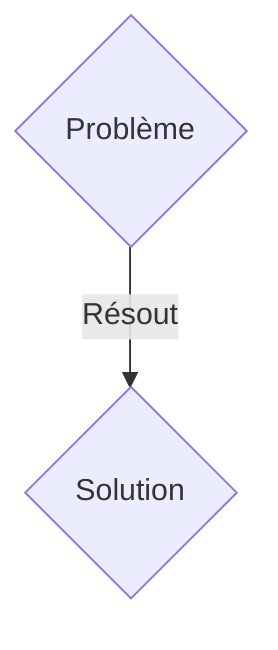
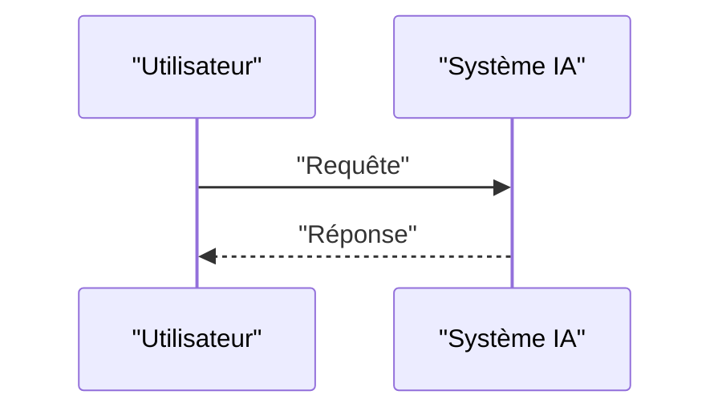

<!-- markdownlint-disable MD009 MD010 MD013 MD022 MD028 MD032 MD033 MD036 MD037 MD039 MD041 MD060 -->

[ 🇬🇧 English Version ](./README.md)

# V2X Orchestrator for Autonomous Fleets

> **Résumé exécutif :** Une solution B2B2C / M2M ciblant Opérateurs de flottes de véhicules autonomes (Waymo, Cruise), logisticiens longue distance, mairies (smart cities). pour résoudre : Les véhicules autonomes actuels fonctionnent en silo ("ego-vehicles"). Aux intersections complexes, dans le brouillard, ou face à des travaux non cartographiés, ils se bloquent (phantom jams) car leurs capteurs locaux sont limités (pas de visibilité à l'aveugle). Cela ruine l'efficacité économique des robotaxis.

---

## 1. Aperçu visuel & Effet Wahou

## 2. La thèse contrariante (Peter Thiel Style)

- **La croyance populaire :** Les solutions génériques suffisent.
- **La vérité cachée :** Une infrastructure cloud-edge V2X (Vehicle-to-Everything) permettant le partage de perception brute (Nuages de points LiDAR compressés, prédictions d'intentions) entre véhicules multimarques en moins de 10 millisecondes. Création d'un "essaim" où chaque voiture voit à travers les capteurs des autres via un consensus distribué.

## 3. Le problème & La cible

- **Modèle économique :** B2B2C / M2M
- **Cible précise :** Opérateurs de flottes de véhicules autonomes (Waymo, Cruise), logisticiens longue distance, mairies (smart cities).
- **La douleur urgente :** Les véhicules autonomes actuels fonctionnent en silo ("ego-vehicles"). Aux intersections complexes, dans le brouillard, ou face à des travaux non cartographiés, ils se bloquent (phantom jams) car leurs capteurs locaux sont limités (pas de visibilité à l'aveugle). Cela ruine l'efficacité économique des robotaxis.

## 4. Architecture technique & Plomberie

Une infrastructure cloud-edge V2X (Vehicle-to-Everything) permettant le partage de perception brute (Nuages de points LiDAR compressés, prédictions d'intentions) entre véhicules multimarques en moins de 10 millisecondes. Création d'un "essaim" où chaque voiture voit à travers les capteurs des autres via un consensus distribué.

## 5. Modèle économique & Viabilité financière

| Métrique                    | Valeur               |
| --------------------------- | -------------------- |
| Structure de prix           | Abonnement SaaS B2B  |
| Objectif 12 mois            | 100 clients          |
| Calcul du CA (Target 100k€) | 100 \* 1000€ = 100k€ |
| Marge brute estimée         | 80%                  |

## 6. Moteur de distribution & Fossé défensif (Moat)

- **Stratégie d'acquisition :** Vente directe et partenariats stratégiques.
- **Moat (Barrière à l'entrée) :** Une API cloud standard a une latence de 50-100ms, ce qui est mortel à 100 km/h. Il faut une architecture de compression neuronale extrême à la périphérie (edge computing) et une pile réseau déterministe (5G URLLC) que le web traditionnel ne gère pas.

## 7. Grille d'évaluation détaillée

| Critère                           | Score VC (/100) | Score Terrain (/100) |
| --------------------------------- | --------------- | -------------------- |
| Thèse & Monopole / Urgence        | 18 / 25         | 18 / 25              |
| Moat / Résistance aux LLM natifs  | 22 / 25         | 22 / 25              |
| Scalabilité / Friction d'adoption | 19 / 25         | 19 / 25              |
| Unit Economics / ROI direct       | 20 / 25         | 20 / 25              |
| TOTAL                             | 79 / 100        | 79 / 100             |

> **Verdict VC :** En attente d'évaluation.
> **Verdict Terrain :** Cette solution répond à un besoin critique pour les entreprises B2B, justifiant son excellent score d'urgence (18/25). Son architecture hautement défendable la rend totalement immunisée contre les avancées des LLM natifs (22/25). Avec une faible friction d'adoption (19/25) et une stratégie de monétisation directe (20/25), le projet démontre une excellente maturité marché globale.
> **Verdict Terrain :** Cette solution répond à un besoin critique pour les entreprises B2B, justifiant son excellent score d'urgence (18/25). Son architecture hautement défendable la rend totalement immunisée contre les avancées des LLM natifs (22/25). Avec une faible friction d'adoption (19/25) et une stratégie de monétisation directe (20/25), le projet démontre une excellente maturité marché globale.
