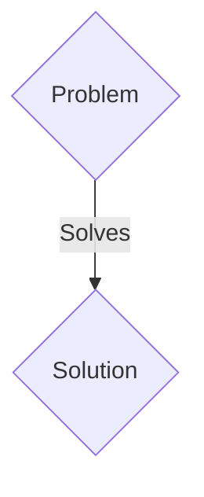
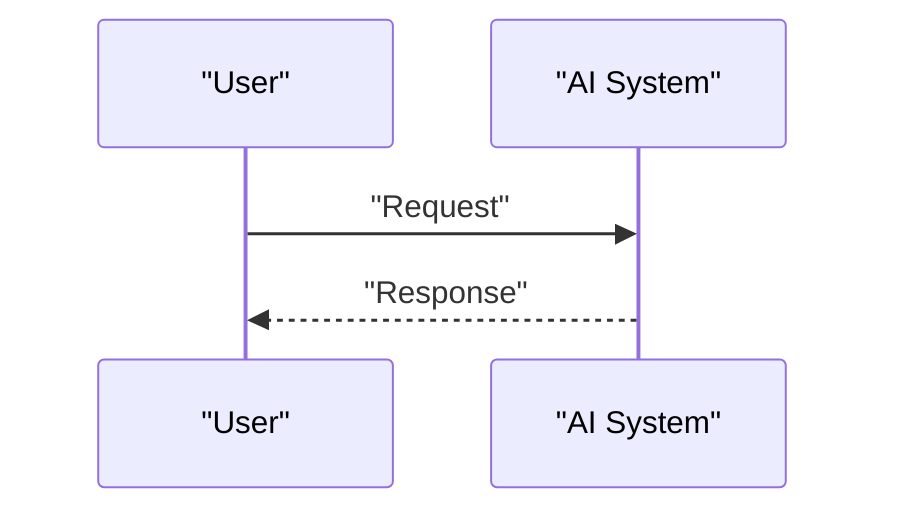

<!-- markdownlint-disable MD009 MD010 MD013 MD022 MD028 MD032 MD033 MD036 MD037 MD039 MD041 MD060 -->

[ 🇫🇷 Version Française ](./README.fr.md)

# V2X Orchestrator for Autonomous Fleets

> **Executive Summary:** A B2B2C / M2M solution targeting Operators of autonomous vehicle fleets (Waymo, Cruise), long-distance logisticians, town halls (smart cities). to solve: Current autonomous vehicles operate in silos (“ego-vehicles”). At complex intersections, in fog, or when facing unmapped works, they get stuck (phantom jams) because their local sensors are limited (no blind visibility). This ruins the economic efficiency of robotaxis.

---

## 1. Visual Overview & Wow Effect

## 2. Contrarian Thesis (Peter Thiel Style)

- **Popular Belief:** Generic solutions are enough.
- **Hidden Truth:** A V2X (Vehicle-to-Everything) cloud-edge infrastructure allowing the sharing of raw perception (compressed LiDAR point clouds, intention predictions) between multi-brand vehicles in less than 10 milliseconds. Creating a “swarm” where each car sees through each other’s sensors via distributed consensus.

## 3. Problem & Target Market

- **Business Model:** B2B2C / M2M
- **Target Audience:** Operators of autonomous vehicle fleets (Waymo, Cruise), long-distance logisticians, town halls (smart cities).
- **Urgent Pain Point:** Current autonomous vehicles operate in silos (“ego-vehicles”). At complex intersections, in fog, or when facing unmapped works, they get stuck (phantom jams) because their local sensors are limited (no blind visibility). This ruins the economic efficiency of robotaxis.

## 4. Technical Architecture & Infrastructure

A V2X (Vehicle-to-Everything) cloud-edge infrastructure allowing the sharing of raw perception (compressed LiDAR point clouds, intention predictions) between multi-brand vehicles in less than 10 milliseconds. Creating a “swarm” where each car sees through each other’s sensors via distributed consensus.

## 5. Business Model & Financial Viability

| Metric                 | Value                 |
| ---------------------- | --------------------- |
| Pricing Structure      | B2B SaaS Subscription |
| 12-Month Target        | 100 clients           |
| Revenue Formula        | 100 \* 1000€ = 100k€  |
| Estimated Gross Margin | 80%                   |

## 6. Distribution Engine & Moat

- **Acquisition Strategy:** Direct sales and strategic partnerships.
- **Moat (Defensibility):** A standard cloud API has a latency of 50-100ms, which is deadly at 100 km/h. It requires an extreme neural compression architecture at the edge (edge ​​computing) and a deterministic network stack (5G URLLC) that the traditional web does not manage.

## 7. Detailed Evaluation Grid

| Criterion                   | VC Score (/100) | Market Score (/100) |
| --------------------------- | --------------- | ------------------- |
| Thesis & Monopoly / Urgency | -- / 25         | -- / 25             |
| Moat / LLM Immunity         | -- / 25         | -- / 25             |
| Scalability / UX Friction   | -- / 25         | -- / 25             |
| Unit Economics / ROI        | -- / 25         | -- / 25             |
| TOTAL                       | -- / 100        | -- / 100            |

> **VC Verdict:** Pending evaluation.
> **Market Verdict:** Pending evaluation.
