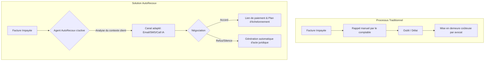
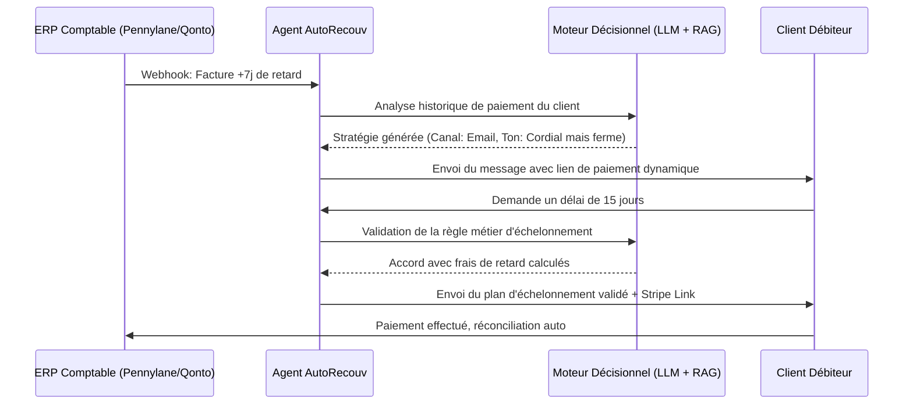

<!-- markdownlint-disable MD013 MD033 -->

# AutoRecouv

> **Résumé exécutif :** AutoRecouv est un agent de recouvrement autonome B2B qui s'intègre directement aux ERP comptables pour gérer 100% du cycle de relance des factures impayées, réduisant le DSO (Days Sales Outstanding) de 30% sans intervention humaine. Contrairement à un simple bot, il négocie des plans d'échelonnement et génère les actes juridiques de mise en demeure.

---

## 1. Aperçu visuel & Effet Wahou

## 2. La thèse contrariante (Peter Thiel Style)

**La croyance populaire :** Le recouvrement nécessite du tact humain et de l'empathie, car les clients en retard de paiement sont fragiles. L'automatisation agressive détruit la relation client.
**La vérité cachée :** 80% des retards B2B sont dus à des oublis, de la désorganisation administrative ou des tests de trésorerie. Une IA implacable mais extrêmement polie, capable de proposer instantanément des solutions de paiement échelonné, est plus efficace et moins perçue comme un jugement moral qu'un appel d'un comptable humain stressé.

## 3. Le problème & La cible

* **Modèle économique :** B2B (SaaS + Commission au succès)
* **Cible précise :** PME de 10 à 250 employés, agences web, cabinets de conseil, entreprises de services B2B avec un volume de facturation récurrent mais sans département de recouvrement dédié.
* **La douleur urgente :** Un DSO (Days Sales Outstanding) élevé qui étouffe la trésorerie. Le coût de l'inaction est direct : besoin de recourir à l'affacturage coûteux (2-5% du CA) ou risque de faillite par manque de BFR (Besoin en Fonds de Roulement).

## 4. Architecture technique & Plomberie

## 5. Modèle économique & Viabilité financière

| Métrique | Valeur |
| :--- | :--- |
| **Structure de prix** | SaaS de base 299€/mois + 2% de commission sur les créances recouvrées à plus de 30 jours |
| **Objectif 12 mois** | 25 clients B2B (avec un recouvrement moyen de 10 000€/mois par client) |
| **Calcul du CA (Target 100k€)** | (25 *299€* 12) + (25 *10000€* 2% * 12) = 89 700€ (SaaS) + 60 000€ (Commissions) = 149 700€ ARR |
| **Marge brute estimée** | 85% (Coûts d'API LLM et d'infrastructure marginaux par rapport à la valeur récupérée) |

## 6. Moteur de distribution & Fossé défensif (Moat)

* **Stratégie d'acquisition :** Acquisition B2B directe via des partenariats avec les experts-comptables (apporteur d'affaires) et intégration sur les marketplaces d'outils financiers (Pennylane, Qonto, Silae). Stratégie de "Product-Led Growth" où l'outil est freemium pour les 3 premières factures.
* **Moat (Barrière à l'entrée) :**
    1. **Intégrations profondes :** La valeur réside dans les connecteurs bi-directionnels durs à construire et à maintenir avec les 50+ ERP et logiciels de facturation locaux. Un simple "wrapper" ne peut pas modifier les statuts de paiement.
    2. **Graphe de données propriétaires :** AutoRecouv crée un score de crédit "caché" basé sur le comportement de paiement inter-entreprises. Si une entreprise X paie toujours en retard l'agence Y et le cabinet Z (tous deux clients AutoRecouv), le système adapte sa stratégie dès le jour 1. OpenAI ne peut pas avoir ces données transactionnelles privées.

## 7. Grille d'évaluation détaillée

| Critère | Score VC (/100) | Score Terrain (/100) |
| :--- | :---: | :---: |
| **Thèse & Monopole / Urgence** | -- / 25 | -- / 25 |
| **Moat / Résistance aux LLM natifs** | -- / 25 | -- / 25 |
| **Scalabilité / Friction d'adoption** | -- / 25 | -- / 25 |
| **Unit Economics / ROI direct** | -- / 25 | -- / 25 |
| **TOTAL** | **-- / 100** | **-- / 100** |

Verdict VC : En attente d'évaluation.

Verdict Terrain : En attente d'évaluation.
