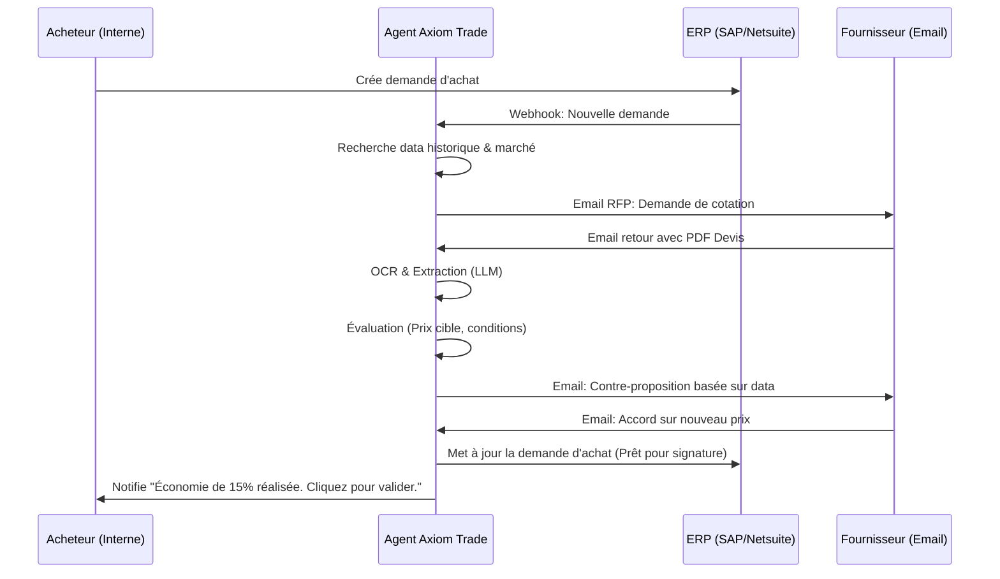

<!-- markdownlint-disable MD013 MD033 -->

# Axiom Trade

> **Résumé exécutif :** Agent IA de négociation autonome pour les achats indirects B2B, qui intercepte les devis fournisseurs et négocie automatiquement les prix, les délais et les conditions de paiement via email et portails web.


---

## 1. Aperçu visuel & Effet Wahou

```mermaid
graph TD
    A[Demande d'achat interne] --> B[Extraction des specs par IA]
    B --> C{"Axiom Trade (Agent IA)"}
    C -->|Génère des RFP| D[Envoi à N fournisseurs cibles]
    D --> E[Réception des devis (Emails/PDFs)]
    E --> C
    C -->|Détecte écarts marché/historique| F[Contre-offre automatisée]
    F --> G[Négociation itérative]
    G --> H[Finalisation des contrats & PO]
    H --> I[Validation humaine Finale (1 clic)]
```

## 2. La thèse contrariante (Peter Thiel Style)

**La croyance populaire :**La négociation d'achats est un art humain relationnel qui ne peut être automatisé, et l'IA ne sert qu'à analyser les données historiques d'achat pour donner des "insights" aux acheteurs.
**La vérité cachée :**80% du volume des achats indirects (SaaS, petit matériel, services récurrents) est négocié de manière sous-optimale car les acheteurs n'ont pas le temps d'appliquer une théorie des jeux rigoureuse à chaque petite dépense. Les fournisseurs cèdent face à la persistance et à la data objective, pas face au "relationnel". Un agent logiciel persistant qui connaît les prix du marché obtient systématiquement de meilleures conditions qu'un humain pressé.

## 3. Le problème & La cible

**Modèle économique :**B2B
**Cible précise :**Directeurs des achats (CPO) et DAF des entreprises ETI (250 - 5000 employés) ayant un volume d'achats indirects > 10M€/an.
**La douleur urgente :**L'inflation augmente les coûts indirects, mais recruter des acheteurs juniors coûte cher. Actuellement, les achats < 10 000€ ne sont presque jamais négociés, entraînant une perte sèche (surcoût) estimée à 5-8% du budget total. C'est une fuite de cash directe sur l'EBITDA.

## 4. Architecture technique & Plomberie



## 5. Modèle économique & Viabilité financière

| Métrique                        | Valeur                                                                                                                                                                                       |
| :------------------------------ | :------------------------------------------------------------------------------------------------------------------------------------------------------------------------------------------- |
| **Structure de prix**           | Commission au succès (Gain Share) : 15% des économies réalisées (différence entre devis initial et final) + Frais d'intégration "Platform fee" fixe (2000€/mois).                            |
| **Objectif 12 mois**            | 10 clients ETI (Target: 50 000€ d'économies générées/mois/client en moyenne).                                                                                                                |
| **Calcul du CA (Target 100k€)** | Platform fee : 10 clients*2000€*12 mois = 240 000€. Gain share: 10 *50k€*15%\*12 mois = 900 000€. Total estimé : > 1M€ ARR. Break-even à 100k€ atteignable avec ~3 clients en quelques mois. |
| **Marge brute estimée**         | 85% (Coûts principaux = API LLM, OCR, serveurs, intégration ERP).                                                                                                                            |

## 6. Moteur de distribution & Fossé défensif (Moat)

**Stratégie d'acquisition :**Vente B2B "Top-Down" par approche de ROI garanti ("Proof of Concept sur vos 100 dernières factures"). Ciblage direct des DAF sur LinkedIn avec un calcul de "cash burn" estimé.
**Moat (Barrière à l'entrée) :**

1. **Intégration Systémique (Switching Cost) :**Une fois branché profondément aux ERP (SAP, Oracle, Netsuite) et aux boîtes mail, déloger la solution est très coûteux.
2. **Proprietary Data Network Effect :**Plus l'agent négocie, plus il accumule une base de données secrète des "vrais" prix planchers acceptés par les fournisseurs par géographie et industrie. Un nouveau concurrent n'aura pas cette donnée d'entraînement pour calibrer ses contre-offres. OpenAI ne possède pas les données de facturation privées des entreprises.

## 7. Grille d'évaluation détaillée

| Critère                           | Score VC (/100) | Score Terrain (/100) |
| :-------------------------------- | :-------------: | :------------------: |
| Thèse & Monopole / Urgence        |     23 / 25     |       24 / 25        |
| Moat / Résistance aux LLM natifs  |     22 / 25     |       20 / 25        |
| Scalabilité / Friction d'adoption |     18 / 25     |       15 / 25        |
| Unit Economics / ROI direct       |     25 / 25     |       25 / 25        |
| **TOTAL**                         |  **88 / 100**   |     **84 / 100**     |

**Verdict global :**Un produit "Painkiller" par excellence avec un modèle de monétisation aligné sur les intérêts du client (Gain-Share). L'intégration ERP reste la plus grosse friction technique, mais la barrière à l'entrée une fois installé est massive, empêchant toute disruption facile par de simples wrappers.
