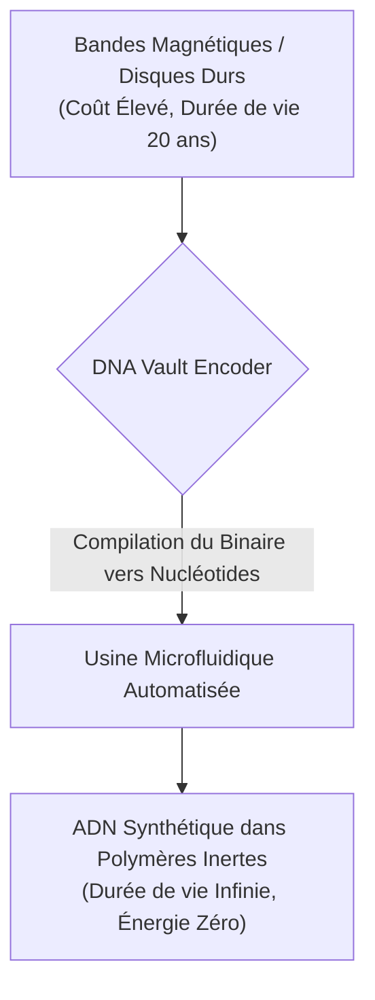
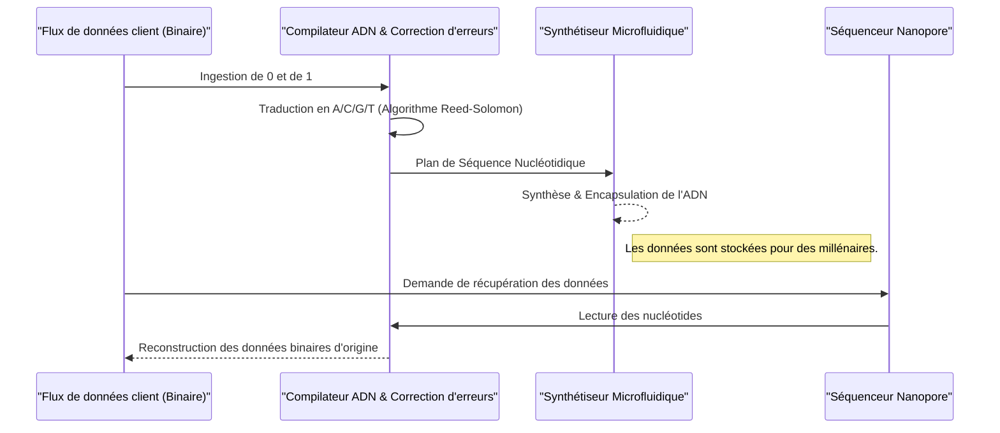

<!-- markdownlint-disable MD009 MD010 MD013 MD022 MD028 MD032 MD033 MD034 MD036 MD037 MD039 MD041 MD060 -->

[ 🇬🇧 English Version ](./README.md)

# DNA Vault Encoder

> **Résumé exécutif :** DNA Vault Encoder résout la crise mondiale du stockage froid ("cold storage") en développant un compilateur hybride logiciel/matériel qui traduit des flux de données binaires massifs en ADN synthétique chimiquement synthétisé, offrant un archivage d'une durée de vie quasi infinie et à consommation d'énergie nulle.

---

## 1. Aperçu visuel & Effet Wahou

## 2. La thèse contrariante (Peter Thiel Style)

**La croyance populaire :** La compression de données, les disques durs plus denses ou les nouvelles bandes magnétiques sont la solution aux besoins explosifs d'archivage des données mondiales.
**La vérité cachée :** Le stockage traditionnel est fondamentalement limité par la physique et les matériaux, nécessitant une alimentation constante et un espace physique immense. La véritable solution au stockage à froid est biologique : l'ADN est le support de stockage d'information le plus optimisé de l'univers. Le défi n'est pas la compression, mais la compilation sécurisée de données binaires en séquences nucléotidiques stables et lisibles.

## 3. Le problème & La cible

**Modèle économique :** B2B
**Cible précise :** Fournisseurs de Cloud (AWS, Azure, Google), centres d'archives nationales, institutions financières, et l'industrie du cinéma (conservation des masters 8K).
**La douleur urgente :** L'explosion des données mondiales entraîne une crise des supports de stockage "froids" (archives à long terme). Les bandes magnétiques (LTO) ou disques durs actuels ont une durée de vie limitée (10-30 ans), nécessitent une migration constante, occupent des entrepôts gigantesques et consomment énormément d'électricité. L'empreinte écologique et le coût de l'archivage profond deviennent insoutenables pour les très grands acteurs.

## 4. Architecture technique & Plomberie

## 5. Modèle économique & Viabilité financière

| Métrique                | Valeur                                                                           |
| ----------------------- | -------------------------------------------------------------------------------- |
| **Structure de prix**   | Archival-as-a-Service (Frais d'écriture élevés + frais de stockage très faibles) |
| **Objectif 12 mois**    | Sécuriser 2 PoCs avec des institutions d'archivage / fournisseurs cloud majeurs  |
| **Calcul du CA**        | Frais de synthèse et de stockage par Téraoctet                                   |
| **Marge brute estimée** | >60% (S'améliorant avec la baisse des coûts de synthèse)                         |

## 6. Moteur de distribution & Fossé défensif (Moat)

**Stratégie d'acquisition :** Partenariats stratégiques avec les fournisseurs de cloud (AWS/Azure) comme niveau premium pour le stockage type "Glacier", et ventes directes aux entreprises dans des secteurs hautement réglementés.
**Moat (Barrière à l'entrée) :** L'encodage du binaire vers l'ADN est une interface incroyablement complexe entre la théorie de l'information (mathématiques) et la biologie synthétique (chimie). L'algorithme d'encodage doit tenir compte des contraintes biochimiques : éviter les longues répétitions de "A", optimiser le ratio GC pour la stabilité thermodynamique, et implémenter des corrections d'erreurs sur mesure. Les algorithmes de compression standards (type ZIP) ignorent totalement ces contraintes physiques. L'orchestration propriétaire des usines microfluidiques automatisées constitue une barrière d'entrée massive.

## 7. Grille d'évaluation détaillée

| Critère                               | Score VC (/100) | Score Terrain (/100) |
| ------------------------------------- | --------------- | -------------------- |
| **Thèse & Monopole / Urgence**        | -- / 25         | -- / 25              |
| **Moat / Résistance aux LLM natifs**  | -- / 25         | -- / 25              |
| **Scalabilité / Friction d'adoption** | -- / 25         | -- / 25              |
| **Unit Economics / ROI direct**       | -- / 25         | -- / 25              |
| **TOTAL**                             | -- / 100        | -- / 100             |

> **Verdict VC :** En attente d'évaluation.
> **Verdict Terrain :** En attente d'évaluation.
