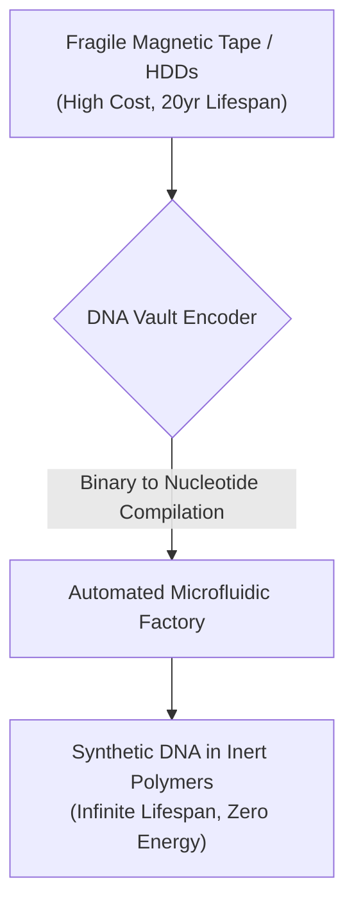
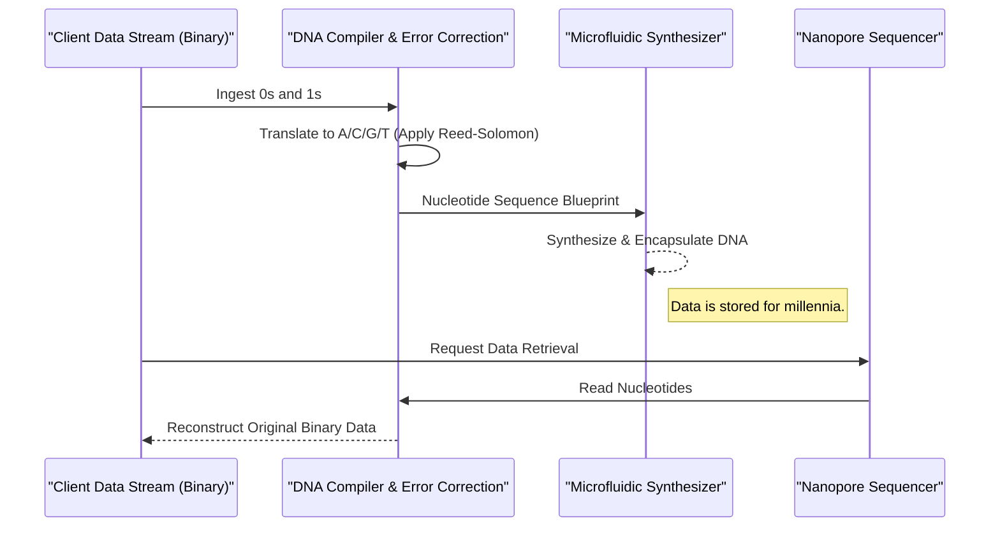

<!-- markdownlint-disable MD009 MD010 MD013 MD022 MD028 MD032 MD033 MD034 MD036 MD037 MD039 MD041 MD060 -->

[ 🇫🇷 Version Française ](./README.fr.md)

# DNA Vault Encoder

> **Executive Summary:** DNA Vault Encoder tackles the global cold storage crisis by developing a software-to-wet-lab compiler that translates massive binary data streams into chemically synthesized synthetic DNA, offering practically infinite, zero-energy archival storage.

---

## 1. Visual Overview & Wow Effect

## 2. Contrarian Thesis (Peter Thiel Style)

**Popular Belief:** Data compression and denser hard drives or new magnetic tapes are the solution to the world's exploding data archiving needs.
**Hidden Truth:** Traditional storage is fundamentally limited by physics and materials, requiring constant power and physical space. The true solution to cold storage is biological: DNA is the universe's most optimized information storage medium. The challenge isn't compression, but compiling binary data securely into stable, readable nucleotide sequences.

## 3. Problem & Target Market

**Business Model:** B2B
**Target Audience:** Cloud Providers (AWS, Azure, Google), National Archives, Financial Institutions, and the Film Industry (preserving 8K master files).
**Urgent Pain Point:** The global data explosion is causing a crisis in "cold" storage (long-term archives). Current magnetic tapes (LTO) or hard drives have a limited lifespan (10-30 years), require constant migration, occupy gigantic warehouses, and consume massive amounts of electricity. The ecological footprint and cost of deep archiving are becoming unsustainable for hyperscalers.

## 4. Technical Architecture & Infrastructure

## 5. Business Model & Financial Viability

| Metric                     | Value                                                            |
| -------------------------- | ---------------------------------------------------------------- |
| **Pricing Structure**      | Archival-as-a-Service (High upfront Write fee + low storage fee) |
| **12-Month Target**        | Secure 2 PoCs with major archival institutions / hyperscalers    |
| **Revenue Formula**        | Per-Terabyte synthesis and storage fee                           |
| **Estimated Gross Margin** | >60% (Improving as synthesis costs drop)                         |

## 6. Distribution Engine & Moat

**Acquisition Strategy:** Strategic partnerships with hyperscalers (AWS/Azure) as a premium tier for "Glacier" storage, and direct enterprise sales to highly regulated industries.
**Moat (Defensibility):** Compiling binary to DNA is an incredibly complex interface between information theory (math) and synthetic biology (chemistry). The encoding algorithm must account for biochemical constraints: avoiding long repeats of "A", optimizing the GC ratio for thermodynamic stability, and implementing custom error correction. Standard compression algorithms cannot handle these physical constraints. The proprietary wet-lab automation orchestration serves as a massive barrier.

## 7. Detailed Evaluation Grid

| Criterion                       | VC Score (/100) | Market Score (/100) |
| ------------------------------- | --------------- | ------------------- |
| **Thesis & Monopoly / Urgency** | -- / 25         | -- / 25             |
| **Moat / LLM Immunity**         | -- / 25         | -- / 25             |
| **Scalability / UX Friction**   | -- / 25         | -- / 25             |
| **Unit Economics / ROI**        | -- / 25         | -- / 25             |
| **TOTAL**                       | -- / 100        | -- / 100            |

> **VC Verdict:** Pending evaluation.
> **Market Verdict:** Pending evaluation.
