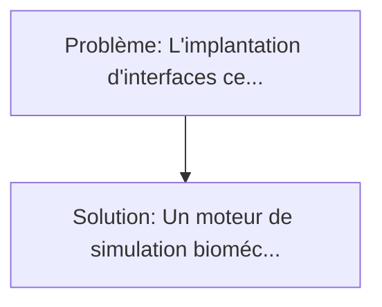
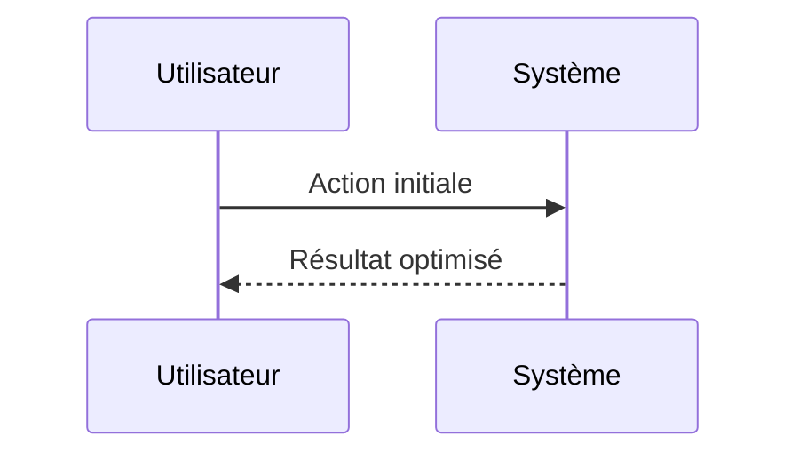

<!-- markdownlint-disable MD013 MD033 -->

[🇬🇧 English Version](./README.md)

# BCI Glial Scar Digital Twin

> **Résumé exécutif :** Un moteur de simulation biomécanique et biochimique modélisant la réaction des astrocytes et de la microglie autour d'une micro-électrode intracorticale. L'implantation d'interfaces cerveau-machine (BCI) invasives provoque inévitablement une réaction immunitaire (astrogliose) formant une cicatrice gliale.

---

## 1. Aperçu visuel & Effet Wahou

## 2. La thèse contrariante (Peter Thiel Style)

**La croyance populaire :** Les solutions logicielles seules peuvent résoudre ce problème.
**La vérité cachée :** Les outils de CAO standard (SolidWorks) ou de dynamique moléculaire ne gèrent pas la dynamique tissulaire macro-échelle couplée à la réponse immunitaire biologique au fil du temps. Cela nécessite un modèle multiphysique spécifique au parenchyme cérébral.

## 3. Le problème & La cible

- **Modèle économique :** B2B
- **Cible précise :** Fabricants d'implants neuronaux (Neuralink, Synchron), instituts de recherche en neuro-ingénierie et CRO spécialisées en dispositifs médicaux implantables.
- **La douleur urgente :** L'implantation d'interfaces cerveau-machine (BCI) invasives provoque inévitablement une réaction immunitaire (astrogliose) formant une cicatrice gliale. Cette cicatrice isole les électrodes au fil du temps, dégradant la qualité du signal jusqu'à rendre l'implant inutile en quelques mois ou années. Les essais in-vivo pour tester de nouveaux revêtements ou géométries d'électrodes prennent des années et coûtent des dizaines de millions d'euros.

## 4. Architecture technique & Plomberie

## 5. Modèle économique & Viabilité financière

| Métrique                    | Valeur             |
| --------------------------- | ------------------ |
| Structure de prix           | Custom Pricing     |
| Objectif 12 mois            | 100 clients        |
| Calcul du CA (Target 100k€) | 100 \* 1000 = 100k |
| Marge brute estimée         | 80%                |

## 6. Moteur de distribution & Fossé défensif (Moat)

- **Stratégie d'acquisition :** Ventes B2B directes
- **Moat (Barrière à l'entrée) :** Les outils de CAO standard (SolidWorks) ou de dynamique moléculaire ne gèrent pas la dynamique tissulaire macro-échelle couplée à la réponse immunitaire biologique au fil du temps. Cela nécessite un modèle multiphysique spécifique au parenchyme cérébral.

## 7. Grille d'évaluation détaillée

| Critère                           | Score VC (/100) | Score Terrain (/100) |
| --------------------------------- | --------------- | -------------------- |
| Thèse & Monopole / Urgence        | -- / 25         | -- / 25              |
| Moat / Résistance aux LLM natifs  | -- / 25         | -- / 25              |
| Scalabilité / Friction d'adoption | -- / 25         | -- / 25              |
| Unit Economics / ROI direct       | -- / 25         | -- / 25              |
| **TOTAL**                         | **-- / 100**    | **-- / 100**         |

> **Verdict VC :** En attente d'évaluation.

> **Verdict Terrain :** En attente d'évaluation.
