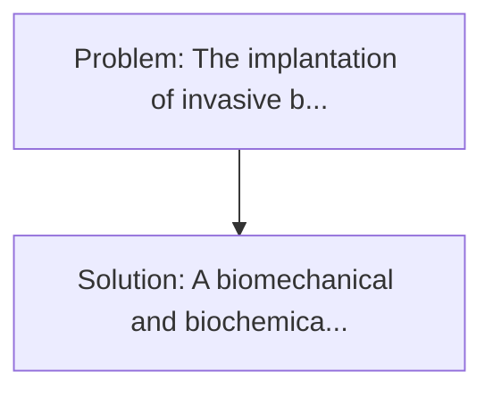
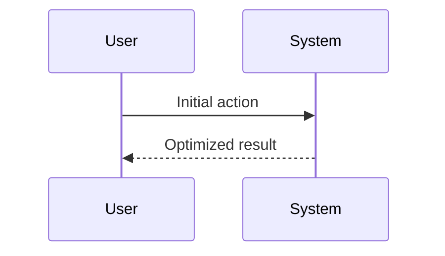

<!-- markdownlint-disable MD013 MD033 -->

[🇫🇷 Version Française](./README.fr.md)

# BCI Glial Scar Digital Twin

> **Executive Summary:** A biomechanical and biochemical simulation engine modeling the reaction of astrocytes and microglia around an intracortical microelectrode. The implantation of invasive brain-machine interfaces (BCI) inevitably causes an immune reaction (astrogliosis) forming a glial scar.

---

## 1. Visual Overview & Wow Effect

## 2. Contrarian Thesis (Peter Thiel Style)

**Popular Belief:** Generic software solutions can solve this.
**Hidden Truth:** Standard CAD (SolidWorks) or molecular dynamic tools do not manage macroscale tissue dynamics coupled with biological immune response over time. This requires a multiphysical model specific to cerebral parenchyma.

## 3. Problem & Target Market

- **Business Model:** B2B
- **Target Audience:** Manufacturers of neuronal implants (Neuralink, Synchron), neuroengineering research institutes and CRO specialized in implantable medical devices.
- **Urgent Pain Point:** The implantation of invasive brain-machine interfaces (BCI) inevitably causes an immune reaction (astrogliosis) forming a glial scar. This scar isolates electrodes over time, degrading the quality of the signal until it renders the implant useless in a few months or years. In-vivo tests to test new electrode coatings or geometries take years and cost tens of millions of euros.

## 4. Technical Architecture & Infrastructure

## 5. Business Model & Financial Viability

| Metric                 | Value              |
| ---------------------- | ------------------ |
| Pricing Structure      | Custom Pricing     |
| 12-Month Target        | 100 customers      |
| Revenue Formula        | 100 \* 1000 = 100k |
| Estimated Gross Margin | 80%                |

## 6. Distribution Engine & Moat

- **Acquisition Strategy:** Direct B2B Sales
- **Moat (Defensibility):** Standard CAD (SolidWorks) or molecular dynamic tools do not manage macroscale tissue dynamics coupled with biological immune response over time. This requires a multiphysical model specific to cerebral parenchyma.

## 7. Detailed Evaluation Grid

| Criterion                   | VC Score (/100) | Market Score (/100) |
| --------------------------- | --------------- | ------------------- |
| Thesis & Monopoly / Urgency | -- / 25         | -- / 25             |
| Moat / LLM Immunity         | -- / 25         | -- / 25             |
| Scalability / UX Friction   | -- / 25         | -- / 25             |
| Unit Economics / ROI        | -- / 25         | -- / 25             |
| **TOTAL**                   | **-- / 100**    | **-- / 100**        |

> **VC Verdict:** Pending evaluation.

> **Market Verdict:** Pending evaluation.
