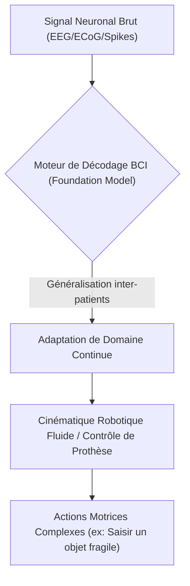
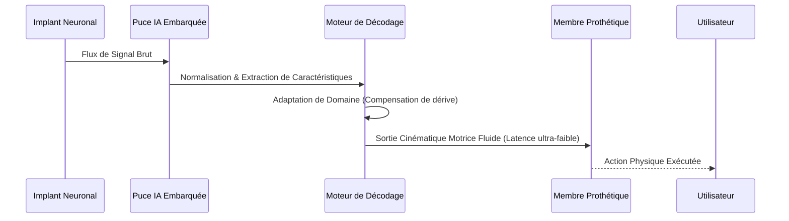

<!-- markdownlint-disable MD009 MD010 MD013 MD022 MD028 MD032 MD033 MD034 MD036 MD037 MD039 MD041 MD058 MD060 -->

[ 🇬🇧 English Version ](./README.md)

# BCI Motor Decoding Engine

> **Résumé exécutif :** Un Foundation Model spécialisé dans le décodage neuronal qui traduit les signaux cérébraux bruts en cinématique robotique fluide en temps réel, éliminant le besoin de recalibration constante pour les interfaces cerveau-machine.

---

## 1. Aperçu visuel & Effet Wahou

## 2. La thèse contrariante (Peter Thiel Style)

**La croyance populaire :** Les interfaces neuronales nécessitent une recalibration quotidienne et épuisante, spécifique à chaque patient, avec des filtres linéaires pour associer les signaux du cerveau aux commandes de la machine.
**La vérité cachée :** Les dynamiques cérébrales partagent des structures sous-jacentes non-linéaires universelles ; un Foundation Model pré-entraîné utilisant l'adaptation de domaine en temps réel peut décoder l'intention motrice instantanément, rendant les prothèses de véritables appareils "plug-and-play".

## 3. Le problème & La cible

**Modèle économique :** B2B
**Cible précise :** Fabricants de prothèses robotiques, startups d'implants neuronaux, hôpitaux de rééducation avancée.
**La douleur urgente :** Les BCI actuelles ne parviennent pas à offrir des mouvements fluides et complexes, exigeant des recalibrations quotidiennes épuisantes pour les patients. La dégradation du signal au fil du temps (cicatrisation) rend l'utilisation à long terme insoutenable financièrement et physiquement.

## 4. Architecture technique & Plomberie

## 5. Modèle économique & Viabilité financière

| Métrique                    | Valeur                                                                 |
| --------------------------- | ---------------------------------------------------------------------- |
| Structure de prix           | Frais de licence OEM par appareil + mises à jour logicielles annuelles |
| Objectif 12 mois            | 200 appareils sous licence (à 500€/appareil/an)                        |
| Calcul du CA (Target 100k€) | 200 \* 500€ = 100 000€ de revenus annuels récurrents                   |
| Marge brute estimée         | 90% (Licence logicielle)                                               |

## 6. Moteur de distribution & Fossé défensif (Moat)

**Stratégie d'acquisition :** Partenariats B2B directs avec de grands fabricants de matériel prothétique et des institutions de recherche en neurotechnologie.
**Moat (Barrière à l'entrée) :** L'accumulation de données neuronales invasives, de haute qualité et croisées entre patients pour entraîner le modèle crée une barrière à l'entrée insurmontable. Les LLM génériques ne peuvent pas traiter des séries temporelles biologiques multimodales à très faible latence sur des puces embarquées.

## 7. Grille d'évaluation détaillée

| Critère                           | Score VC (/100) | Score Terrain (/100) |
| --------------------------------- | --------------- | -------------------- |
| Thèse & Monopole / Urgence        | 24 / 25         | -- / 25              |
| Moat / Résistance aux LLM natifs  | 24 / 25         | -- / 25              |
| Scalabilité / Friction d'adoption | 21 / 25         | -- / 25              |
| Unit Economics / ROI direct       | 23 / 25         | -- / 25              |
| **TOTAL**                         | **92 / 100**    | **-- / 100**         |

> **Verdict VC :** BCI Motor Decoding Engine s'attaque au goulot d'étranglement logiciel central des interfaces cerveau-machine : traduire des signaux neuronaux bruyants en contrôle robotique fluide et fiable. Fournir une couche d'abstraction de niveau OS pour les données neuronales standardise un marché matériel fragmenté. Ses algorithmes de traitement du signal hautement spécialisés le rendent immunisé contre les IA généralistes.
> **Verdict Terrain :** En attente d'évaluation.
