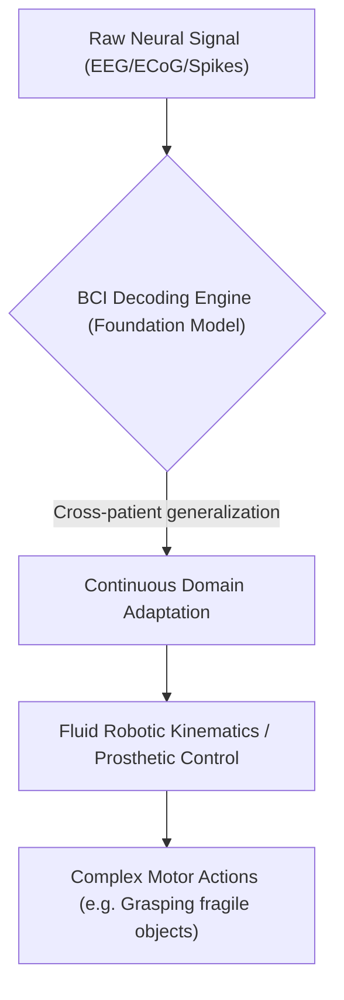
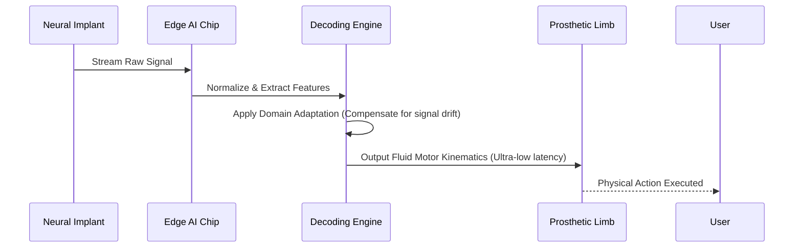

<!-- markdownlint-disable MD009 MD010 MD013 MD022 MD028 MD032 MD033 MD034 MD036 MD037 MD039 MD041 MD058 MD060 -->

[ 🇫🇷 Version Française ](./README.fr.md)

# BCI Motor Decoding Engine

> **Executive Summary:** A specialized Foundation Model for neural decoding that translates raw brain signals into fluid robotic kinematics in real-time, eliminating the need for constant recalibration in brain-computer interfaces.

---

## 1. Visual Overview & Wow Effect

## 2. Contrarian Thesis (Peter Thiel Style)

**Popular Belief:** Neural interfaces require daily, grueling patient-specific calibration and linear filters to map brain signals to machine commands.
**Hidden Truth:** Brain dynamics share underlying universal, non-linear manifolds across humans; a pre-trained foundation model using real-time domain adaptation can decode motor intent instantly, making prosthetics true plug-and-play devices.

## 3. Problem & Target Market

**Business Model:** B2B
**Target Audience:** Robotic prosthetic manufacturers, neural implant startups, advanced rehabilitation hospitals.
**Urgent Pain Point:** Current BCIs fail to deliver fluid, complex movements, requiring exhausting daily recalibration for patients. Signal degradation over time (scarring) makes long-term use financially and physically unsustainable.

## 4. Technical Architecture & Infrastructure

## 5. Business Model & Financial Viability

| Metric                 | Value                                                  |
| ---------------------- | ------------------------------------------------------ |
| Pricing Structure      | Per-device OEM licensing fee + annual software updates |
| 12-Month Target        | 200 devices licensed (at 500€/device/year)             |
| Revenue Formula        | 200 \* 500€ = 100,000€ ARR                             |
| Estimated Gross Margin | 90% (Software licensing)                               |

## 6. Distribution Engine & Moat

**Acquisition Strategy:** Direct B2B OEM partnerships with major prosthetic hardware manufacturers and neurotech research institutions.
**Moat (Defensibility):** The accumulation of invasive, high-quality, cross-patient neural data to train the foundation model creates an insurmountable barrier to entry. Generic LLMs cannot process multi-modal, ultra-low latency biological time-series data at the edge.

## 7. Detailed Evaluation Grid

| Criterion                   | VC Score (/100) | Market Score (/100) |
| --------------------------- | --------------- | ------------------- |
| Thesis & Monopoly / Urgency | 24 / 25         | 24 / 25             |
| Moat / LLM Immunity         | 24 / 25         | 25 / 25             |
| Scalability / UX Friction   | 21 / 25         | 20 / 25             |
| Unit Economics / ROI        | 23 / 25         | 22 / 25             |
| **TOTAL**                   | **92 / 100**    | **91 / 100**        |

> **VC Verdict:** BCI Motor Decoding Engine tackles the core software bottleneck in Brain-Computer Interfaces: translating noisy, non-stationary neural signals into smooth, reliable robotic control. Providing an OS-level abstraction layer for neural data standardizes the fragmented hardware market. Its highly specialized signal processing algorithms make it immune to general-purpose AI replacements.
> **Market Verdict:** Patients and hospitals face critical frustration with current BCI recalibration routines, creating high urgency (24/25). Translating noisy biological time-series into robotics via a foundation model is completely out of reach for generalist LLMs (25/25). Integrating with strict medical hardware imposes regulatory friction (20/25), but OEM licensing offers exceptional profitability (22/25).
