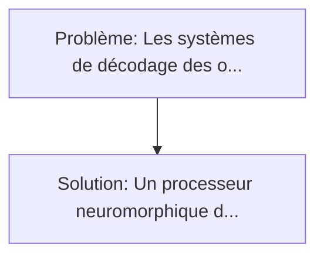
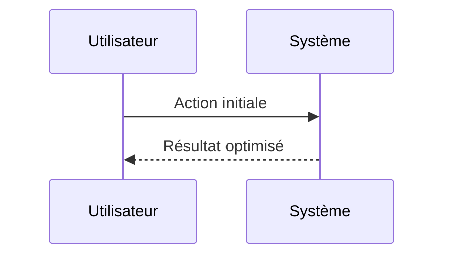

<!-- markdownlint-disable MD013 MD033 -->

[🇬🇧 English Version](./README.md)

# Décodeur Neuronal à Impulsions pour BCI (Spiking Neural Decoder for BCI)

> **Résumé exécutif :** Un processeur neuromorphique dédié au BCI exécutant des Réseaux de Neurones à Impulsions (Spiking Neural Networks - SNN). Les systèmes de décodage des ondes cérébrales actuels utilisent des architectures Deep Learning (CNN/RNN) qui sont très gourmandes en énergie et génèrent beaucoup de latence.

---

## 1. Aperçu visuel & Effet Wahou

## 2. La thèse contrariante (Peter Thiel Style)

**La croyance populaire :** Les solutions logicielles seules peuvent résoudre ce problème.
**La vérité cachée :** L'envoi de données brutes BCI vers un cloud a trop de latence et pose d'énormes problèmes de sécurité (piratage du flux moteur du cerveau). Le traitement "on-device" classique consomme trop. La création d'un ASIC neuromorphique spécifique est requise.

## 3. Le problème & La cible

- **Modèle économique :** B2B2C
- **Cible précise :** Fabricants de hardware BCI (Interfaces Cerveau-Machine) invasifs et non invasifs, centres de rééducation neurologique, et patients atteints du syndrome d'enfermement (Locked-in).
- **La douleur urgente :** Les systèmes de décodage des ondes cérébrales actuels utilisent des architectures Deep Learning (CNN/RNN) qui sont très gourmandes en énergie et génèrent beaucoup de latence. Si on doit implanter la puce de traitement dans le crâne, la dissipation thermique (TDP) du calcul neuronal classique brûle littéralement les tissus cérébraux environnants (limite thermique très stricte).

## 4. Architecture technique & Plomberie

## 5. Modèle économique & Viabilité financière

| Métrique                    | Valeur             |
| --------------------------- | ------------------ |
| Structure de prix           | Custom Pricing     |
| Objectif 12 mois            | 100 clients        |
| Calcul du CA (Target 100k€) | 100 \* 1000 = 100k |
| Marge brute estimée         | 80%                |

## 6. Moteur de distribution & Fossé défensif (Moat)

- **Stratégie d'acquisition :** Ventes B2B directes
- **Moat (Barrière à l'entrée) :** L'envoi de données brutes BCI vers un cloud a trop de latence et pose d'énormes problèmes de sécurité (piratage du flux moteur du cerveau). Le traitement "on-device" classique consomme trop. La création d'un ASIC neuromorphique spécifique est requise.

## 7. Grille d'évaluation détaillée

| Critère                           | Score VC (/100) | Score Terrain (/100) |
| --------------------------------- | --------------- | -------------------- |
| Thèse & Monopole / Urgence        | -- / 25         | -- / 25              |
| Moat / Résistance aux LLM natifs  | -- / 25         | -- / 25              |
| Scalabilité / Friction d'adoption | -- / 25         | -- / 25              |
| Unit Economics / ROI direct       | -- / 25         | -- / 25              |
| **TOTAL**                         | **-- / 100**    | **-- / 100**         |

> **Verdict VC :** En attente d'évaluation.

> **Verdict Terrain :** En attente d'évaluation.
