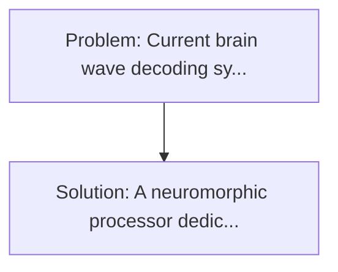
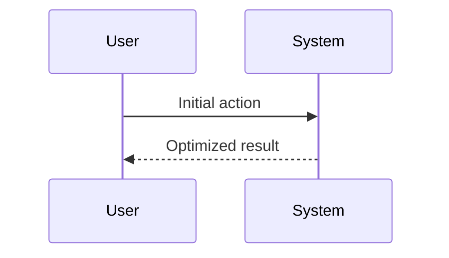

<!-- markdownlint-disable MD013 MD033 -->

[🇫🇷 Version Française](./README.fr.md)

# Neuronal Impulsive Decoder for BCI

> **Executive Summary:** A neuromorphic processor dedicated to BCI running Impulsive Neurons (SNN) Networks. Current brain wave decoding systems use Deep Learning (CNN/RNN) architectures that are energy-intensive and latency-intensive.

---

## 1. Visual Overview & Wow Effect

## 2. Contrarian Thesis (Peter Thiel Style)

**Popular Belief:** Generic software solutions can solve this.
**Hidden Truth:** Sending raw BCI data to a cloud has too much latency and poses enormous security problems (piracy of the brain's motor flow). Classic "on-device" treatment consumes too much. The creation of a specific neuromorphic ASIC is required.

## 3. Problem & Target Market

- **Business Model:** B2B2C
- **Target Audience:** Manufacturers of invasive and non-invasive BCI hardware (brain-Machine interfaces), neurological rehabilitation centres, and patients with locked-in syndrome.
- **Urgent Pain Point:** Current brain wave decoding systems use Deep Learning (CNN/RNN) architectures that are energy-intensive and latency-intensive. If the treatment chip is to be implanted in the skull, the thermal dissipation (TDP) of the classical neuronal calculation literally burns the surrounding brain tissue (very strict thermal limit).

## 4. Technical Architecture & Infrastructure

## 5. Business Model & Financial Viability

| Metric                 | Value              |
| ---------------------- | ------------------ |
| Pricing Structure      | Custom Pricing     |
| 12-Month Target        | 100 customers      |
| Revenue Formula        | 100 \* 1000 = 100k |
| Estimated Gross Margin | 80%                |

## 6. Distribution Engine & Moat

- **Acquisition Strategy:** Direct B2B Sales
- **Moat (Defensibility):** Sending raw BCI data to a cloud has too much latency and poses enormous security problems (piracy of the brain's motor flow). Classic "on-device" treatment consumes too much. The creation of a specific neuromorphic ASIC is required.

## 7. Detailed Evaluation Grid

| Criterion                   | VC Score (/100) | Market Score (/100) |
| --------------------------- | --------------- | ------------------- |
| Thesis & Monopoly / Urgency | -- / 25         | -- / 25             |
| Moat / LLM Immunity         | -- / 25         | -- / 25             |
| Scalability / UX Friction   | -- / 25         | -- / 25             |
| Unit Economics / ROI        | -- / 25         | -- / 25             |
| **TOTAL**                   | **-- / 100**    | **-- / 100**        |

> **VC Verdict:** Pending evaluation.

> **Market Verdict:** Pending evaluation.
