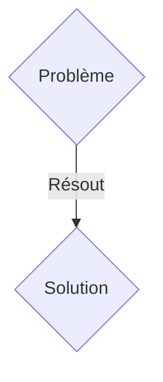
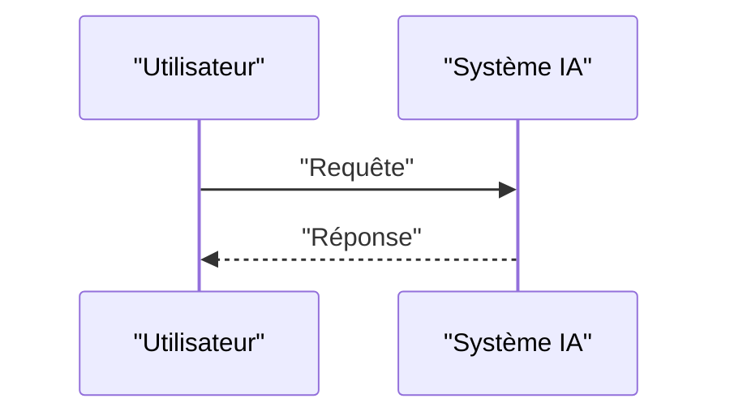

<!-- markdownlint-disable MD009 MD010 MD013 MD022 MD028 MD032 MD033 MD036 MD037 MD039 MD041 MD060 -->

[ 🇬🇧 English Version ](./README.md)

# BioTwin OT

> **Résumé exécutif :** Une solution B2B ciblant Fabricants de bioproduits (CDMOs), laboratoires pharmaceutiques, producteurs de viande cultivée. pour résoudre : Le passage à l'échelle (scale-up) des bioréacteurs du stade laboratoire à la production industrielle entraîne souvent des échecs coûteux (mort cellulaire, rendements faibles) à cause de dynamiques de fluides et de stress de cisaillement imprévisibles à grande échelle.

---

## 1. Aperçu visuel & Effet Wahou

## 2. La thèse contrariante (Peter Thiel Style)

- **La croyance populaire :** Les solutions génériques suffisent.
- **La vérité cachée :** Un jumeau numérique hybride combinant des capteurs IoT multi-spectraux in-situ et un modèle de simulation physique-biologique (metabolic flux + CFD) pour prédire en temps réel la santé cellulaire et ajuster les paramètres du bioréacteur.

## 3. Le problème & La cible

- **Modèle économique :** B2B
- **Cible précise :** Fabricants de bioproduits (CDMOs), laboratoires pharmaceutiques, producteurs de viande cultivée.
- **La douleur urgente :** Le passage à l'échelle (scale-up) des bioréacteurs du stade laboratoire à la production industrielle entraîne souvent des échecs coûteux (mort cellulaire, rendements faibles) à cause de dynamiques de fluides et de stress de cisaillement imprévisibles à grande échelle.

## 4. Architecture technique & Plomberie

Un jumeau numérique hybride combinant des capteurs IoT multi-spectraux in-situ et un modèle de simulation physique-biologique (metabolic flux + CFD) pour prédire en temps réel la santé cellulaire et ajuster les paramètres du bioréacteur.

## 5. Modèle économique & Viabilité financière

| Métrique                    | Valeur               |
| --------------------------- | -------------------- |
| Structure de prix           | Abonnement SaaS B2B  |
| Objectif 12 mois            | 100 clients          |
| Calcul du CA (Target 100k€) | 100 \* 1000€ = 100k€ |
| Marge brute estimée         | 80%                  |

## 6. Moteur de distribution & Fossé défensif (Moat)

- **Stratégie d'acquisition :** Vente directe et partenariats stratégiques.
- **Moat (Barrière à l'entrée) :** Le problème combine la biologie de synthèse (métabolisme cellulaire) et la physique complexe (mélange de fluides non newtoniens). Un simple dashboard IoT ou une IA générative textuelle est inutile sans la modélisation mathématique du vivant.

## 7. Grille d'évaluation détaillée

| Critère                           | Score VC (/100) | Score Terrain (/100) |
| --------------------------------- | --------------- | -------------------- |
| Thèse & Monopole / Urgence        | -- / 25         | -- / 25              |
| Moat / Résistance aux LLM natifs  | -- / 25         | -- / 25              |
| Scalabilité / Friction d'adoption | -- / 25         | -- / 25              |
| Unit Economics / ROI direct       | -- / 25         | -- / 25              |
| TOTAL                             | -- / 100        | -- / 100             |

> **Verdict VC :** En attente d'évaluation.
> **Verdict Terrain :** En attente d'évaluation.
