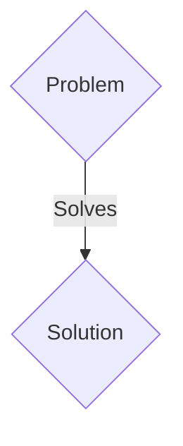
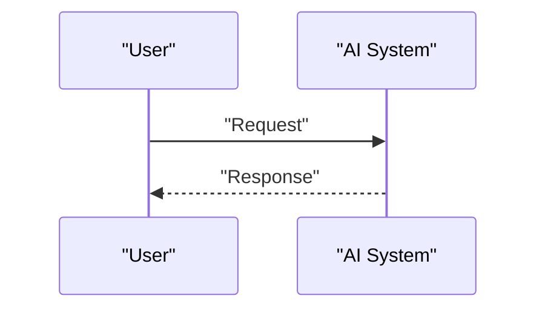

<!-- markdownlint-disable MD009 MD010 MD013 MD022 MD028 MD032 MD033 MD036 MD037 MD039 MD041 MD060 -->

[ 🇫🇷 Version Française ](./README.fr.md)

# BioTwin OT

> **Executive Summary:** A B2B solution targeting Bioproduct manufacturers (CDMOs), pharmaceutical laboratories, cultured meat producers. to solve: Scaling up bioreactors from laboratory stage to industrial production often results in costly failures (cell death, low yields) due to unpredictable fluid dynamics and shear stress at large scale.

---

## 1. Visual Overview & Wow Effect

## 2. Contrarian Thesis (Peter Thiel Style)

- **Popular Belief:** Generic solutions are enough.
- **Hidden Truth:** A hybrid digital twin combining in-situ multi-spectral IoT sensors and a physical-biological simulation model (metabolic flux + CFD) to predict cellular health in real time and adjust bioreactor parameters.

## 3. Problem & Target Market

- **Business Model:** B2B
- **Target Audience:** Bioproduct manufacturers (CDMOs), pharmaceutical laboratories, cultured meat producers.
- **Urgent Pain Point:** Scaling up bioreactors from laboratory stage to industrial production often results in costly failures (cell death, low yields) due to unpredictable fluid dynamics and shear stress at large scale.

## 4. Technical Architecture & Infrastructure

A hybrid digital twin combining in-situ multi-spectral IoT sensors and a physical-biological simulation model (metabolic flux + CFD) to predict cellular health in real time and adjust bioreactor parameters.

## 5. Business Model & Financial Viability

| Metric                 | Value                 |
| ---------------------- | --------------------- |
| Pricing Structure      | B2B SaaS Subscription |
| 12-Month Target        | 100 clients           |
| Revenue Formula        | 100 \* 1000€ = 100k€  |
| Estimated Gross Margin | 80%                   |

## 6. Distribution Engine & Moat

- **Acquisition Strategy:** Direct sales and strategic partnerships.
- **Moat (Defensibility):** The problem combines synthetic biology (cellular metabolism) and complex physics (mixing non-Newtonian fluids). A simple IoT dashboard or textual generative AI is useless without mathematical modeling of life.

## 7. Detailed Evaluation Grid

| Criterion                   | VC Score (/100) | Market Score (/100) |
| --------------------------- | --------------- | ------------------- |
| Thesis & Monopoly / Urgency | -- / 25         | -- / 25             |
| Moat / LLM Immunity         | -- / 25         | -- / 25             |
| Scalability / UX Friction   | -- / 25         | -- / 25             |
| Unit Economics / ROI        | -- / 25         | -- / 25             |
| TOTAL                       | -- / 100        | -- / 100            |

> **VC Verdict:** Pending evaluation.
> **Market Verdict:** Pending evaluation.
