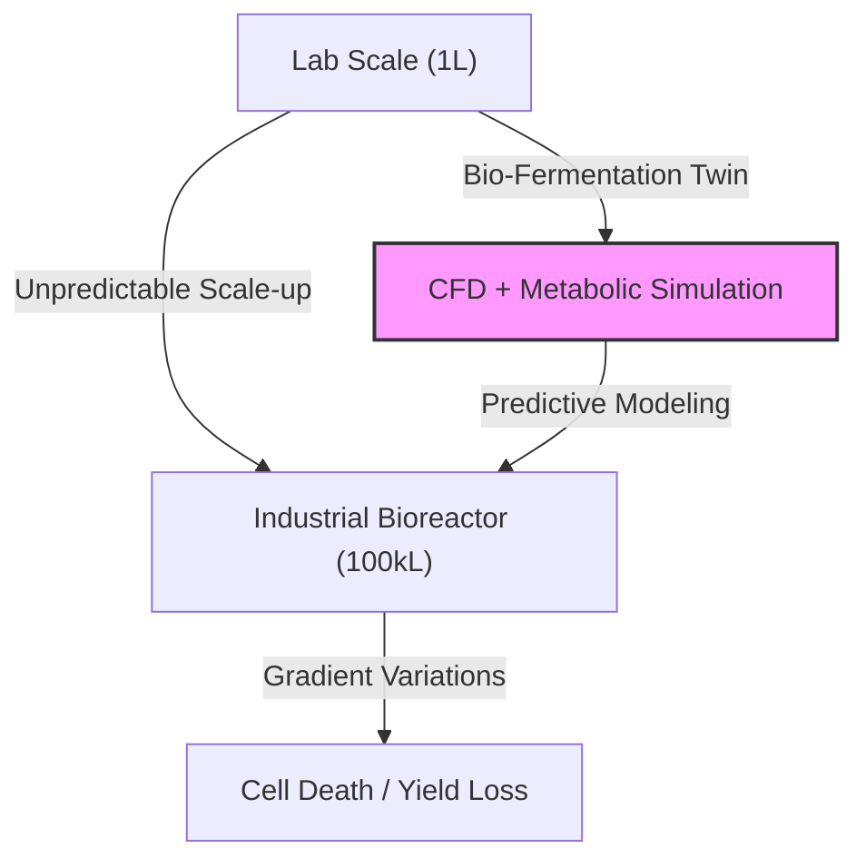
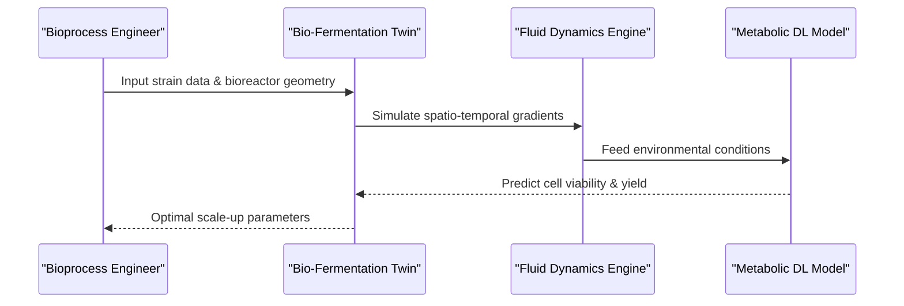

<!-- markdownlint-disable MD009 MD010 MD013 MD022 MD028 MD032 MD033 MD034 MD036 MD037 MD039 MD041 MD058 MD060 -->

[ 🇫🇷 Version Française ](./README.fr.md)

# Bio-Fermentation Twin

> **Executive Summary:** A digital twin platform using physical fluid dynamics and deep learning metabolic models to predict cellular behavior in massive bioreactors, solving the scale-up unpredictability in biotech.

---

## 1. Visual Overview & Wow Effect

## 2. Contrarian Thesis (Peter Thiel Style)

**Popular Belief:** Biotech scale-up is purely an empirical process requiring incremental physical trials and massive capital to build physical pilot plants.
**Hidden Truth:** The biological behavior at scale is a deterministic function of fluid dynamics and metabolic response that can be fully simulated computationally before any steel is cut.

## 3. Problem & Target Market

**Business Model:** B2B
**Target Audience:** Biotech industrial manufacturers (alternative proteins, bioplastics, pharma) holding R&D and production budgets.
**Urgent Pain Point:** Scaling from 1L to 100,000L fails frequently due to microscopic gradient variations (temp, pH, oxygen), costing months of delays and millions of dollars in lost batches and retrofits.

## 4. Technical Architecture & Infrastructure

## 5. Business Model & Financial Viability

| Metric                     | Value                                   |
| :------------------------- | :-------------------------------------- |
| **Pricing Structure**      | Annual license per strain/reactor model |
| **12-Month Target**        | 2 - 3 enterprise contracts              |
| **Revenue Formula**        | 3 contracts \* €40k/year = €120k ARR    |
| **Estimated Gross Margin** | 80% (High compute costs for CFD)        |

## 6. Distribution Engine & Moat

**Acquisition Strategy:** Direct enterprise sales targeting Chief Scientific Officers and VP of Bioprocessing, backed by published case studies showing saved capital.
**Moat (Defensibility):** Requires proprietary integration of computational fluid dynamics with deep bioinformatics and metabolic modeling; generic LLMs cannot simulate physical fluid mechanics or cellular biology.

## 7. Detailed Evaluation Grid

| Criterion                       | VC Score (/100) | Market Score (/100) |
| :------------------------------ | :-------------- | :------------------ |
| **Thesis & Monopoly / Urgency** | -- / 25         | 20 / 25             |
| **Moat / LLM Immunity**         | -- / 25         | 24 / 25             |
| **Scalability / UX Friction**   | -- / 25         | 15 / 25             |
| **Unit Economics / ROI**        | -- / 25         | 22 / 25             |
| **TOTAL**                       | **-- / 100**    | **81 / 100**        |

> **VC Verdict:** Pending evaluation.

> **Market Verdict:** Bio-fermentation-twin precisely targets the pain of scaling biological production, offering measurable cost and time savings. Its deep integration with existing bioreactor hardware creates a robust moat against native LLMs. Monetization is clear through direct hardware savings, though initial setup friction remains high.
