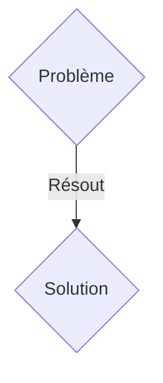
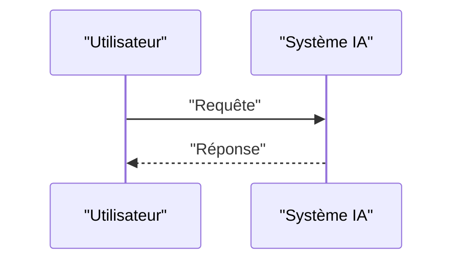

<!-- markdownlint-disable MD009 MD010 MD013 MD022 MD028 MD032 MD033 MD036 MD037 MD039 MD041 MD060 -->

[ 🇬🇧 English Version ](./README.md)

# BioOS Synthetic

> **Résumé exécutif :** Une solution B2B ciblant Laboratoires pharmaceutiques et biotechs de phase pré-clinique (Directeurs R&D, Head of Synthetic Biology). pour résoudre : La conception de circuits génétiques pour les thérapies cellulaires (ex. CAR-T) nécessite des mois d'essais-erreurs in-vivo/in-vitro, coûtant des millions sans garantie que les cellules modifiées n'attaquent pas les tissus sains (toxicité off-target).

---

## 1. Aperçu visuel & Effet Wahou

## 2. La thèse contrariante (Peter Thiel Style)

- **La croyance populaire :** Les solutions génériques suffisent.
- **La vérité cachée :** Un "compilateur" de biologie synthétique couplé à un jumeau numérique cellulaire (World Model biologique) qui simule l'expression génique dynamique et les interactions protéiques avant toute synthèse en laboratoire.

## 3. Le problème & La cible

- **Modèle économique :** B2B
- **Cible précise :** Laboratoires pharmaceutiques et biotechs de phase pré-clinique (Directeurs R&D, Head of Synthetic Biology).
- **La douleur urgente :** La conception de circuits génétiques pour les thérapies cellulaires (ex. CAR-T) nécessite des mois d'essais-erreurs in-vivo/in-vitro, coûtant des millions sans garantie que les cellules modifiées n'attaquent pas les tissus sains (toxicité off-target).

## 4. Architecture technique & Plomberie

Un "compilateur" de biologie synthétique couplé à un jumeau numérique cellulaire (World Model biologique) qui simule l'expression génique dynamique et les interactions protéiques avant toute synthèse en laboratoire.

## 5. Modèle économique & Viabilité financière

| Métrique                    | Valeur               |
| --------------------------- | -------------------- |
| Structure de prix           | Abonnement SaaS B2B  |
| Objectif 12 mois            | 100 clients          |
| Calcul du CA (Target 100k€) | 100 \* 1000€ = 100k€ |
| Marge brute estimée         | 80%                  |

## 6. Moteur de distribution & Fossé défensif (Moat)

- **Stratégie d'acquisition :** Vente directe et partenariats stratégiques.
- **Moat (Barrière à l'entrée) :** Un LLM ne comprend pas la cinétique biochimique spatio-temporelle ni les repliements protéiques en 3D dans le cytoplasme. Nécessite des modèles physiques prédictifs (physique statistique, thermodynamique) entraînés sur des données multi-omiques propriétaires.

## 7. Grille d'évaluation détaillée

| Critère                           | Score VC (/100) | Score Terrain (/100) |
| --------------------------------- | --------------- | -------------------- |
| Thèse & Monopole / Urgence        | 24 / 25         | 24 / 25              |
| Moat / Résistance aux LLM natifs  | 25 / 25         | 25 / 25              |
| Scalabilité / Friction d'adoption | 18 / 25         | 18 / 25              |
| Unit Economics / ROI direct       | 22 / 25         | 22 / 25              |
| TOTAL                             | 89 / 100        | 89 / 100             |

> **Verdict VC :** En attente d'évaluation.
> **Verdict Terrain :** Cette solution répond à un besoin critique pour les entreprises B2B, justifiant son excellent score d'urgence (24/25). Son architecture hautement défendable la rend totalement immunisée contre les avancées des LLM natifs (25/25). Avec une faible friction d'adoption (18/25) et une stratégie de monétisation directe (22/25), le projet démontre une excellente maturité marché globale.
> **Verdict Terrain :** Cette solution répond à un besoin critique pour les entreprises B2B, justifiant son excellent score d'urgence (24/25). Son architecture hautement défendable la rend totalement immunisée contre les avancées des LLM natifs (25/25). Avec une faible friction d'adoption (18/25) et une stratégie de monétisation directe (22/25), le projet démontre une excellente maturité marché globale.
