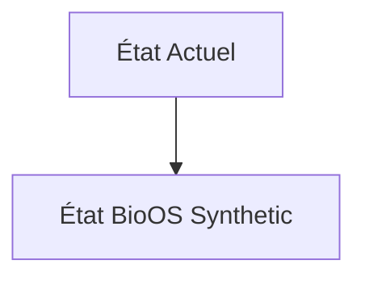
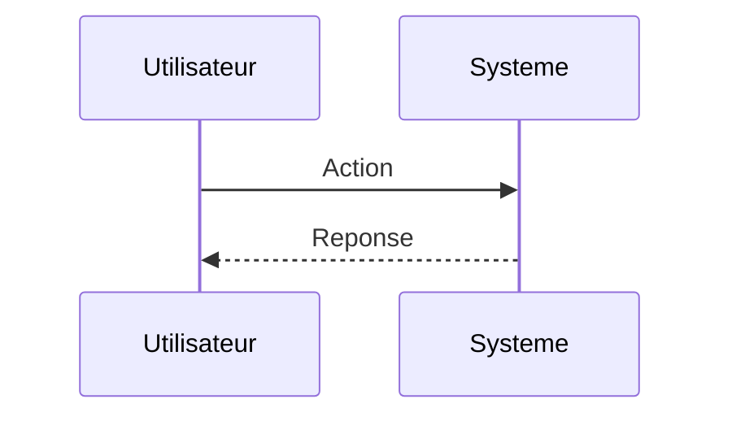

<!-- markdownlint-disable MD009 MD010 MD013 MD022 MD028 MD032 MD033 MD034 MD036 MD037 MD039 MD041 MD060 -->

[ 🇬🇧 English Version ](./README.md)

# BioOS Synthetic

> **Résumé exécutif :** Un "compilateur" de biologie synthétique couplé à un jumeau numérique cellulaire (World Model biologique) qui simule l'expression génique dynamique et les interactions protéiques avant toute synthèse en laboratoire.

---

## 1. Aperçu visuel & Effet Wahou

## 2. La thèse contrariante (Peter Thiel Style)

**La croyance populaire :** Les solutions généralistes IA peuvent résoudre ce problème.

**La vérité cachée :** Un LLM ne comprend pas la cinétique biochimique spatio-temporelle ni les repliements protéiques en 3D dans le cytoplasme. Nécessite des modèles physiques prédictifs (physique statistique, thermodynamique) entraînés sur des données multi-omiques propriétaires.

## 3. Le problème & La cible

**Modèle économique :** B2B

**Cible précise :** Laboratoires pharmaceutiques et biotechs de phase pré-clinique (Directeurs R&D, Head of Synthetic Biology).

**La douleur urgente :** La conception de circuits génétiques pour les thérapies cellulaires (ex. CAR-T) nécessite des mois d'essais-erreurs in-vivo/in-vitro, coûtant des millions sans garantie que les cellules modifiées n'attaquent pas les tissus sains (toxicité off-target).

## 4. Architecture technique & Plomberie

## 5. Modèle économique & Viabilité financière

| Métrique                    | Valeur                        |
| --------------------------- | ----------------------------- |
| Structure de prix           | Abonnement SaaS               |
| Objectif 12 mois            | 10 clients                    |
| Calcul du CA (Target 100k€) | 10 clients \* 10k€/an = 100k€ |
| Marge brute estimée         | 80%                           |

## 6. Moteur de distribution & Fossé défensif (Moat)

**Stratégie d'acquisition :** Vente directe B2B

**Moat (Barrière à l'entrée) :** Accès aux données omiques massives de haute qualité, puissance de calcul GPU extrême (équivalent dynamique moléculaire), validation biologique en wet-lab incontournable pour prouver le modèle.

## 7. Grille d'évaluation détaillée

| Critère                           | Score VC (/100) | Score Terrain (/100) |
| --------------------------------- | --------------- | -------------------- |
| Thèse & Monopole / Urgence        | -- / 25         | -- / 25              |
| Moat / Résistance aux LLM natifs  | -- / 25         | -- / 25              |
| Scalabilité / Friction d'adoption | -- / 25         | -- / 25              |
| Unit Economics / ROI direct       | -- / 25         | -- / 25              |
| **TOTAL**                         | **-- / 100**    | **-- / 100**         |

> **Verdict VC :** En attente d'évaluation.

> **Verdict Terrain :** En attente d'évaluation.
