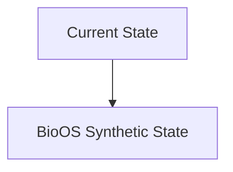
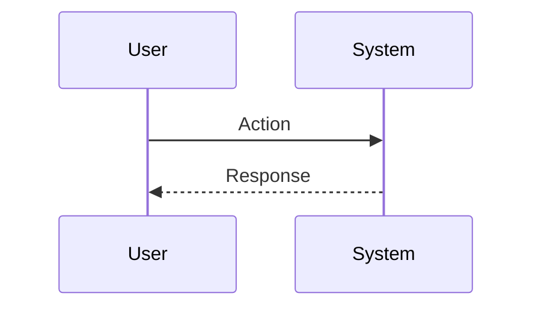

<!-- markdownlint-disable MD009 MD010 MD013 MD022 MD028 MD032 MD033 MD034 MD036 MD037 MD039 MD041 MD060 -->

[ 🇫🇷 Version Française ](./README.fr.md)

# BioOS Synthetic

> **Executive Summary:** A synthetic biology “compiler” coupled with a cellular digital twin (Biological World Model) that simulates dynamic gene expression and protein interactions before any synthesis in the laboratory.

---

## 1. Visual Overview & Wow Effect

## 2. Contrarian Thesis (Peter Thiel Style)

**Popular Belief:** General AI solutions can solve this problem.

**Hidden Truth:** An LLM does not understand spatiotemporal biochemical kinetics or 3D protein folding in the cytoplasm. Requires predictive physical models (statistical physics, thermodynamics) trained on proprietary multi-omics data.

## 3. Problem & Target Market

**Business Model:** B2B

**Target Audience:** Pre-clinical phase pharmaceutical and biotech laboratories (R&D Directors, Head of Synthetic Biology).

**Urgent Pain Point:** The design of genetic circuits for cell therapies (e.g. CAR-T) requires months of in-vivo/in-vitro trial and error, costing millions with no guarantee that the modified cells do not attack healthy tissues (off-target toxicity).

## 4. Technical Architecture & Infrastructure

## 5. Business Model & Financial Viability

| Metric                 | Value                           |
| ---------------------- | ------------------------------- |
| Pricing Structure      | SaaS subscription               |
| 12-Month Target        | 10 customers                    |
| Revenue Formula        | 10 clients \* 10k€/year = 100k€ |
| Estimated Gross Margin | 80%                             |

## 6. Distribution Engine & Moat

**Acquisition Strategy:** B2B direct sales

**Moat (Defensibility):** Access to high-quality massive omics data, extreme GPU computing power (molecular dynamics equivalent), essential wet-lab biological validation to prove the model.

## 7. Detailed Evaluation Grid

| Criterion                   | VC Score (/100) | Market Score (/100) |
| --------------------------- | --------------- | ------------------- |
| Thesis & Monopoly / Urgency | -- / 25         | -- / 25             |
| Moat / LLM Immunity         | -- / 25         | -- / 25             |
| Scalability / UX Friction   | -- / 25         | -- / 25             |
| Unit Economics / ROI        | -- / 25         | -- / 25             |
| **TOTAL**                   | **-- / 100**    | **-- / 100**        |

> **VC Verdict:** Pending evaluation.

> **Market Verdict:** Pending evaluation.
