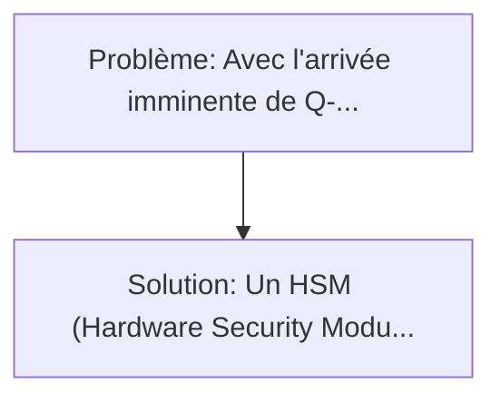
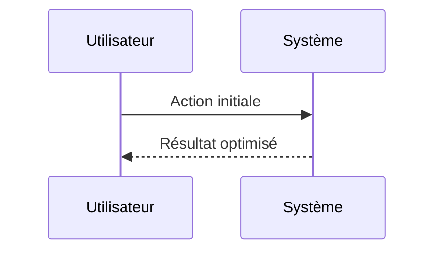

<!-- markdownlint-disable MD013 MD033 -->

[🇬🇧 English Version](./README.md)

# HSM Biométrique PQC (Biometric Post-Quantum Cryptography Hardware Security Module)

> **Résumé exécutif :** Un HSM (Hardware Security Module) de nouvelle génération intégrant nativement l'accélération matérielle pour les algorithmes PQC (NIST standards comme Kyber/Dilithium) combiné à un verrouillage cryptographique biométrique continu (capteurs capacitifs et infrarouges intégrés au châssis du serveur qui déchiffrent le master secret uniquement lors de la présence physique authentifiée multi-facteur et multi-personnes). Avec l'arrivée imminente de Q-Day (où les ordinateurs quantiques casseront RSA/ECC), les infrastructures existantes doivent migrer vers des algorithmes PQC (Post-Quantum Cryptography).

---

## 1. Aperçu visuel & Effet Wahou

## 2. La thèse contrariante (Peter Thiel Style)

**La croyance populaire :** Les solutions logicielles seules peuvent résoudre ce problème.
**La vérité cachée :** Un SaaS ne peut pas stocker physiquement et de manière isolée des clefs de niveau étatique (air-gapped). Les HSM actuels n'ont pas la puissance de calcul FPGA/ASIC requise pour les signatures PQC massives sans créer un goulot d'étranglement majeur de latence, et aucun n'intègre un verrouillage par "preuve de présence physique multi-biométrique" au niveau matériel.

## 3. Le problème & La cible

- **Modèle économique :** B2B
- **Cible précise :** Infrastructures critiques (gouvernements, banques centrales, opérateurs d'importance vitale), data centers de niveau 4, et fournisseurs d'identité souveraine qui gèrent des clefs racines.
- **La douleur urgente :** Avec l'arrivée imminente de Q-Day (où les ordinateurs quantiques casseront RSA/ECC), les infrastructures existantes doivent migrer vers des algorithmes PQC (Post-Quantum Cryptography). Cependant, la génération et le stockage de ces clefs PQC, beaucoup plus larges et complexes, nécessitent de nouveaux HSM physiques. De plus, le vecteur d'attaque de "l'insider threat" (un administrateur corrompu extrayant la clef avec accès physique) reste critique.

## 4. Architecture technique & Plomberie

## 5. Modèle économique & Viabilité financière

| Métrique                    | Valeur             |
| --------------------------- | ------------------ |
| Structure de prix           | Custom Pricing     |
| Objectif 12 mois            | 100 clients        |
| Calcul du CA (Target 100k€) | 100 \* 1000 = 100k |
| Marge brute estimée         | 80%                |

## 6. Moteur de distribution & Fossé défensif (Moat)

- **Stratégie d'acquisition :** Ventes B2B directes
- **Moat (Barrière à l'entrée) :** Un SaaS ne peut pas stocker physiquement et de manière isolée des clefs de niveau étatique (air-gapped). Les HSM actuels n'ont pas la puissance de calcul FPGA/ASIC requise pour les signatures PQC massives sans créer un goulot d'étranglement majeur de latence, et aucun n'intègre un verrouillage par "preuve de présence physique multi-biométrique" au niveau matériel.

## 7. Grille d'évaluation détaillée

| Critère                           | Score VC (/100) | Score Terrain (/100) |
| --------------------------------- | --------------- | -------------------- |
| Thèse & Monopole / Urgence        | -- / 25         | -- / 25              |
| Moat / Résistance aux LLM natifs  | -- / 25         | -- / 25              |
| Scalabilité / Friction d'adoption | -- / 25         | -- / 25              |
| Unit Economics / ROI direct       | -- / 25         | -- / 25              |
| **TOTAL**                         | **-- / 100**    | **-- / 100**         |

> **Verdict VC :** En attente d'évaluation.

> **Verdict Terrain :** En attente d'évaluation.
