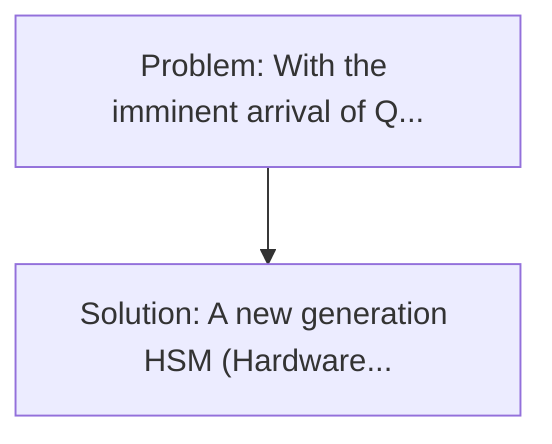
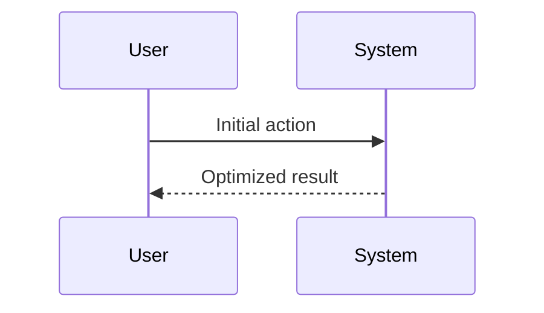

<!-- markdownlint-disable MD013 MD033 -->

[🇫🇷 Version Française](./README.fr.md)

# HSM Biometric PQC (Biometric Post-Quantum Cryptography Hardware Security Module)

> **Executive Summary:** A new generation HSM (Hardware Security Module) natively integrating hardware acceleration for PQC algorithms (NIST standards like Kyber/Dilithium) combined with a continuous biometric cryptographic lock (capacitive and infrared sensors embedded in the server chassis that decipher the secret master only during the multi-factor and multi-person authenticated physical presence). With the imminent arrival of Q-Day (where quantum computers will break RSA/ECC), existing infrastructures must migrate to PQC (Post-Quantum Cryptography) algorithms.

---

## 1. Visual Overview & Wow Effect

## 2. Contrarian Thesis (Peter Thiel Style)

**Popular Belief:** Generic software solutions can solve this.
**Hidden Truth:** A SaaS cannot physically and in isolation store state-level keys (air-gapped). Current HSMs do not have the FPGA/ASIC computing power required for massive PQC signatures without creating a major latency bottleneck, and none integrates a "multi-biometric physical presence proof" lock at the hardware level.

## 3. Problem & Target Market

- **Business Model:** B2B
- **Target Audience:** Critical infrastructure (governments, central banks, vital operators), level 4 data centres and sovereign identity providers that manage root keys.
- **Urgent Pain Point:** With the imminent arrival of Q-Day (where quantum computers will break RSA/ECC), existing infrastructures must migrate to PQC (Post-Quantum Cryptography) algorithms. However, the generation and storage of these much larger and complex PQC keys require new physical HSMs. Moreover, the attack vector of the "insider threat" (a corrupt administrator extracting the key with physical access) remains critical.

## 4. Technical Architecture & Infrastructure

## 5. Business Model & Financial Viability

| Metric                 | Value              |
| ---------------------- | ------------------ |
| Pricing Structure      | Custom Pricing     |
| 12-Month Target        | 100 customers      |
| Revenue Formula        | 100 \* 1000 = 100k |
| Estimated Gross Margin | 80%                |

## 6. Distribution Engine & Moat

- **Acquisition Strategy:** Direct B2B Sales
- **Moat (Defensibility):** A SaaS cannot physically and in isolation store state-level keys (air-gapped). Current HSMs do not have the FPGA/ASIC computing power required for massive PQC signatures without creating a major latency bottleneck, and none integrates a "multi-biometric physical presence proof" lock at the hardware level.

## 7. Detailed Evaluation Grid

| Criterion                   | VC Score (/100) | Market Score (/100) |
| --------------------------- | --------------- | ------------------- |
| Thesis & Monopoly / Urgency | -- / 25         | -- / 25             |
| Moat / LLM Immunity         | -- / 25         | -- / 25             |
| Scalability / UX Friction   | -- / 25         | -- / 25             |
| Unit Economics / ROI        | -- / 25         | -- / 25             |
| **TOTAL**                   | **-- / 100**    | **-- / 100**        |

> **VC Verdict:** Pending evaluation.

> **Market Verdict:** Pending evaluation.
