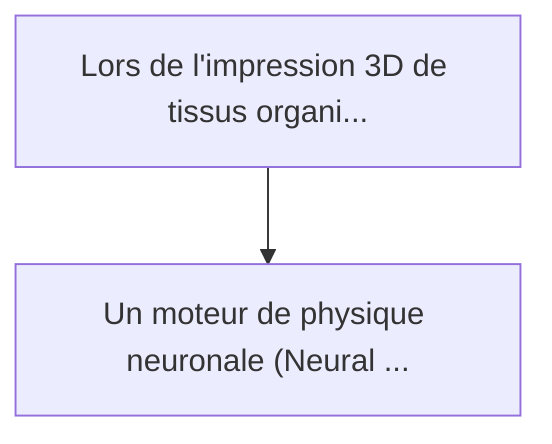
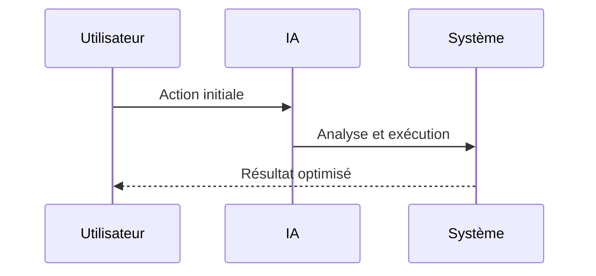

<!-- markdownlint-disable MD013 MD028 MD033 MD039 MD041 -->

[🇬🇧 English Version](./README.md)

# Bioprinting Microfluidic Neural Physics Engine

> **Résumé exécutif :** Un moteur de physique neuronale (Neural Physics Engine) entraîné sur des milliers de simulations CFD haute-fidélité de bio-encres. Intégré directem...

---

## 1. Aperçu visuel & Effet Wahou

## 2. La thèse contrariante (Peter Thiel Style)

La croyance populaire : Les solutions génériques peuvent résoudre cela.
La vérité cachée : Un LLM ne comprend pas la mécanique des fluides non newtoniens. Un logiciel de CAO ou un slicer 3D standard ne prend pas en compte la dégradation cellulaire due à la contrainte de cisaillement ou l'affaissement des tissus mous sous la gravité avant polymérisation.

## 3. Le problème & La cible

Modèle économique : B2B
Cible précise : Fabricants d'imprimantes 3D bioprinting, laboratoires d'ingénierie tissulaire et startups de viande cultivée.
La douleur urgente : Lors de l'impression 3D de tissus organiques complexes (comme des réseaux vasculaires), les bio-encres non newtoniennes subissent des contraintes de cisaillement qui détruisent la viabilité cellulaire. Les réseaux s'effondrent souvent avant la réticulation car la dynamique des fluides à l'échelle micrométrique est imprévisible. Les simulations CFD classiques prennent des heures par couche, empêchant tout ajustement en temps réel pendant l'impression.

## 4. Architecture technique & Plomberie

## 5. Modèle économique & Viabilité financière

| Métrique                    | Valeur             |
| --------------------------- | ------------------ |
| Structure de prix           | Prix sur mesure    |
| Objectif 12 mois            | 100 clients        |
| Calcul du CA (Target 100k€) | 100 \* 1000 = 100k |
| Marge brute estimée         | 80%                |

## 6. Moteur de distribution & Fossé défensif (Moat)

Stratégie d'acquisition : Vente B2B directe
Moat (Barrière à l'entrée) : Un LLM ne comprend pas la mécanique des fluides non newtoniens. Un logiciel de CAO ou un slicer 3D standard ne prend pas en compte la dégradation cellulaire due à la contrainte de cisaillement ou l'affaissement des tissus mous sous la gravité avant polymérisation.

## 7. Grille d'évaluation détaillée

| Critère                           | Score VC (/100) | Score Terrain (/100) |
| --------------------------------- | --------------- | -------------------- |
| Thèse & Monopole / Urgence        | 21 / 25         | -- / 25              |
| Moat / Résistance aux LLM natifs  | 24 / 25         | -- / 25              |
| Scalabilité / Friction d'adoption | 18 / 25         | -- / 25              |
| Unit Economics / ROI direct       | 20 / 25         | -- / 25              |
| **TOTAL**                         | **83 / 100**    | **-- / 100**         |

> **Verdict VC :** Cette plateforme résout un goulet d'étranglement clé en médecine régénérative en combinant la physique profonde avec la simulation neuronale pour la fluidique des bio-encres. Les données d'entraînement hautement spécialisées sur des simulations CFD de haute fidélité créent un fossé technique massif que les modèles de fondation génériques ne peuvent pas reproduire. Bien que le passage à l'échelle nécessite de naviguer dans des ventes complexes en biotechnologie, le potentiel de monopole dans l'impression d'organes de nouvelle génération est immense.

> **Verdict Terrain :** En attente d'évaluation.
