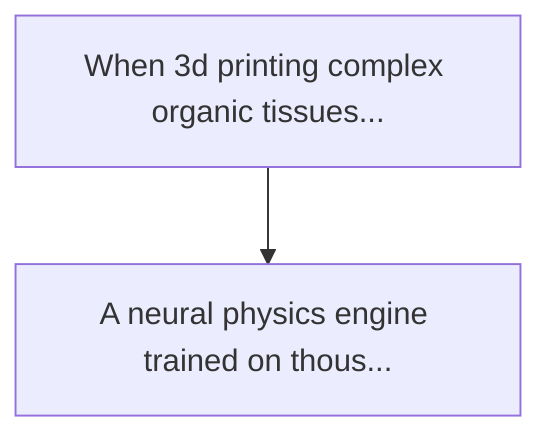
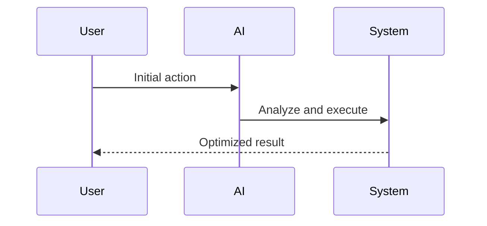

<!-- markdownlint-disable MD013 MD028 MD033 MD039 MD041 -->

[🇫🇷 Version Française](./README.fr.md)

# Bioprinting microfluidic neural physics engine

> **Executive Summary:** A neural physics engine trained on thousands of high-fidelity cfd simulations of bio-inks. directly integrated...

---

## 1. Visual Overview & Wow Effect

## 2. Contrarian Thesis (Peter Thiel Style)

Popular Belief: Generic solutions can solve this.
Hidden Truth: A llm does not include the mechanics of non-newtonian fluids. a standard cad software or 3d slicer does not take into account cell degradation due to shear stress or subsidence of soft tissue under gravity before polymerization.

## 3. Problem & Target Market

Business Model: B2B
Target Audience: Manufacturers of 3d bioprinting printers, tissue engineering laboratories and grown meat startups.
Urgent Pain Point: When 3d printing complex organic tissues (such as vascular networks), non-newtonian bio-inks are subjected to shearing constraints that destroy cell viability. networks often collapse before cross-linking because the fluid dynamics on the micrometric scale are unpredictable. conventional cfd simulations take hours per layer, preventing any real-time adjustment during printing.

## 4. Technical Architecture & Infrastructure

## 5. Business Model & Financial Viability

| Metric                 | Value              |
| ---------------------- | ------------------ |
| Pricing Structure      | Custom Pricing     |
| 12-Month Target        | 100 customers      |
| Revenue Formula        | 100 \* 1000 = 100k |
| Estimated Gross Margin | 80%                |

## 6. Distribution Engine & Moat

Acquisition Strategy: Direct B2B Sales
Moat (Defensibility): A llm does not include the mechanics of non-newtonian fluids. a standard cad software or 3d slicer does not take into account cell degradation due to shear stress or subsidence of soft tissue under gravity before polymerization.

## 7. Detailed Evaluation Grid

| Criterion                   | VC Score (/100) | Market Score (/100) |
| --------------------------- | --------------- | ------------------- |
| Thesis & Monopoly / Urgency | -- / 25         | -- / 25             |
| Moat / LLM Immunity         | -- / 25         | -- / 25             |
| Scalability / UX Friction   | -- / 25         | -- / 25             |
| Unit Economics / ROI        | -- / 25         | -- / 25             |
| **TOTAL**                   | **-- / 100**    | **-- / 100**        |

> **VC Verdict:** Pending evaluation.

> **Market Verdict:** Pending evaluation.
