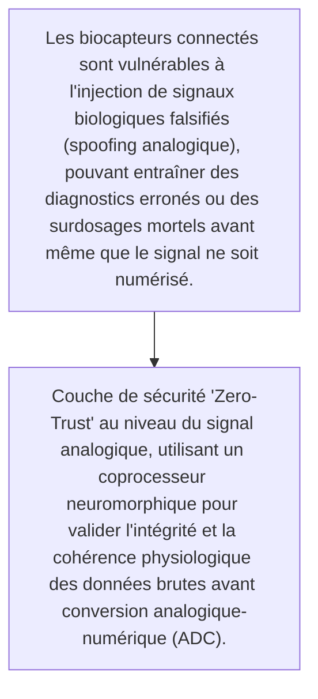
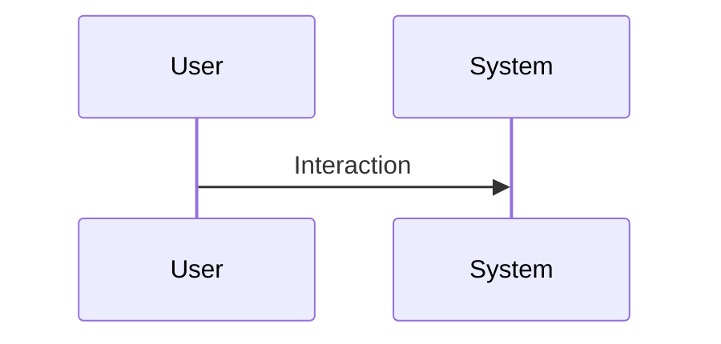

<!-- markdownlint-disable MD009 MD010 MD013 MD022 MD028 MD032 MD033 MD034 MD036 MD037 MD039 MD041 MD060 -->

[ 🇬🇧 English Version ](./README.md)

# Analog Bio-Shield

> **Résumé exécutif :** Couche de sécurité "Zero-Trust" au niveau du signal analogique, utilisant un coprocesseur neuromorphique pour valider l'intégrité et la cohérence physiologique des données brutes avant conversion analogique-numérique (ADC).

---

## 1. Aperçu visuel & Effet Wahou

## 2. La thèse contrariante (Peter Thiel Style)

- **La croyance populaire :** Les pare-feux logiciels traditionnels et les API de sécurité opèrent post-numérisation et sont complètement aveugles aux attaques physiques sur le capteur lui-même.
- **La vérité cachée :** Couche de sécurité "Zero-Trust" au niveau du signal analogique, utilisant un coprocesseur neuromorphique pour valider l'intégrité et la cohérence physiologique des données brutes avant conversion analogique-numérique (ADC).

## 3. Le problème & La cible

- **Modèle économique :** B2B
- **Cible précise :** Hôpitaux, laboratoires d'analyses médicales et fabricants de dispositifs médicaux implantables (pacemakers, pompes à insuline)
- **La douleur urgente :** Les biocapteurs connectés sont vulnérables à l'injection de signaux biologiques falsifiés (spoofing analogique), pouvant entraîner des diagnostics erronés ou des surdosages mortels avant même que le signal ne soit numérisé.

## 4. Architecture technique & Plomberie

## 5. Modèle économique & Viabilité financière

| Métrique                    | Valeur                                                          |
| --------------------------- | --------------------------------------------------------------- |
| Structure de prix           | [Prix / Modèle d'abonnement / Commission]                       |
| Objectif 12 mois            | [Nombre exact de clients/utilisateurs/transactions nécessaires] |
| Calcul du CA (Target 100k€) | [Formule mathématique exacte]                                   |
| Marge brute estimée         | [Marge en %]                                                    |

## 6. Moteur de distribution & Fossé défensif (Moat)

- **Stratégie d'acquisition :** [Viralité B2C, réseau C2C, acquisition B2B directe, adhésion dev M2M]
- **Moat (Barrière à l'entrée) :** Latence introduite par le filtrage matériel (critique pour les implants), nécessité d'une certification FDA/CE médicale longue et coûteuse.

## 7. Grille d'évaluation détaillée

| Critère                           | Score VC (/100) | Score Terrain (/100) |
| --------------------------------- | --------------- | -------------------- |
| Thèse & Monopole / Urgence        | -- / 25         | 22 / 25              |
| Moat / Résistance aux LLM natifs  | -- / 25         | 23 / 25              |
| Scalabilité / Friction d'adoption | -- / 25         | 15 / 25              |
| Unit Economics / ROI direct       | -- / 25         | 20 / 25              |
| **TOTAL**                         | -- / 100        | **80 / 100**         |

> **Verdict VC :** En attente d'évaluation.
> **Verdict Terrain :** Urgence modérée mais valeur stratégique à long terme. L'immunité aux LLM est bonne, reposant sur des modèles spécifiques. L'adoption présente des frictions notables qui pourraient ralentir la monétisation initiale.
