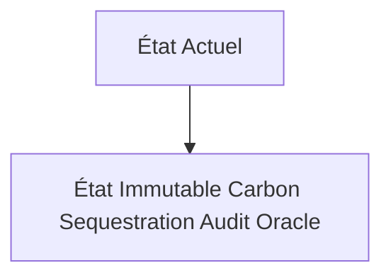
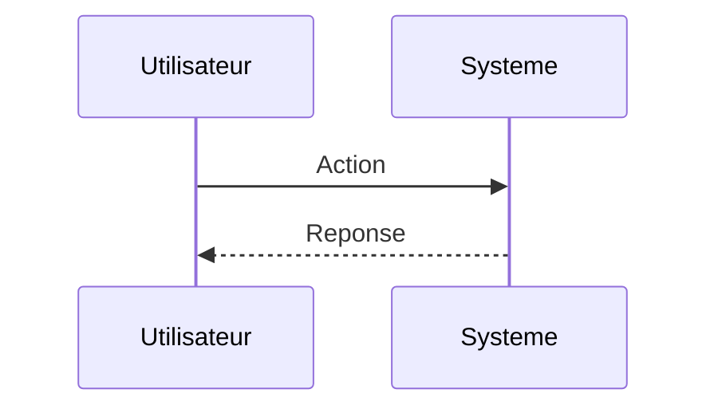

<!-- markdownlint-disable MD009 MD010 MD013 MD022 MD028 MD032 MD033 MD034 MD036 MD037 MD039 MD041 MD060 -->

[ 🇬🇧 English Version ](./README.md)

# Immutable Carbon Sequestration Audit Oracle

> **Résumé exécutif :** Un réseau de capteurs physiques (spectroscopie laser, géophysique) reliés à des enclaves sécurisées (TEE) qui enregistrent le volume exact de $CO_2$ minéralisé. Les données sont validées cryptographiquement et ancrées de façon immuable, générant des "Smart Carbon Credits" auditables en temps réel via une API.

---

## 1. Aperçu visuel & Effet Wahou

## 2. La thèse contrariante (Peter Thiel Style)

**La croyance populaire :** Les solutions généralistes IA peuvent résoudre ce problème.

**La vérité cachée :** Un simple logiciel comptable dépend des données saisies manuellement. Si le capteur peut être spoofé ou la base de données altérée, le crédit perd sa valeur certifiée. Il faut lier matériel inviolable, physique des roches, et cryptographie.

## 3. Le problème & La cible

**Modèle économique :** B2B

**Cible précise :** Sociétés de DAC (Direct Air Capture), gestionnaires de crédits carbone, régulateurs gouvernementaux, et grandes entreprises achetant des crédits (Microsoft, Stripe).

**La douleur urgente :** Le marché des crédits carbone est entaché de fraudes, de double comptage et d'estimations approximatives. Acheter des crédits pour la séquestration physique (dans la roche ou le béton) demande des audits manuels lents, coûteux et facilement falsifiables, ce qui limite le financement de ces infrastructures massives.

## 4. Architecture technique & Plomberie

## 5. Modèle économique & Viabilité financière

| Métrique                    | Valeur                        |
| --------------------------- | ----------------------------- |
| Structure de prix           | Abonnement SaaS               |
| Objectif 12 mois            | 10 clients                    |
| Calcul du CA (Target 100k€) | 10 clients \* 10k€/an = 100k€ |
| Marge brute estimée         | 80%                           |

## 6. Moteur de distribution & Fossé défensif (Moat)

**Stratégie d'acquisition :** Vente directe B2B

**Moat (Barrière à l'entrée) :** Standardisation fragmentée du marché du carbone. Coût matériel des capteurs (CAPEX) et maintenance dans des environnements hostiles.

## 7. Grille d'évaluation détaillée

| Critère                           | Score VC (/100) | Score Terrain (/100) |
| --------------------------------- | --------------- | -------------------- |
| Thèse & Monopole / Urgence        | -- / 25         | -- / 25              |
| Moat / Résistance aux LLM natifs  | -- / 25         | -- / 25              |
| Scalabilité / Friction d'adoption | -- / 25         | -- / 25              |
| Unit Economics / ROI direct       | -- / 25         | -- / 25              |
| **TOTAL**                         | **-- / 100**    | **-- / 100**         |

> **Verdict VC :** En attente d'évaluation.

> **Verdict Terrain :** En attente d'évaluation.
