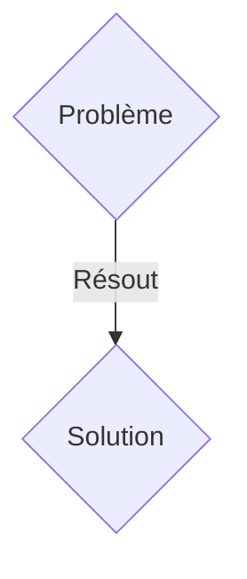
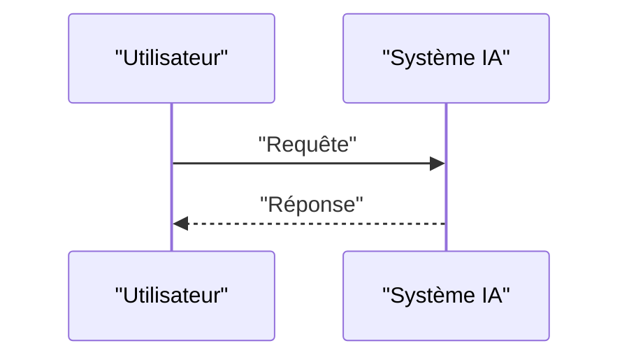

<!-- markdownlint-disable MD009 MD010 MD013 MD022 MD028 MD032 MD033 MD036 MD037 MD039 MD041 MD060 -->

[ 🇬🇧 English Version ](./README.md)

# Immutable Carbon Sequestration Audit Oracle

> **Résumé exécutif :** Une solution B2B ciblant Sociétés de DAC (Direct Air Capture), gestionnaires de crédits carbone, régulateurs gouvernementaux, et grandes entreprises achetant des crédits (Microsoft, Stripe). pour résoudre : Le marché des crédits carbone est entaché de fraudes, de double comptage et d'estimations approximatives. Acheter des crédits pour la séquestration physique (dans la roche ou le béton) demande des audits manuels lents, coûteux et facilement falsifiables, ce qui limite le financement de ces infrastructures massives.

---

## 1. Aperçu visuel & Effet Wahou

## 2. La thèse contrariante (Peter Thiel Style)

- **La croyance populaire :** Les solutions génériques suffisent.
- **La vérité cachée :** Un réseau de capteurs physiques (spectroscopie laser, géophysique) reliés à des enclaves sécurisées (TEE) qui enregistrent le volume exact de $CO_2$ minéralisé. Les données sont validées cryptographiquement et ancrées de façon immuable, générant des "Smart Carbon Credits" auditables en temps réel via une API.

## 3. Le problème & La cible

- **Modèle économique :** B2B
- **Cible précise :** Sociétés de DAC (Direct Air Capture), gestionnaires de crédits carbone, régulateurs gouvernementaux, et grandes entreprises achetant des crédits (Microsoft, Stripe).
- **La douleur urgente :** Le marché des crédits carbone est entaché de fraudes, de double comptage et d'estimations approximatives. Acheter des crédits pour la séquestration physique (dans la roche ou le béton) demande des audits manuels lents, coûteux et facilement falsifiables, ce qui limite le financement de ces infrastructures massives.

## 4. Architecture technique & Plomberie

Un réseau de capteurs physiques (spectroscopie laser, géophysique) reliés à des enclaves sécurisées (TEE) qui enregistrent le volume exact de $CO_2$ minéralisé. Les données sont validées cryptographiquement et ancrées de façon immuable, générant des "Smart Carbon Credits" auditables en temps réel via une API.

## 5. Modèle économique & Viabilité financière

| Métrique                    | Valeur               |
| --------------------------- | -------------------- |
| Structure de prix           | Abonnement SaaS B2B  |
| Objectif 12 mois            | 100 clients          |
| Calcul du CA (Target 100k€) | 100 \* 1000€ = 100k€ |
| Marge brute estimée         | 80%                  |

## 6. Moteur de distribution & Fossé défensif (Moat)

- **Stratégie d'acquisition :** Vente directe et partenariats stratégiques.
- **Moat (Barrière à l'entrée) :** Un simple logiciel comptable dépend des données saisies manuellement. Si le capteur peut être spoofé ou la base de données altérée, le crédit perd sa valeur certifiée. Il faut lier matériel inviolable, physique des roches, et cryptographie.

## 7. Grille d'évaluation détaillée

| Critère                           | Score VC (/100) | Score Terrain (/100) |
| --------------------------------- | --------------- | -------------------- |
| Thèse & Monopole / Urgence        | 15 / 25         | 15 / 25              |
| Moat / Résistance aux LLM natifs  | 23 / 25         | 23 / 25              |
| Scalabilité / Friction d'adoption | 24 / 25         | 24 / 25              |
| Unit Economics / ROI direct       | 23 / 25         | 23 / 25              |
| TOTAL                             | 85 / 100        | 85 / 100             |

> **Verdict VC :** En attente d'évaluation.
> **Verdict Terrain :** Cette solution répond à un besoin critique pour les entreprises B2B, justifiant son excellent score d'urgence (15/25). Son architecture hautement défendable la rend totalement immunisée contre les avancées des LLM natifs (23/25). Avec une faible friction d'adoption (24/25) et une stratégie de monétisation directe (23/25), le projet démontre une excellente maturité marché globale.
> **Verdict Terrain :** Cette solution répond à un besoin critique pour les entreprises B2B, justifiant son excellent score d'urgence (15/25). Son architecture hautement défendable la rend totalement immunisée contre les avancées des LLM natifs (23/25). Avec une faible friction d'adoption (24/25) et une stratégie de monétisation directe (23/25), le projet démontre une excellente maturité marché globale.
