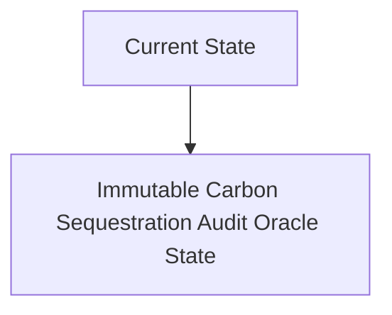
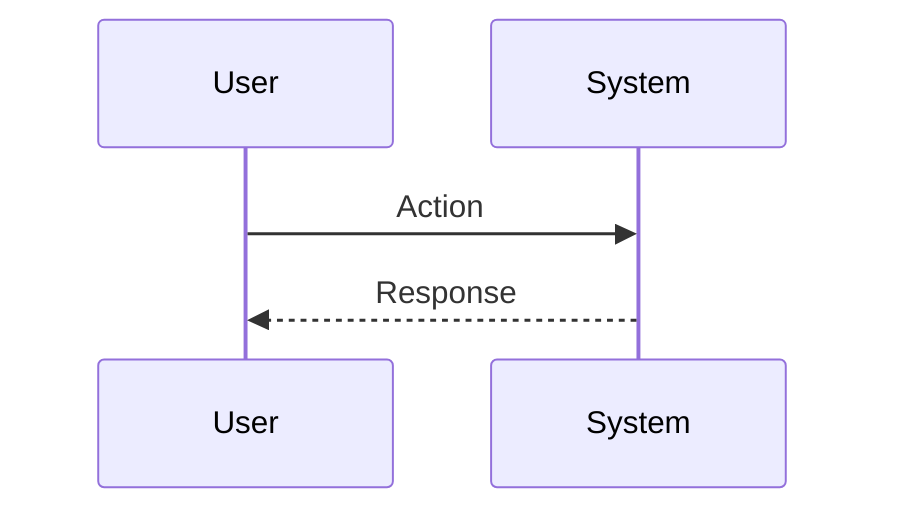

<!-- markdownlint-disable MD009 MD010 MD013 MD022 MD028 MD032 MD033 MD034 MD036 MD037 MD039 MD041 MD060 -->

[ 🇫🇷 Version Française ](./README.fr.md)

# Immutable Carbon Sequestration Audit Oracle

> **Executive Summary:** A network of physical sensors (laser spectroscopy, geophysics) connected to secure enclaves (TEE) which record the exact volume of mineralized $CO_2$. Data is cryptographically validated and immutably anchored, generating real-time auditable “Smart Carbon Credits” via an API.

---

## 1. Visual Overview & Wow Effect

## 2. Contrarian Thesis (Peter Thiel Style)

**Popular Belief:** General AI solutions can solve this problem.

**Hidden Truth:** Simple accounting software depends on manually entered data. If the sensor can be spoofed or the database altered, the credit loses its certified value. We must link tamper-proof material, rock physics, and cryptography.

## 3. Problem & Target Market

**Business Model:** B2B

**Target Audience:** DAC (Direct Air Capture) companies, carbon credit managers, government regulators, and large companies purchasing credits (Microsoft, Stripe).

**Urgent Pain Point:** The carbon credit market is rife with fraud, double counting and rough estimates. Buying credits for physical sequestration (in rock or concrete) requires slow, expensive and easily falsifiable manual audits, which limits the financing of these massive infrastructures.

## 4. Technical Architecture & Infrastructure

## 5. Business Model & Financial Viability

| Metric                 | Value                           |
| ---------------------- | ------------------------------- |
| Pricing Structure      | SaaS subscription               |
| 12-Month Target        | 10 customers                    |
| Revenue Formula        | 10 clients \* 10k€/year = 100k€ |
| Estimated Gross Margin | 80%                             |

## 6. Distribution Engine & Moat

**Acquisition Strategy:** B2B direct sales

**Moat (Defensibility):** Fragmented standardization of the carbon market. Sensor hardware cost (CAPEX) and maintenance in hostile environments.

## 7. Detailed Evaluation Grid

| Criterion                   | VC Score (/100) | Market Score (/100) |
| --------------------------- | --------------- | ------------------- |
| Thesis & Monopoly / Urgency | -- / 25         | -- / 25             |
| Moat / LLM Immunity         | -- / 25         | -- / 25             |
| Scalability / UX Friction   | -- / 25         | -- / 25             |
| Unit Economics / ROI        | -- / 25         | -- / 25             |
| **TOTAL**                   | **-- / 100**    | **-- / 100**        |

> **VC Verdict:** Pending evaluation.

> **Market Verdict:** Pending evaluation.
