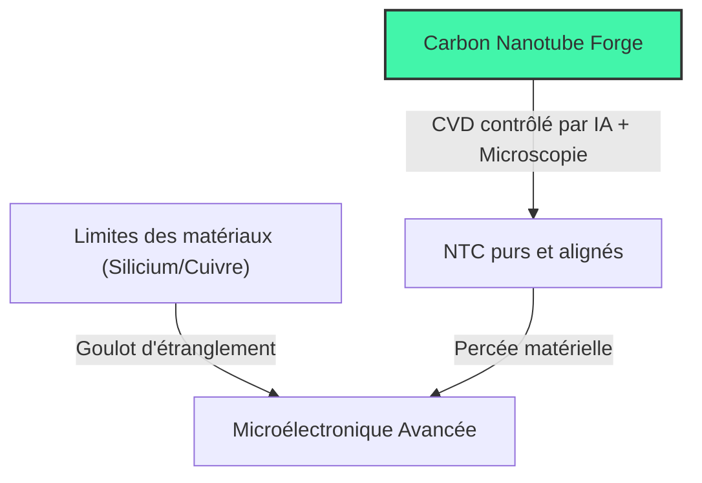
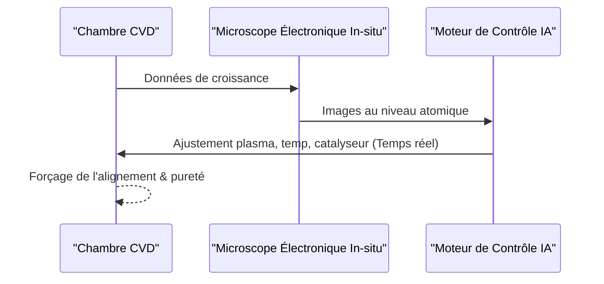

<!-- markdownlint-disable MD009 MD010 MD013 MD022 MD028 MD032 MD033 MD034 MD036 MD037 MD039 MD041 MD058 MD060 -->

[ 🇬🇧 English Version ](./README.md)

# Carbon Nanotube Forge

> **Résumé exécutif :** Un système de dépôt CVD assisté par IA et robotique de précision, permettant la production à l'échelle industrielle de nanotubes de carbone purs et alignés pour la microélectronique et les batteries avancées.

---

## 1. Aperçu visuel & Effet Wahou

## 2. La thèse contrariante (Peter Thiel Style)

**La croyance populaire :** Les nanotubes de carbone resteront éternellement un "matériau du futur", impossible à produire avec la pureté et l'alignement requis pour l'industrie des semi-conducteurs.
**La vérité cachée :** Le problème n'est pas le matériau, mais l'absence de retour d'information en temps réel au niveau atomique pendant la synthèse—un obstacle que la microscopie in situ pilotée par l'IA peut désormais surmonter.

## 3. Le problème & La cible

**Modèle économique :** B2B
**Cible précise :** Les fonderies de semi-conducteurs (TSMC, Intel), l'industrie aérospatiale, et les fabricants de batteries.
**La douleur urgente :** La fabrication actuelle ne produit que des "plats de spaghettis" impurs, inutilisables pour la microélectronique avancée, alors que l'industrie se heurte aux limites physiques du silicium et du cuivre.

## 4. Architecture technique & Plomberie

## 5. Modèle économique & Viabilité financière

| Métrique                        | Valeur                                                 |
| :------------------------------ | :----------------------------------------------------- |
| **Structure de prix**           | Location d'équipement + maintenance / Licence IP       |
| **Objectif 12 mois**            | 1 à 2 programmes pilotes avec des labos R&D            |
| **Calcul du CA (Target 100k€)** | 1 programme pilote \* 150k€ = 150k€ ARR                |
| **Marge brute estimée**         | 60% (Forte intensité capitalistique & coûts matériels) |

## 6. Moteur de distribution & Fossé défensif (Moat)

**Stratégie d'acquisition :** Ventes directes (B2B) aux départements R&D deep tech et partenariats stratégiques avec de grandes fonderies de semi-conducteurs.
**Moat (Barrière à l'entrée) :** Intensité capitalistique extrême, défis d'ingénierie matérielle (vide poussé, lasers), et propriété intellectuelle (IP) sur le contrôle du processus de fabrication qui échappent aux logiciels SaaS classiques.

## 7. Grille d'évaluation détaillée

| Critère                               | Score VC (/100) | Score Terrain (/100) |
| :------------------------------------ | :-------------- | :------------------- |
| **Thèse & Monopole / Urgence**        | -- / 25         | 22 / 25              |
| **Moat / Résistance aux LLM natifs**  | -- / 25         | 25 / 25              |
| **Scalabilité / Friction d'adoption** | -- / 25         | 14 / 25              |
| **Unit Economics / ROI direct**       | -- / 25         | 20 / 25              |
| **TOTAL**                             | **-- / 100**    | **81 / 100**         |

> **Verdict VC :** En attente d'évaluation.

> **Verdict Terrain :** Carbon-nanotube-forge répond à un besoin urgent de matériaux de nouvelle génération avec un potentiel de marché massif. La boucle physico-informatique offre une immunité totale aux LLM purement numériques. L'adoption nécessite des dépenses d'investissement importantes, mais le ROI sur les percées matérielles justifie le prix.
