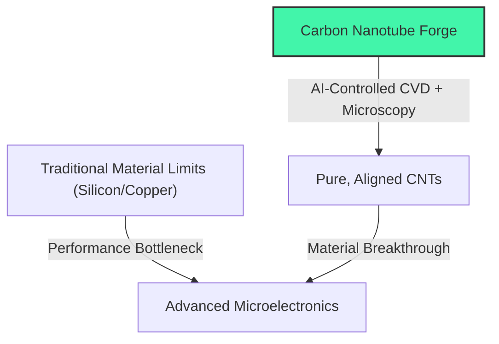
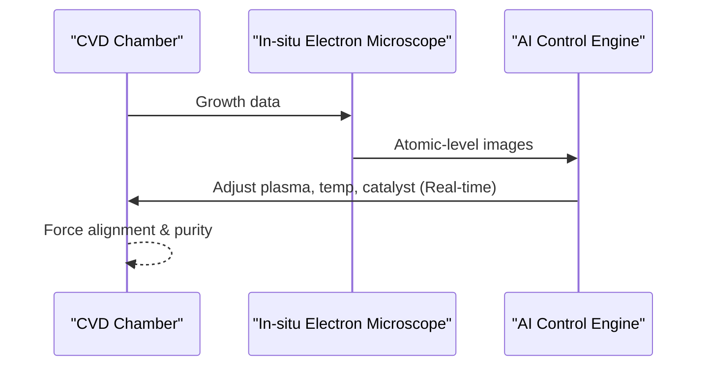

<!-- markdownlint-disable MD009 MD010 MD013 MD022 MD028 MD032 MD033 MD034 MD036 MD037 MD039 MD041 MD058 MD060 -->

[ 🇫🇷 Version Française ](./README.fr.md)

# Carbon Nanotube Forge

> **Executive Summary:** An AI-assisted and precision robotics CVD system enabling industrial-scale production of pure, aligned carbon nanotubes for advanced microelectronics and battery technologies.

---

## 1. Visual Overview & Wow Effect

## 2. Contrarian Thesis (Peter Thiel Style)

**Popular Belief:** Carbon nanotubes are a perpetual "material of the future" that will never reach industrial purity or alignment necessary for real-world semiconductor applications.
**Hidden Truth:** The problem isn't the material, but the lack of real-time, atomic-level feedback during synthesis—a barrier that AI-driven in-situ microscopy can now overcome.

## 3. Problem & Target Market

**Business Model:** B2B
**Target Audience:** Semiconductor foundries (TSMC, Intel), aerospace industry, and battery manufacturers reaching the physical limits of traditional materials.
**Urgent Pain Point:** Current manufacturing produces impure "spaghetti-like" CNTs unusable for advanced microelectronics, while Moore's Law and energy density demands require a leap beyond silicon and copper.

## 4. Technical Architecture & Infrastructure

## 5. Business Model & Financial Viability

| Metric                     | Value                                        |
| :------------------------- | :------------------------------------------- |
| **Pricing Structure**      | Equipment lease + maintenance / IP licensing |
| **12-Month Target**        | 1 - 2 pilot programs with R&D labs           |
| **Revenue Formula**        | 1 pilot program \* €150k = €150k ARR         |
| **Estimated Gross Margin** | 60% (High Capex & Hardware costs)            |

## 6. Distribution Engine & Moat

**Acquisition Strategy:** Direct B2B sales to deep tech R&D departments and strategic partnerships with major semiconductor foundries.
**Moat (Defensibility):** Extreme capital intensity, hardware engineering complexity, and proprietary AI algorithms for in-situ process control that cannot be replicated by software alone.

## 7. Detailed Evaluation Grid

| Criterion                       | VC Score (/100) | Market Score (/100) |
| :------------------------------ | :-------------- | :------------------ |
| **Thesis & Monopoly / Urgency** | -- / 25         | 22 / 25             |
| **Moat / LLM Immunity**         | -- / 25         | 25 / 25             |
| **Scalability / UX Friction**   | -- / 25         | 14 / 25             |
| **Unit Economics / ROI**        | -- / 25         | 20 / 25             |
| **TOTAL**                       | **-- / 100**    | **81 / 100**        |

> **VC Verdict:** Pending evaluation.

> **Market Verdict:** Carbon-nanotube-forge addresses an urgent need in next-gen materials with massive market potential. The physical-computational loop provides total immunity to purely digital LLMs. Adoption requires significant capital expenditure, but the ROI on material breakthroughs justifies the pricing.
