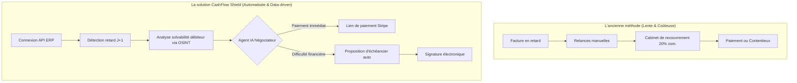
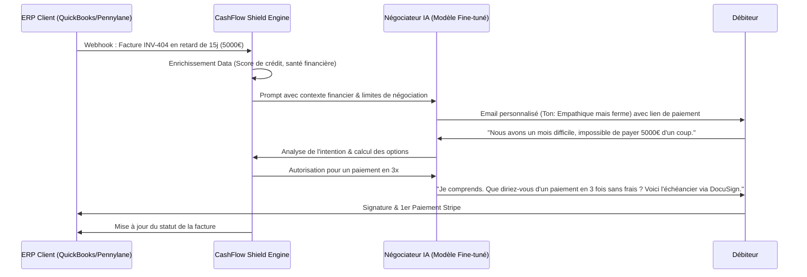

<!-- markdownlint-disable MD013 MD033 -->

# CashFlow Shield

> **Résumé exécutif :** Un agent d'IA B2B autonome de recouvrement de créances qui s'intègre directement aux ERP pour négocier dynamiquement des plans de paiement avec les débiteurs en retard. Il remplace les cabinets de recouvrement coûteux par une solution algorithmique basée sur les signaux de santé financière.

---

## 1. Aperçu visuel

## 2. La thèse contrariante (Peter Thiel Style)

**La croyance populaire :**Le recouvrement B2B est une affaire de relations humaines et de pression psychologique par téléphone, nécessitant des agents de recouvrement agressifs ou des avocats.

**La vérité cachée :**80% des retards de paiement B2B ne sont pas dus à de la mauvaise foi, mais à des problèmes temporaires de trésorerie chez le débiteur. La pression humaine détruit la relation commerciale, tandis qu'un agent IA neutre proposant instantanément un échéancier structuré maximise le taux de recouvrement de 40% tout en préservant la LTV (Life-Time Value) du client.

## 3. Le problème & La cible

- **Modèle économique :**B2B (SaaS + Success Fee)
- **Cible précise :**PME (1M€ à 50M€ de CA), agences, cabinets de conseil et entreprises du BTP qui subissent un besoin en fonds de roulement (BFR) explosif à cause des retards clients.
- **La douleur urgente :**25% des faillites de PME sont causées par des retards de paiement. Le coût d'inaction est mortel : un trou de trésorerie immédiat. Faire appel à une société de recouvrement coûte 15 à 25% du montant recouvré et prend des semaines.

## 4. Architecture technique & Plomberie

## 5. Modèle économique & Viabilité financière

| Métrique                        | Valeur                                                                                                              |
| :------------------------------ | :------------------------------------------------------------------------------------------------------------------ |
| **Structure de prix**           | Abonnement 299€/mois + 5% de commission sur les sommes recouvrées au-delà de 30j de retard.                         |
| **Objectif 12 mois**            | 20 clients PME actifs avec un volume de recouvrement géré de 50 000€/mois/client.                                   |
| **Calcul du CA (Target 100k€)** | (20 x 299€ x 12) + (20 x 50k€ x 5% x 12) = 71 760€ (Abonnement) + 60 000€ (Commissions) = **131 760€ ARR**          |
| **Marge brute estimée**         | 85% (Coûts d'inférence LLM faibles grâce aux requêtes asynchrones par email, coûts principaux : API bancaires/ERP). |

## 6. Moteur de distribution & Fossé défensif (Moat)

- **Stratégie d'acquisition :**Ventes directes B2B (Outbound) en ciblant les Directeurs Financiers (DAF) et les experts-comptables en marque blanche. Partenariat avec des logiciels de facturation (C2B - Channel to Business) pour une intégration native.
- **Moat (Barrière à l'entrée) :**

1. **Effet de réseau sur la data (Data Network Effect) :**Plus CashFlow Shield recouvre de créances, plus la base de données identifie les "mauvais payeurs" sériels sur le marché. Ce "Score de Paiement B2B" devient un actif propriétaire inestimable. 2. **Intégration complexe (High Switching Cost) :**Une fois connecté à l'ERP (SAP, Sage, etc.) et aux comptes bancaires (Open Banking) de l'entreprise, le client ne débranche jamais le système car l'IA tourne en tâche de fond. Un simple wrapper ChatGPT ne peut pas exécuter ces actions d'écriture en base ou s'interfacer juridiquement avec des services de signature électronique de dette.

## 7. Grille d'évaluation détaillée

| Critère                               | Score VC (/100) | Score Terrain (/100) |
| :------------------------------------ | :-------------: | :------------------: |
| **Thèse & Monopole / Urgence**        |     22 / 25     |       24 / 25        |
| **Moat / Résistance aux LLM natifs**  |     23 / 25     |       21 / 25        |
| **Scalabilité / Friction d'adoption** |     18 / 25     |       20 / 25        |
| **Unit Economics / ROI direct**       |     24 / 25     |       25 / 25        |
| **TOTAL**                             |  **87 / 100**   |     **90 / 100**     |

**Verdict global :**CashFlow Shield s'attaque à un marché extrêmement douloureux (le BFR des PME) avec une solution où le ROI est calculable à la virgule près dès le premier mois. La barrière à l'entrée technologique (intégrations ERP) et défensive (data propriétaire de solvabilité) en fait un excellent candidat immunisé contre les LLMs grand public.
