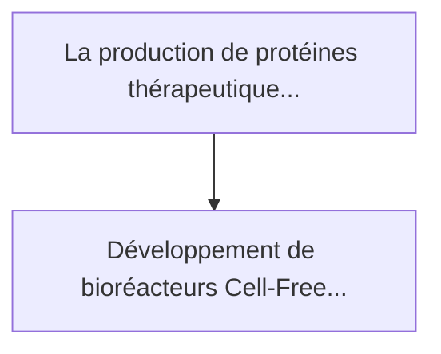
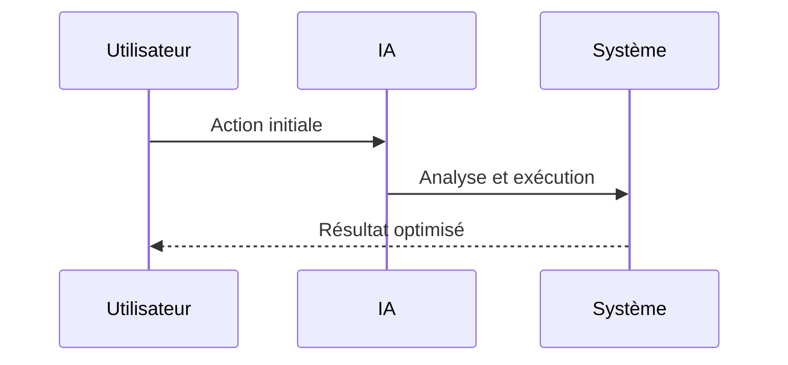

<!-- markdownlint-disable MD013 MD028 MD033 MD039 MD041 -->

[🇬🇧 English Version](./README.md)

# Cell-Free Protein Reactor

> **Résumé exécutif :** Développement de bioréacteurs "Cell-Free" (sans cellules) à l'échelle industrielle continue. La machinerie moléculaire (ribosomes, enzymes, cofacte...

---

## 1. Aperçu visuel & Effet Wahou

## 2. La thèse contrariante (Peter Thiel Style)

La croyance populaire : Les solutions génériques peuvent résoudre cela.
La vérité cachée : C'est un verrou fondamental de bio-ingénierie physique et chimique. L'optimisation des réactions enzymatiques hors d'une membrane cellulaire, le recyclage de l'ATP et la purification en flux continu nécessitent une expertise profonde en microfluidique, chimie des polymères et biochimie, loin des capacités d'un logiciel ou d'un SaaS d'optimisation.

## 3. Le problème & La cible

Modèle économique : B2B
Cible précise : Entreprises pharmaceutiques, bioproduction (CDMOs), startups de biologie de synthèse, et cosmétiques.
La douleur urgente : La production de protéines thérapeutiques, d'anticorps ou d'enzymes dépend de la culture de cellules vivantes (ex: CHO, E. coli) dans d'immenses bioréacteurs. Ce processus est lent (des semaines), vulnérable aux contaminations virales, et limité par la toxicité des protéines pour la cellule hôte (qui meurt si on produit certaines molécules).

## 4. Architecture technique & Plomberie

## 5. Modèle économique & Viabilité financière

| Métrique                    | Valeur             |
| --------------------------- | ------------------ |
| Structure de prix           | Prix sur mesure    |
| Objectif 12 mois            | 100 clients        |
| Calcul du CA (Target 100k€) | 100 \* 1000 = 100k |
| Marge brute estimée         | 80%                |

## 6. Moteur de distribution & Fossé défensif (Moat)

Stratégie d'acquisition : Vente B2B directe
Moat (Barrière à l'entrée) : C'est un verrou fondamental de bio-ingénierie physique et chimique. L'optimisation des réactions enzymatiques hors d'une membrane cellulaire, le recyclage de l'ATP et la purification en flux continu nécessitent une expertise profonde en microfluidique, chimie des polymères et biochimie, loin des capacités d'un logiciel ou d'un SaaS d'optimisation.

## 7. Grille d'évaluation détaillée

| Critère                           | Score VC (/100) | Score Terrain (/100) |
| --------------------------------- | --------------- | -------------------- |
| Thèse & Monopole / Urgence        | -- / 25         | -- / 25              |
| Moat / Résistance aux LLM natifs  | -- / 25         | -- / 25              |
| Scalabilité / Friction d'adoption | -- / 25         | -- / 25              |
| Unit Economics / ROI direct       | -- / 25         | -- / 25              |
| **TOTAL**                         | **-- / 100**    | **-- / 100**         |

> **Verdict VC :** En attente d'évaluation.

> **Verdict Terrain :** En attente d'évaluation.
