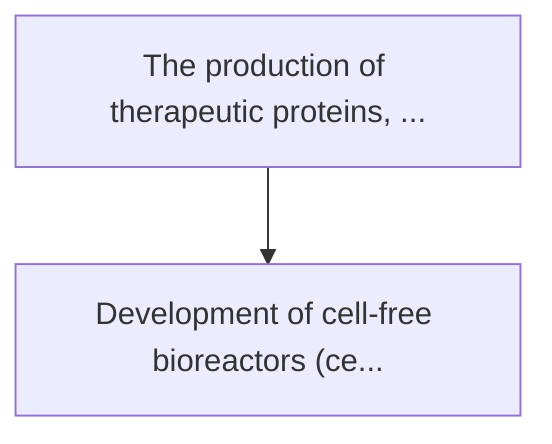
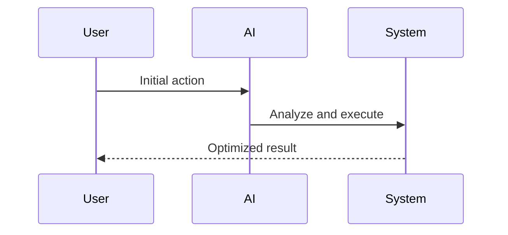

<!-- markdownlint-disable MD013 MD028 MD033 MD039 MD041 -->

[ 🇫🇷 Version Française ](./README.fr.md)

# Cell-free protein reactor

> **Executive Summary:** Development of cell-free bioreactors (cell-free) on a continuous industrial scale. molecular machinery (ribosomes, enzymes, cofact...

---

## 1. Visual Overview & Wow Effect

## 2. Contrarian Thesis (Peter Thiel Style)

Popular Belief: Generic solutions can solve this.
Hidden Truth: It is a fundamental lock in physical and chemical bioengineering. optimizing enzyme reactions outside a cell membrane, recycling atp and continuous flow purification require deep expertise in microfluidic, polymer chemistry and biochemistry, far from the capabilities of a software or saas optimization.

## 3. Problem & Target Market

Business Model: B2B
Target Audience: Pharmaceutical companies, bioproduction (cdmos), synthetic biology startups, and cosmetics.
Urgent Pain Point: The production of therapeutic proteins, antibodies or enzymes depends on the culture of living cells (e.g. cho, e. coli) in huge bioreactors. this process is slow (weeks), vulnerable to viral contamination, and limited by the toxicity of proteins to the host cell (which dies if some molecules are produced).

## 4. Technical Architecture & Infrastructure

## 5. Business Model & Financial Viability

| Metric                 | Value              |
| ---------------------- | ------------------ |
| Pricing Structure      | Custom Pricing     |
| 12-Month Target        | 100 customers      |
| Revenue Formula        | 100 \* 1000 = 100k |
| Estimated Gross Margin | 80%                |

## 6. Distribution Engine & Moat

Acquisition Strategy: Direct B2B Sales
Moat (Defensibility): It is a fundamental lock in physical and chemical bioengineering. optimizing enzyme reactions outside a cell membrane, recycling atp and continuous flow purification require deep expertise in microfluidic, polymer chemistry and biochemistry, far from the capabilities of a software or saas optimization.

## 7. Detailed Evaluation Grid

| Criterion                   | VC Score (/100) | Market Score (/100) |
| --------------------------- | --------------- | ------------------- |
| Thesis & Monopoly / Urgency | -- / 25         | -- / 25             |
| Moat / LLM Immunity         | -- / 25         | -- / 25             |
| Scalability / UX Friction   | -- / 25         | -- / 25             |
| Unit Economics / ROI        | -- / 25         | -- / 25             |
| **TOTAL**                   | **-- / 100**    | **-- / 100**        |

> **VC Verdict:** Pending evaluation.

> **Market Verdict:** Pending evaluation.
