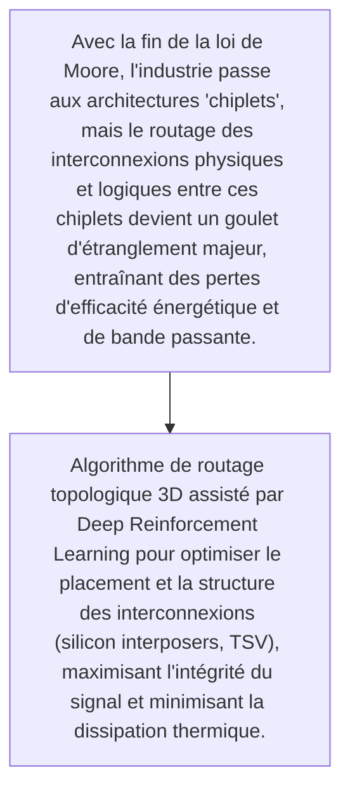
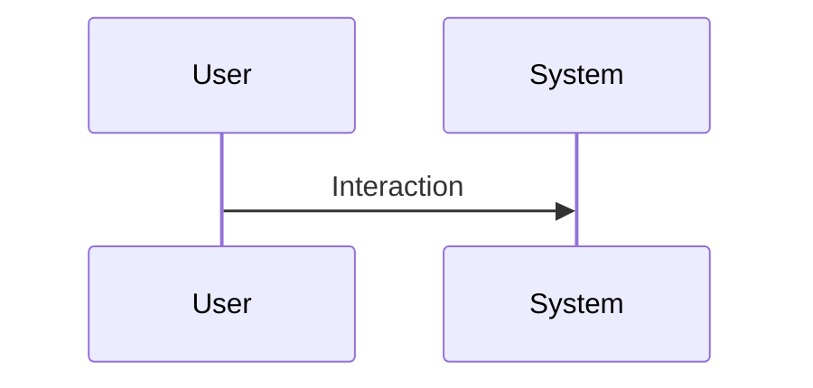

<!-- markdownlint-disable MD009 MD010 MD013 MD022 MD028 MD032 MD033 MD034 MD036 MD037 MD039 MD041 MD060 -->

[ 🇬🇧 English Version ](./README.md)

# Die-to-Die Fabric

> **Résumé exécutif :** Algorithme de routage topologique 3D assisté par Deep Reinforcement Learning pour optimiser le placement et la structure des interconnexions (silicon interposers, TSV), maximisant l'intégrité du signal et minimisant la dissipation thermique.

---

## 1. Aperçu visuel & Effet Wahou

## 2. La thèse contrariante (Peter Thiel Style)

- **La croyance populaire :** Nécessite une intégration profonde avec les outils EDA (Electronic Design Automation) vieillissants, la manipulation de fichiers de conception IP très lourds et protégés, et la gestion des contraintes physiques de fabrication quantique/nanométrique.
- **La vérité cachée :** Algorithme de routage topologique 3D assisté par Deep Reinforcement Learning pour optimiser le placement et la structure des interconnexions (silicon interposers, TSV), maximisant l'intégrité du signal et minimisant la dissipation thermique.

## 3. Le problème & La cible

- **Modèle économique :** B2B
- **Cible précise :** Fondeurs (TSMC, Intel), concepteurs de puces (Nvidia, AMD, startups d'accélérateurs IA)
- **La douleur urgente :** Avec la fin de la loi de Moore, l'industrie passe aux architectures 'chiplets', mais le routage des interconnexions physiques et logiques entre ces chiplets devient un goulet d'étranglement majeur, entraînant des pertes d'efficacité énergétique et de bande passante.

## 4. Architecture technique & Plomberie

## 5. Modèle économique & Viabilité financière

| Métrique                    | Valeur                                                          |
| --------------------------- | --------------------------------------------------------------- |
| Structure de prix           | [Prix / Modèle d'abonnement / Commission]                       |
| Objectif 12 mois            | [Nombre exact de clients/utilisateurs/transactions nécessaires] |
| Calcul du CA (Target 100k€) | [Formule mathématique exacte]                                   |
| Marge brute estimée         | [Marge en %]                                                    |

## 6. Moteur de distribution & Fossé défensif (Moat)

- **Stratégie d'acquisition :** [Viralité B2C, réseau C2C, acquisition B2B directe, adhésion dev M2M]
- **Moat (Barrière à l'entrée) :** Monopole des géants EDA (Synopsys, Cadence) difficiles à déloger, cycle de vente de plusieurs années, extrême exigence de précision (zéro droit à l'erreur).

## 7. Grille d'évaluation détaillée

| Critère                           | Score VC (/100) | Score Terrain (/100) |
| --------------------------------- | --------------- | -------------------- |
| Thèse & Monopole / Urgence        | -- / 25         | 24 / 25              |
| Moat / Résistance aux LLM natifs  | -- / 25         | 25 / 25              |
| Scalabilité / Friction d'adoption | -- / 25         | 14 / 25              |
| Unit Economics / ROI direct       | -- / 25         | 21 / 25              |
| **TOTAL**                         | -- / 100        | **84 / 100**         |

> **Verdict VC :** En attente d'évaluation.
> **Verdict Terrain :** Forte urgence et valeur évidente pour la cible. La résistance aux LLM est élevée grâce à une intégration matérielle ou physique forte. Malgré quelques frictions d'adoption, la monétisation B2B est très claire.
