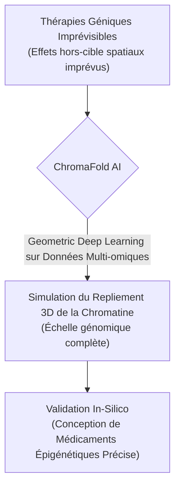
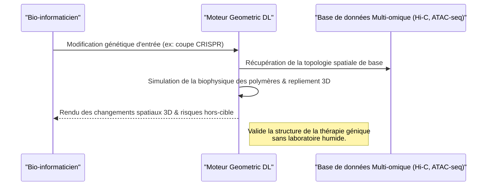

<!-- markdownlint-disable MD009 MD010 MD013 MD022 MD028 MD032 MD033 MD034 MD036 MD037 MD039 MD041 MD060 -->

[ 🇬🇧 English Version ](./README.md)

# ChromaFold AI

> **Résumé exécutif :** ChromaFold AI est le premier moteur de prédiction de l'architecture 3D de la chromatine à l'échelle du génome grâce au Geometric Deep Learning, permettant à l'industrie pharmaceutique de simuler et d'éviter les effets "hors-cible" spatiaux des thérapies géniques avant les essais en laboratoire.

---

## 1. Aperçu visuel & Effet Wahou

## 2. La thèse contrariante (Peter Thiel Style)

**La croyance populaire :** La clé pour guérir les maladies génétiques réside entièrement dans la cartographie des séquences d'ADN linéaires ou la prédiction de la structure de protéines isolées (comme AlphaFold).
**La vérité cachée :** Le repliement physique 3D de l'ensemble du brin d'ADN (l'architecture de la chromatine) dicte quels gènes sont actifs ou réprimés. Sans comprendre cette topologie spatiale 3D, la modification d'une séquence linéaire (ex: via CRISPR) provoque souvent des effets "hors-cible" catastrophiques et involontaires en raison de la proximité physique à l'intérieur du noyau.

## 3. Le problème & La cible

**Modèle économique :** B2B
**Cible précise :** Sociétés pharmaceutiques (Big Pharma), startups en thérapie génique et laboratoires de recherche académique.
**La douleur urgente :** Bien que des systèmes comme AlphaFold prédisent la structure 3D des protéines, la manière dont l'ADN entier se replie en 3D (l'architecture de la chromatine) à l'intérieur du noyau reste une boîte noire. Ce repliement détermine quels gènes sont activés ou réprimés. L'impossibilité de prédire ces structures 3D de la chromatine entraîne un taux d'échec massif (et des milliards perdus) lors de la conception de thérapies géniques ou de médicaments ciblant l'épigénétique, car l'effet "off-target" (hors-cible) spatial n'est pas modélisable.

## 4. Architecture technique & Plomberie

## 5. Modèle économique & Viabilité financière

| Métrique                | Valeur                                                                 |
| ----------------------- | ---------------------------------------------------------------------- |
| **Structure de prix**   | Licence Entreprise Annuelle + Facturation au calcul (Compute)          |
| **Objectif 12 mois**    | 3 à 5 contrats pilotes avec des startups de pointe en thérapie génique |
| **Calcul du CA**        | 5 Pilotes \* 20k€/an                                                   |
| **Marge brute estimée** | >80%                                                                   |

## 6. Moteur de distribution & Fossé défensif (Moat)

**Stratégie d'acquisition :** Ventes directes à la R&D des Big Pharma, co-publication de recherches dans des revues de premier plan (Nature/Science) pour asseoir un consensus académique.
**Moat (Barrière à l'entrée) :** Un LLM textuel ne comprend pas la topologie spatiale. Prédire le repliement de milliards de paires de bases requiert une infrastructure algorithmique traitant des graphes 3D dynamiques et l'intégration de contraintes physiques (biophysique des polymères), ce qui est hors de portée d'une simple base de données ou d'un réseau de neurones standard. Les données d'entraînement multi-omiques massives (Hi-C, ATAC-seq, ChIP-seq) et la puissance GPU requise forment une barrière à l'entrée colossale.

## 7. Grille d'évaluation détaillée

| Critère                               | Score VC (/100) | Score Terrain (/100) |
| ------------------------------------- | --------------- | -------------------- |
| **Thèse & Monopole / Urgence**        | -- / 25         | -- / 25              |
| **Moat / Résistance aux LLM natifs**  | -- / 25         | -- / 25              |
| **Scalabilité / Friction d'adoption** | -- / 25         | -- / 25              |
| **Unit Economics / ROI direct**       | -- / 25         | -- / 25              |
| **TOTAL**                             | -- / 100        | -- / 100             |

> **Verdict VC :** En attente d'évaluation.
> **Verdict Terrain :** En attente d'évaluation.
