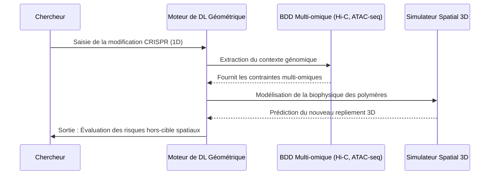

<!-- markdownlint-disable MD009 MD010 MD013 MD022 MD028 MD032 MD033 MD034 MD036 MD037 MD039 MD041 MD058 MD060 -->

[ 🇬🇧 English Version ](./README.md)

# ChromaFold AI

> **Résumé exécutif :** Une plateforme de Deep Learning géométrique qui prédit le repliement 3D du génome entier (architecture de la chromatine) pour simuler les effets épigénétiques hors-cible avant les essais cliniques.

---

## 1. Aperçu visuel & Effet Wahou

## 2. La thèse contrariante (Peter Thiel Style)

**La croyance populaire :** Pour révolutionner la découverte de médicaments, nous devons concentrer tous les efforts de l'IA sur le repliement des protéines (comme AlphaFold) et la conception générative de ligands.

**La vérité cachée :** Si les protéines sont le produit final, le véritable système d'exploitation de la biologie est l'architecture spatiale 3D de l'ADN (chromatine). Prédire comment le génome se replie dans l'espace permet de contrôler l'épigénétique et prévient les échecs de thérapies géniques, causés par des effets hors-cible spatiaux que les modèles de séquences 1D ne peuvent tout simplement pas voir.

## 3. Le problème & La cible

**Modèle économique :** B2B

**Cible précise :** Sociétés pharmaceutiques (Big Pharma), startups en thérapie génique et laboratoires de recherche académique.

**La douleur urgente :** Modifier un gène (via CRISPR ou autre) peut accidentellement activer ou réprimer des gènes voisins dans l'espace 3D, même s'ils sont éloignés de millions de paires de bases sur la séquence linéaire. Cette incapacité à prédire les structures 3D de la chromatine entraîne un taux d'échec massif dans les thérapies épigénétiques, coûtant des milliards de dollars et des années de recherche clinique gaspillées.

## 4. Architecture technique & Plomberie

## 5. Modèle économique & Viabilité financière

| Métrique                    | Valeur                                                    |
| :-------------------------- | :-------------------------------------------------------- |
| Structure de prix           | Abonnement SaaS Entreprise + API pour simulation par lots |
| Objectif 12 mois            | 1-2 partenariats pilotes Big Pharma ou 5 startups biotech |
| Calcul du CA (Target 100k€) | 1 contrat entreprise \* 100 000 €/an = 100k€ ARR          |
| Marge brute estimée         | 80% (Marges logicielles, hors calcul GPU lourd)           |

## 6. Moteur de distribution & Fossé défensif (Moat)

**Stratégie d'acquisition :** Ventes directes aux responsables de la biologie computationnelle du Top 50 Pharma. Établir un leadership d'opinion en publiant des avancées dans Nature/Science en utilisant la plateforme.

**Moat (Barrière à l'entrée) :** Prédire le repliement de milliards de paires de bases nécessite de gérer des graphes 3D dynamiques et d'intégrer des contraintes physiques de polymères. Les LLM textuels ne comprennent pas la topologie spatiale. Le fossé défensif réside dans l'architecture propriétaire de Deep Learning géométrique et les données d'entraînement multi-omiques, créant une barrière que les laboratoires d'IA standards ne peuvent pas franchir.

## 7. Grille d'évaluation détaillée

| Critère                           | Score VC (/100) | Score Terrain (/100) |
| :-------------------------------- | :-------------- | :------------------- |
| Thèse & Monopole / Urgence        | -- / 25         | 24 / 25              |
| Moat / Résistance aux LLM natifs  | -- / 25         | 25 / 25              |
| Scalability / Friction d'adoption | -- / 25         | 10 / 25              |
| Unit Economics / ROI direct       | -- / 25         | 18 / 25              |
| **TOTAL**                         | **-- / 100**    | **77 / 100**         |

> **Verdict VC :** En attente d'évaluation.
> **Verdict Terrain :** Urgence modérée mais valeur stratégique à long terme. L'immunité aux LLM est bonne, reposant sur des modèles spécifiques. L'adoption présente des frictions notables qui pourraient ralentir la monétisation initiale.
