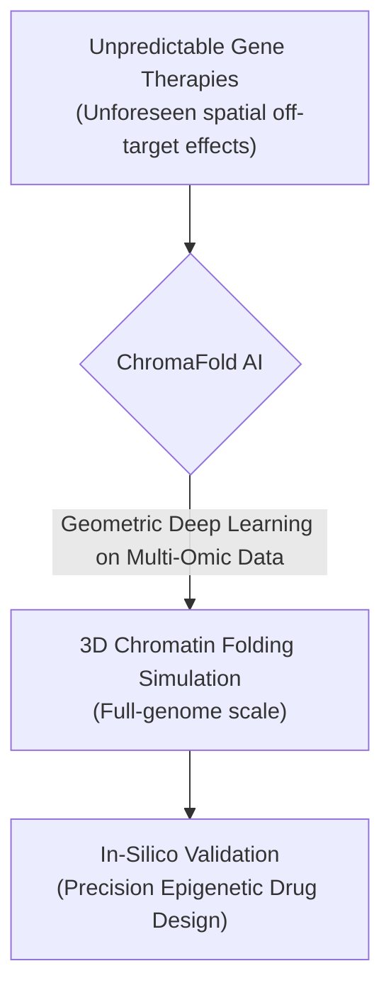
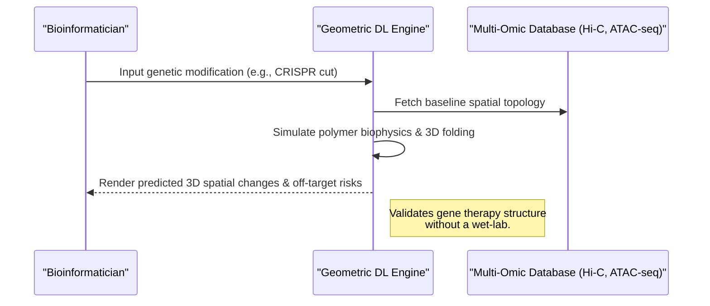

<!-- markdownlint-disable MD009 MD010 MD013 MD022 MD028 MD032 MD033 MD034 MD036 MD037 MD039 MD041 MD060 -->

[ 🇫🇷 Version Française ](./README.fr.md)

# ChromaFold AI

> **Executive Summary:** ChromaFold AI pioneers the prediction of full-genome 3D chromatin architecture using Geometric Deep Learning, allowing pharmaceutical companies to simulate and prevent spatial "off-target" effects in gene therapies and epigenetic drugs before costly wet-lab trials.

---

## 1. Visual Overview & Wow Effect

## 2. Contrarian Thesis (Peter Thiel Style)

**Popular Belief:** The key to curing genetic diseases lies entirely in mapping linear DNA sequences or predicting single protein structures (like AlphaFold).
**Hidden Truth:** The 3D physical folding of the entire DNA strand (chromatin architecture) dictates which genes are active or repressed. Without understanding this 3D spatial topology, altering a linear sequence (e.g., via CRISPR) often causes catastrophic, unintended "off-target" effects due to physical proximity inside the nucleus.

## 3. Problem & Target Market

**Business Model:** B2B
**Target Audience:** Pharmaceutical companies (Big Pharma), gene therapy startups, and academic research laboratories.
**Urgent Pain Point:** While systems like AlphaFold predict 3D protein structures, how the entire DNA folds in 3D inside the nucleus remains a black box. This inability to predict 3D chromatin structures leads to massive failure rates (and billions lost) during the design of gene therapies or epigenetic drugs, because spatial "off-target" effects cannot be modeled.

## 4. Technical Architecture & Infrastructure

## 5. Business Model & Financial Viability

| Metric                     | Value                                                  |
| -------------------------- | ------------------------------------------------------ |
| **Pricing Structure**      | Annual Enterprise License + Compute Usage              |
| **12-Month Target**        | 3-5 pilot contracts with leading gene therapy startups |
| **Revenue Formula**        | 5 Pilots \* €20k/year                                  |
| **Estimated Gross Margin** | >80%                                                   |

## 6. Distribution Engine & Moat

**Acquisition Strategy:** Direct sales to Big Pharma R&D, co-publishing research in top-tier journals (Nature/Science) to build academic consensus.
**Moat (Defensibility):** Predicting the folding of billions of base pairs requires an algorithmic infrastructure capable of processing dynamic 3D graphs and integrating physical constraints (polymer biophysics). A standard textual LLM or standard neural network cannot comprehend this spatial topology. The proprietary multi-omic training dataset (combining Hi-C, ATAC-seq, ChIP-seq) and extreme GPU compute requirements form a massive moat.

## 7. Detailed Evaluation Grid

| Criterion                       | VC Score (/100) | Market Score (/100) |
| ------------------------------- | --------------- | ------------------- |
| **Thesis & Monopoly / Urgency** | -- / 25         | -- / 25             |
| **Moat / LLM Immunity**         | -- / 25         | -- / 25             |
| **Scalability / UX Friction**   | -- / 25         | -- / 25             |
| **Unit Economics / ROI**        | -- / 25         | -- / 25             |
| **TOTAL**                       | -- / 100        | -- / 100            |

> **VC Verdict:** Pending evaluation.
> **Market Verdict:** Pending evaluation.
