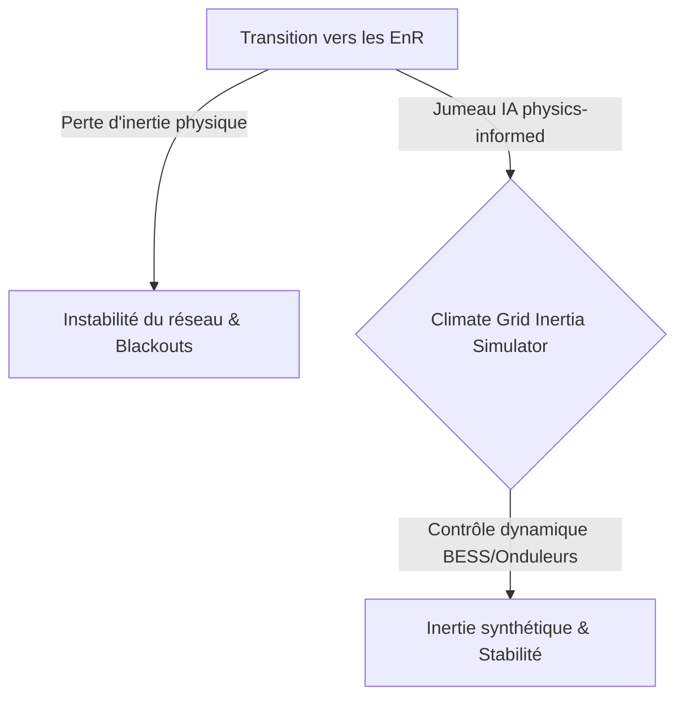
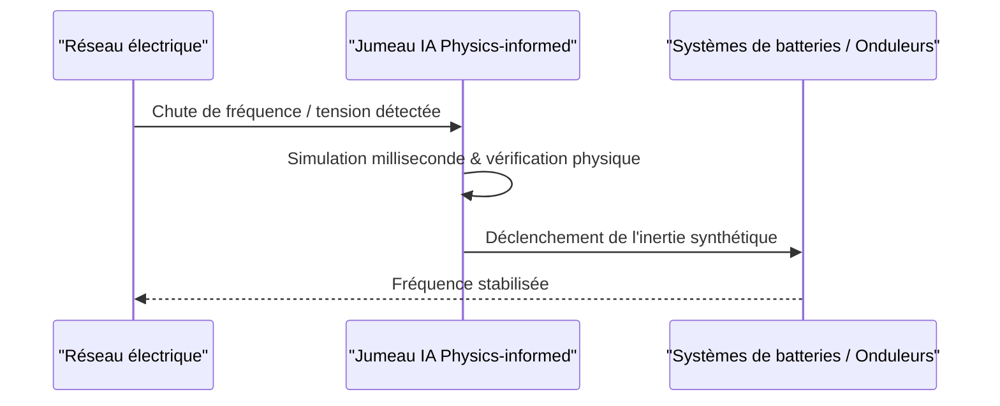

<!-- markdownlint-disable MD009 MD010 MD013 MD022 MD028 MD032 MD033 MD034 MD036 MD037 MD039 MD041 MD058 MD060 -->

[🇬🇧 English Version](./README.md)

# Climate Grid Inertia Simulator

> **Résumé exécutif :** Un jumeau numérique temps réel de la grille électrique utilisant l'IA physics-informed pour injecter dynamiquement de l'inertie synthétique et prévenir les blackouts.

---

## 1. Aperçu visuel & Effet Wahou

## 2. La thèse contrariante (Peter Thiel Style)

La croyance populaire : Les logiciels SCADA standards et les modèles ML classiques suffisent à gérer les réseaux modernes d'énergies renouvelables.
La vérité cachée : Les modèles ML standards hallucinent les lois de Kirchhoff et le SCADA est trop lent. Un modèle d'IA strictement contraint par la physique, fonctionnant en millisecondes, est indispensable pour orchestrer l'inertie synthétique dans un monde sans générateurs rotatifs lourds.

## 3. Le problème & La cible

Modèle économique : B2B
Cible précise : Gestionnaires de réseaux de transport (RTE, National Grid, TSO), opérateurs de fermes éoliennes/solaires.
La douleur urgente : Le remplacement des générateurs rotatifs lourds par des onduleurs électroniques supprime l'"inertie physique" du réseau, augmentant drastiquement le risque de blackouts instantanés en cas de fluctuation soudaine de la fréquence électrique.

## 4. Architecture technique & Plomberie

## 5. Modèle économique & Viabilité financière

| Métrique                    | Valeur                             |
| --------------------------- | ---------------------------------- |
| Structure de prix           | Licence entreprise par MW géré     |
| Objectif 12 mois            | 2 à 3 contrats pilotes majeurs TSO |
| Calcul du CA (Target 100k€) | 2 \* 50k = 100k                    |
| Marge brute estimée         | 80%                                |

## 6. Moteur de distribution & Fossé défensif (Moat)

Stratégie d'acquisition : Ventes directes B2G/B2B aux monopoles d'État et aux grandes entreprises de services publics, programmes pilotes stratégiques.
Moat (Barrière à l'entrée) : Les barrières réglementaires extrêmes, la responsabilité juridique immense exigeant une précision physique sans faille, et l'intégration complexe avec des onduleurs matériels hétérogènes créent un fossé quasi impénétrable face aux concurrents SaaS génériques.

## 7. Grille d'évaluation détaillée

| Critère                           | Score VC (/100) | Score Terrain (/100) |
| --------------------------------- | --------------- | -------------------- |
| Thèse & Monopole / Urgence        | 20 / 25         | -- / 25              |
| Moat / Résistance aux LLM natifs  | 18 / 25         | -- / 25              |
| Scalabilité / Friction d'adoption | 22 / 25         | -- / 25              |
| Unit Economics / ROI direct       | 22 / 25         | -- / 25              |
| **TOTAL**                         | **82 / 100**    | **-- / 100**         |

> **Verdict VC :** Ce projet présente une thèse fortement contrariante avec un véritable potentiel de monopole (20/25). Bien que l'approche technique soit solide, le fossé défensif face à des acteurs établis bien financés reste partiellement perméable (18/25). Associée à une évolutivité massive (22/25) et d'excellents unit economics (22/25), il s'agit d'une proposition hautement finançable.
>
> **Verdict Terrain :** En attente d'évaluation.
