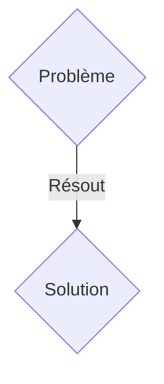
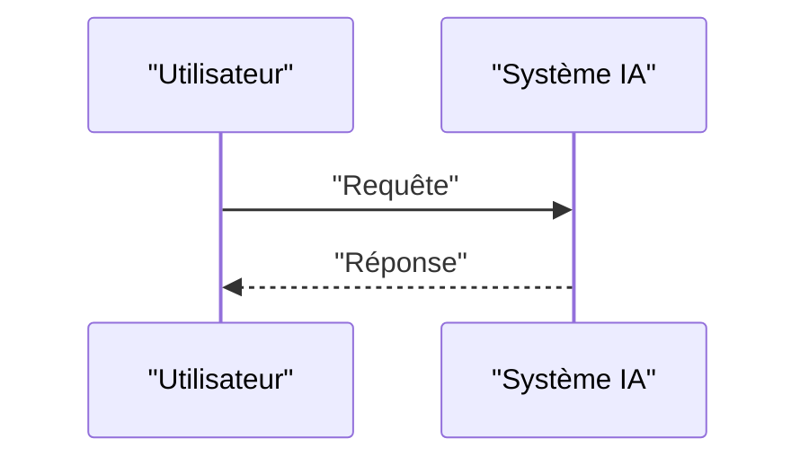

<!-- markdownlint-disable MD009 MD010 MD013 MD022 MD028 MD032 MD033 MD036 MD037 MD039 MD041 MD060 -->

[ 🇬🇧 English Version ](./README.md)

# Geo Carbon MRV

> **Résumé exécutif :** Une solution B2B ciblant Acheteurs de crédits carbone industriels, opérateurs de capture et stockage de carbone (CCS), auditeurs de durabilité. pour résoudre : Les marchés du carbone manquent de confiance (greenwashing). Prouver physiquement et de manière inaltérable qu'une tonne spécifique de CO2 a été enfouie et minéralisée dans la roche est extrêmement difficile.

---

## 1. Aperçu visuel & Effet Wahou

## 2. La thèse contrariante (Peter Thiel Style)

- **La croyance populaire :** Les solutions génériques suffisent.
- **La vérité cachée :** Un système IoT combinant des capteurs sismiques de fond de puits et un World Model géophysique qui valide la réaction chimique de minéralisation en temps réel et émet un certificat cryptographiquement lié à la donnée capteur brute.

## 3. Le problème & La cible

- **Modèle économique :** B2B
- **Cible précise :** Acheteurs de crédits carbone industriels, opérateurs de capture et stockage de carbone (CCS), auditeurs de durabilité.
- **La douleur urgente :** Les marchés du carbone manquent de confiance (greenwashing). Prouver physiquement et de manière inaltérable qu'une tonne spécifique de CO2 a été enfouie et minéralisée dans la roche est extrêmement difficile.

## 4. Architecture technique & Plomberie

Un système IoT combinant des capteurs sismiques de fond de puits et un World Model géophysique qui valide la réaction chimique de minéralisation en temps réel et émet un certificat cryptographiquement lié à la donnée capteur brute.

## 5. Modèle économique & Viabilité financière

| Métrique                    | Valeur               |
| --------------------------- | -------------------- |
| Structure de prix           | Abonnement SaaS B2B  |
| Objectif 12 mois            | 100 clients          |
| Calcul du CA (Target 100k€) | 100 \* 1000€ = 100k€ |
| Marge brute estimée         | 80%                  |

## 6. Moteur de distribution & Fossé défensif (Moat)

- **Stratégie d'acquisition :** Vente directe et partenariats stratégiques.
- **Moat (Barrière à l'entrée) :** La mesure, le rapport et la vérification (MRV) basés sur des feuilles de calcul sont falsifiables. Il faut intégrer du hardware de mesure géologique avec de la modélisation thermodynamique souterraine.

## 7. Grille d'évaluation détaillée

| Critère                           | Score VC (/100) | Score Terrain (/100) |
| --------------------------------- | --------------- | -------------------- |
| Thèse & Monopole / Urgence        | -- / 25         | -- / 25              |
| Moat / Résistance aux LLM natifs  | -- / 25         | -- / 25              |
| Scalabilité / Friction d'adoption | -- / 25         | -- / 25              |
| Unit Economics / ROI direct       | -- / 25         | -- / 25              |
| TOTAL                             | -- / 100        | -- / 100             |

> **Verdict VC :** En attente d'évaluation.
> **Verdict Terrain :** En attente d'évaluation.
