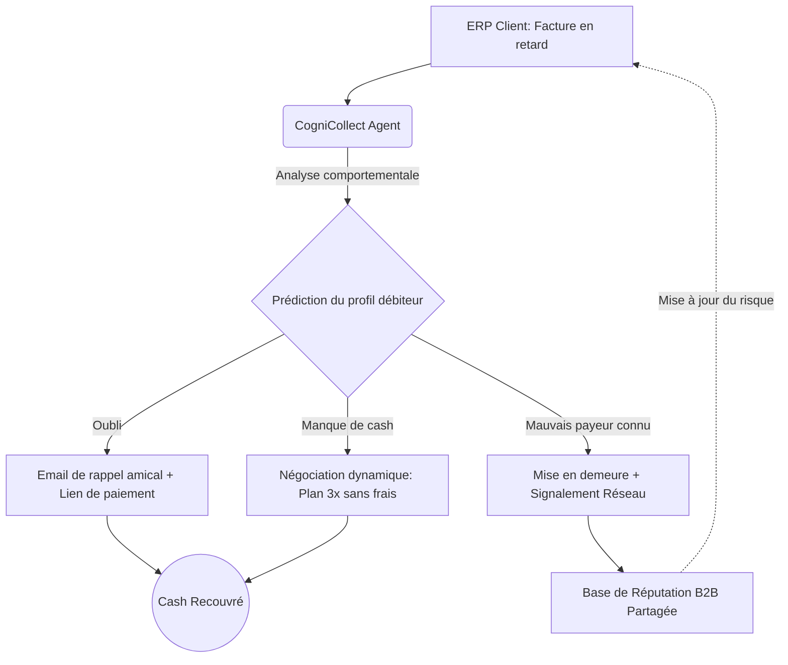
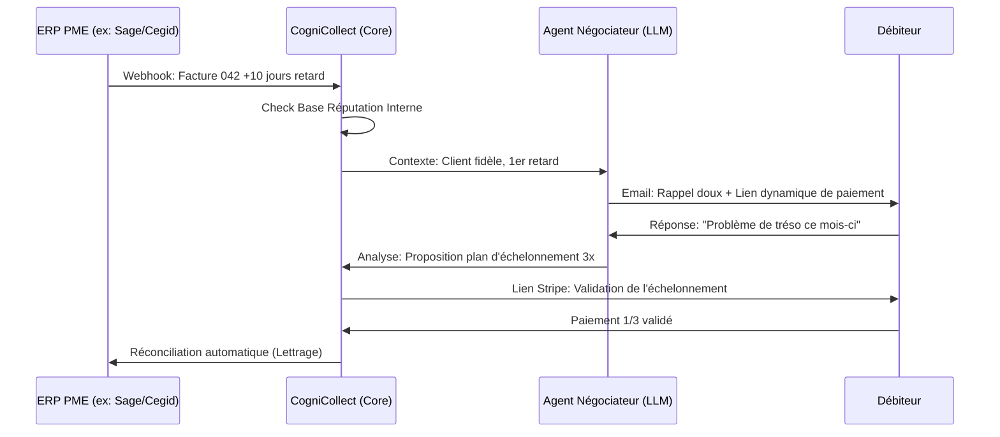

<!-- markdownlint-disable MD013 MD033 -->

# CogniCollect

> **Résumé exécutif :** Un agent autonome qui s'intègre aux ERP des PME pour négocier et recouvrer les factures impayées, tout en bâtissant un registre communautaire de solvabilité inter-entreprises.

---

## 1. Aperçu visuel & Effet Wahou

## 2. La thèse contrariante (Peter Thiel Style)

**La croyance populaire :**Le recouvrement B2B est une affaire de relations humaines et de diplomatie téléphonique ; automatiser cette tâche par l'IA risquerait de froisser les relations commerciales et de perdre le client.

**La vérité cachée :**Les débiteurs en retard de paiement ressentent de la honte et de l'anxiété face à un interlocuteur humain. Ils ignorent les appels pour fuir la confrontation. Une IA agit comme un tiers de confiance sans jugement : elle désamorce l'ego et augmente les taux de conversion en proposant des micro-plans d'échelonnement instantanés, négociables en ligne 24/7.

## 3. Le problème & La cible

**Modèle économique :**B2B

**Cible précise :**Les PME (1M€ - 50M€ CA), agences, et fournisseurs de services qui ont +100 factures émises par mois.

**La douleur urgente :**Le besoin en fonds de roulement (BFR). Les impayés sont la première cause de faillite des PME. L'inaction ou la lenteur du recouvrement coûte directement de la trésorerie vitale, réduit la capacité d'investissement et génère un stress opérationnel massif pour le dirigeant ou le DAF.

## 4. Architecture technique & Plomberie

L'infrastructure ne repose pas sur la complexité du LLM, mais sur la "plomberie" d'intégration (ERP legacy, processeurs de paiement, API juridiques).

## 5. Modèle économique & Viabilité financière

| Métrique                    | Valeur                                                                                                                               |
| --------------------------- | ------------------------------------------------------------------------------------------------------------------------------------ |
| Structure de prix           | Abonnement SaaS 250€/mois (intégration ERP) + Commission 2% sur cash recouvré                                                        |
| Objectif 12 mois            | 20 clients (pour valider le produit) puis scale à 250 clients                                                                        |
| Calcul du CA (Target 100k€) | 250 clients × 3000€ ARR = 750 000€ (SaaS pur). Hypothèse conservatrice : 100 clients × 250€/m (30k€) + 70k€ en commissions sur flux. |
| Marge brute estimée         | 85% (Coûts d'inférence très faibles via appels LLM textuels asynchrones)                                                             |

## 6. Moteur de distribution & Fossé défensif (Moat)

**Stratégie d'acquisition :**Acquisition directe B2B (Outbound sur DAFs et dirigeants) via une promesse "No-brainer" : ROI mesurable dès la première semaine ("On connecte l'outil, il va chercher l'argent qui dort dehors le jour même"). Partenariats comptables (prescripteurs).

**Moat (Barrière à l'entrée) :**

1. _Data Network Effects (Réseau C2C de solvabilité)_ : Chaque retard de paiement d'une entreprise X alimente une base de réputation commune, anonymisée mais mutualisée. Si l'entreprise X a un défaut chez le Client A, le Client B (également sur CogniCollect) en est notifié pour resserrer ses conditions de crédit. OpenAI ou Google ne peuvent pas cloner cette base de données propriétaire et communautaire sans avoir le réseau d'utilisateurs.
2. _Intégrations profondes "boring"_ : La difficulté de s'interfacer de manière bidirectionnelle avec des ERP legacy fragmentés décourage les créateurs de simples wrappers.

## 7. Grille d'évaluation détaillée

| Critère                           | Score VC (/100) | Score Terrain (/100) |
| --------------------------------- | --------------- | -------------------- |
| Thèse & Monopole / Urgence        | 23 / 25         | 25 / 25              |
| Moat / Résistance aux LLM natifs  | 22 / 25         | 20 / 25              |
| Scalabilité / Friction d'adoption | 20 / 25         | 23 / 25              |
| Unit Economics / ROI direct       | 25 / 25         | 25 / 25              |
| **TOTAL**                         | **90 / 100**    | **93 / 100**         |

**Verdict global :**Un projet à exceptionnellement haute viabilité financière avec une utilité "Hair on Fire" immédiate pour les PME en manque de trésorerie. La construction d'un mini-bureau de crédit B2B privatisé via l'agrégation des données de paiement constitue un fossé défensif massif face aux géants de la tech.
