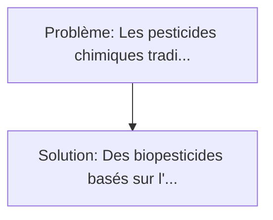
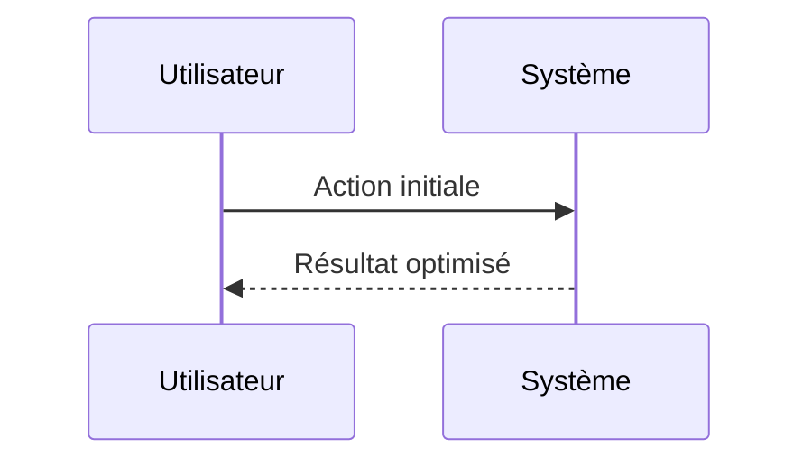

<!-- markdownlint-disable MD013 MD033 -->

[🇬🇧 English Version](./README.md)

# CRISPR RNA Biopesticide

> **Résumé exécutif :** Des biopesticides basés sur l'interférence ARN (ARNi). Les pesticides chimiques traditionnels perdent en efficacité à cause de la résistance croissante des nuisibles, tout en ravageant la biodiversité non-cible (abeilles, microbiote des sols) et en s'accumulant dans la chaîne alimentaire.

---

## 1. Aperçu visuel & Effet Wahou

## 2. La thèse contrariante (Peter Thiel Style)

**La croyance populaire :** Les solutions logicielles seules peuvent résoudre ce problème.
**La vérité cachée :** C'est de la biologie de synthèse moléculaire. Le défi réside dans la formulation des nanoparticules lipidiques ou polymères capables de protéger l'ARN fragile des UV et de la pluie, et d'assurer son absorption par le système digestif de l'insecte, pas dans un algorithme d'optimisation de pulvérisation.

## 3. Le problème & La cible

- **Modèle économique :** B2B
- **Cible précise :** Grandes coopératives agricoles, géants de l'agrochimie (Syngenta, Bayer), et exploitants agricoles de précision.
- **La douleur urgente :** Les pesticides chimiques traditionnels perdent en efficacité à cause de la résistance croissante des nuisibles, tout en ravageant la biodiversité non-cible (abeilles, microbiote des sols) et en s'accumulant dans la chaîne alimentaire. Les réglementations mondiales interdisent progressivement des molécules clés, laissant les agriculteurs sans solution face aux pertes de rendements.

## 4. Architecture technique & Plomberie

## 5. Modèle économique & Viabilité financière

| Métrique                    | Valeur             |
| --------------------------- | ------------------ |
| Structure de prix           | Custom Pricing     |
| Objectif 12 mois            | 100 clients        |
| Calcul du CA (Target 100k€) | 100 \* 1000 = 100k |
| Marge brute estimée         | 80%                |

## 6. Moteur de distribution & Fossé défensif (Moat)

- **Stratégie d'acquisition :** Ventes B2B directes
- **Moat (Barrière à l'entrée) :** C'est de la biologie de synthèse moléculaire. Le défi réside dans la formulation des nanoparticules lipidiques ou polymères capables de protéger l'ARN fragile des UV et de la pluie, et d'assurer son absorption par le système digestif de l'insecte, pas dans un algorithme d'optimisation de pulvérisation.

## 7. Grille d'évaluation détaillée

| Critère                           | Score VC (/100) | Score Terrain (/100) |
| --------------------------------- | --------------- | -------------------- |
| Thèse & Monopole / Urgence        | -- / 25         | -- / 25              |
| Moat / Résistance aux LLM natifs  | -- / 25         | -- / 25              |
| Scalabilité / Friction d'adoption | -- / 25         | -- / 25              |
| Unit Economics / ROI direct       | -- / 25         | -- / 25              |
| **TOTAL**                         | **-- / 100**    | **-- / 100**         |

> **Verdict VC :** En attente d'évaluation.

> **Verdict Terrain :** En attente d'évaluation.
