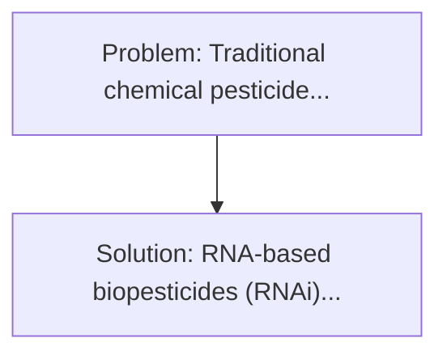
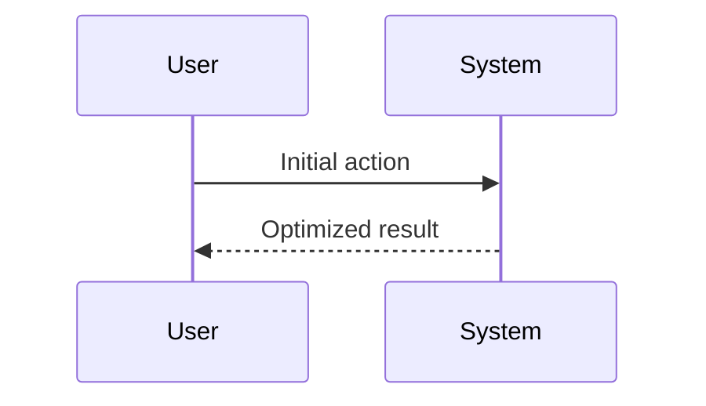

<!-- markdownlint-disable MD013 MD033 -->

[🇫🇷 Version Française](./README.fr.md)

# CRISPR RNA Biopesticide

> **Executive Summary:** RNA-based biopesticides (RNAi). Traditional chemical pesticides are becoming less effective because of the increasing resistance of pests, while ravaging non-target biodiversity (bees, soil microbiota) and accumulating in the food chain.

---

## 1. Visual Overview & Wow Effect

## 2. Contrarian Thesis (Peter Thiel Style)

**Popular Belief:** Generic software solutions can solve this.
**Hidden Truth:** It's molecular synthesis biology. The challenge lies in the formulation of lipid nanoparticles or polymers capable of protecting fragile RNA from UV and rain, and ensuring its absorption by the digestive system of the insect, not in a spray optimization algorithm.

## 3. Problem & Target Market

- **Business Model:** B2B
- **Target Audience:** Large agricultural cooperatives, agrochemical giants (Syngenta, Bayer), and precision farmers.
- **Urgent Pain Point:** Traditional chemical pesticides are becoming less effective because of the increasing resistance of pests, while ravaging non-target biodiversity (bees, soil microbiota) and accumulating in the food chain. Global regulations are gradually banning key molecules, leaving farmers with no solution to yield losses.

## 4. Technical Architecture & Infrastructure

## 5. Business Model & Financial Viability

| Metric                 | Value              |
| ---------------------- | ------------------ |
| Pricing Structure      | Custom Pricing     |
| 12-Month Target        | 100 customers      |
| Revenue Formula        | 100 \* 1000 = 100k |
| Estimated Gross Margin | 80%                |

## 6. Distribution Engine & Moat

- **Acquisition Strategy:** Direct B2B Sales
- **Moat (Defensibility):** It's molecular synthesis biology. The challenge lies in the formulation of lipid nanoparticles or polymers capable of protecting fragile RNA from UV and rain, and ensuring its absorption by the digestive system of the insect, not in a spray optimization algorithm.

## 7. Detailed Evaluation Grid

| Criterion                   | VC Score (/100) | Market Score (/100) |
| --------------------------- | --------------- | ------------------- |
| Thesis & Monopoly / Urgency | -- / 25         | -- / 25             |
| Moat / LLM Immunity         | -- / 25         | -- / 25             |
| Scalability / UX Friction   | -- / 25         | -- / 25             |
| Unit Economics / ROI        | -- / 25         | -- / 25             |
| **TOTAL**                   | **-- / 100**    | **-- / 100**        |

> **VC Verdict:** Pending evaluation.

> **Market Verdict:** Pending evaluation.
