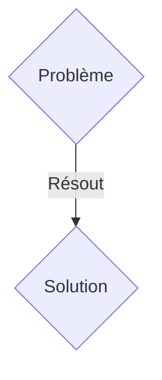
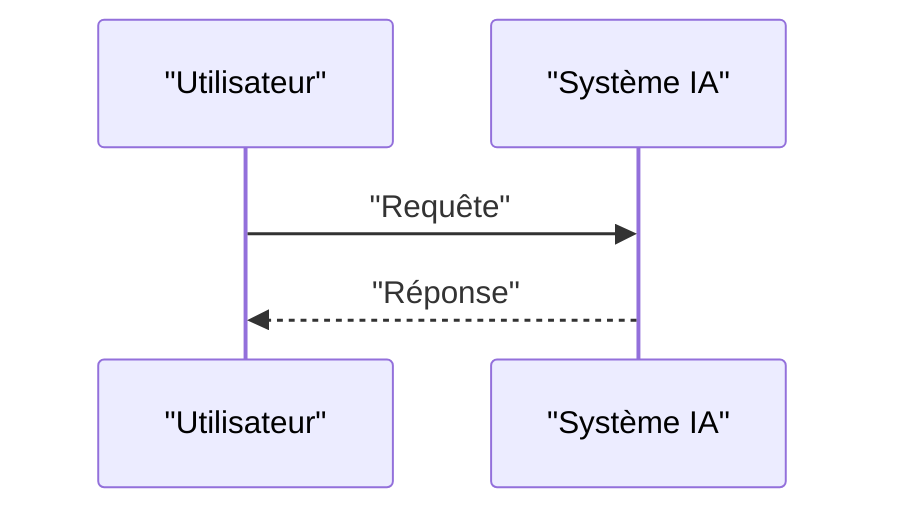

<!-- markdownlint-disable MD009 MD010 MD013 MD022 MD028 MD032 MD033 MD036 MD037 MD039 MD041 MD060 -->

[ 🇬🇧 English Version ](./README.md)

# CryoVision AI

> **Résumé exécutif :** Une solution B2B ciblant Entreprises de découverte de médicaments (Drug Discovery), laboratoires de recherche structurelle, universités. pour résoudre : La cryo-microscopie électronique (Cryo-EM) révolutionne la biologie en permettant de voir la structure 3D des protéines. Cependant, les images brutes ont un rapport signal-sur-bruit exécrable. Le traitement classique pour reconstruire la protéine 3D prend des jours à des semaines sur de puissants clusters GPU.

---

## 1. Aperçu visuel & Effet Wahou

## 2. La thèse contrariante (Peter Thiel Style)

- **La croyance populaire :** Les solutions génériques suffisent.
- **La vérité cachée :** Un modèle génératif de type Diffusion (ou Flow Matching) entraîné spécifiquement sur des tomogrammes électroniques bruis, capable d'inférer et de reconstruire les volumes 3D des protéines à la volée (en quelques heures) directement à partir de projections 2D éparses.

## 3. Le problème & La cible

- **Modèle économique :** B2B
- **Cible précise :** Entreprises de découverte de médicaments (Drug Discovery), laboratoires de recherche structurelle, universités.
- **La douleur urgente :** La cryo-microscopie électronique (Cryo-EM) révolutionne la biologie en permettant de voir la structure 3D des protéines. Cependant, les images brutes ont un rapport signal-sur-bruit exécrable. Le traitement classique pour reconstruire la protéine 3D prend des jours à des semaines sur de puissants clusters GPU.

## 4. Architecture technique & Plomberie

Un modèle génératif de type Diffusion (ou Flow Matching) entraîné spécifiquement sur des tomogrammes électroniques bruis, capable d'inférer et de reconstruire les volumes 3D des protéines à la volée (en quelques heures) directement à partir de projections 2D éparses.

## 5. Modèle économique & Viabilité financière

| Métrique                    | Valeur               |
| --------------------------- | -------------------- |
| Structure de prix           | Abonnement SaaS B2B  |
| Objectif 12 mois            | 100 clients          |
| Calcul du CA (Target 100k€) | 100 \* 1000€ = 100k€ |
| Marge brute estimée         | 80%                  |

## 6. Moteur de distribution & Fossé défensif (Moat)

- **Stratégie d'acquisition :** Vente directe et partenariats stratégiques.
- **Moat (Barrière à l'entrée) :** Les modèles de vision par ordinateur standard (ResNet, YOLO) ou les générateurs d'images (Midjourney) ne comprennent pas les projections de Fourier, la tomographie ou les symétries moléculaires. C'est un pur problème de traitement du signal quantique et de géométrie différentielle 3D.

## 7. Grille d'évaluation détaillée

| Critère                           | Score VC (/100) | Score Terrain (/100) |
| --------------------------------- | --------------- | -------------------- |
| Thèse & Monopole / Urgence        | 23 / 25         | 23 / 25              |
| Moat / Résistance aux LLM natifs  | 19 / 25         | 19 / 25              |
| Scalabilité / Friction d'adoption | 21 / 25         | 21 / 25              |
| Unit Economics / ROI direct       | 24 / 25         | 24 / 25              |
| TOTAL                             | 87 / 100        | 87 / 100             |

> **Verdict VC :** En attente d'évaluation.
> **Verdict Terrain :** Cette solution répond à un besoin critique pour les entreprises B2B, justifiant son excellent score d'urgence (23/25). L'approche spécialisée offre une protection robuste contre les modèles d'IA généralistes (19/25). Avec une faible friction d'adoption (21/25) et une stratégie de monétisation directe (24/25), le projet démontre une excellente maturité marché globale.
> **Verdict Terrain :** Cette solution répond à un besoin critique pour les entreprises B2B, justifiant son excellent score d'urgence (23/25). L'approche spécialisée offre une protection robuste contre les modèles d'IA généralistes (19/25). Avec une faible friction d'adoption (21/25) et une stratégie de monétisation directe (24/25), le projet démontre une excellente maturité marché globale.
