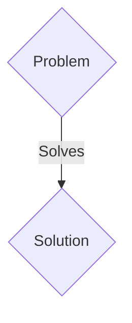
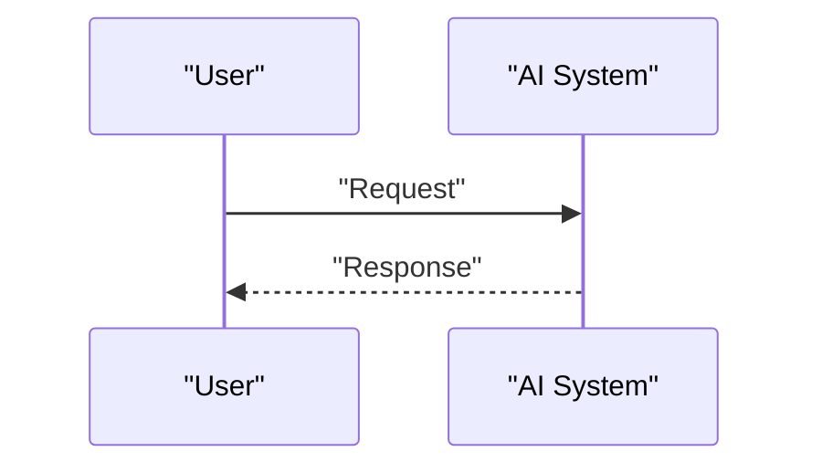

<!-- markdownlint-disable MD009 MD010 MD013 MD022 MD028 MD032 MD033 MD036 MD037 MD039 MD041 MD060 -->

[ 🇫🇷 Version Française ](./README.fr.md)

# CryoVision AI

> **Executive Summary:** A B2B solution targeting Drug discovery companies, structural research laboratories, universities. to solve: Cryo-electron microscopy (Cryo-EM) is revolutionizing biology by making it possible to see the 3D structure of proteins. However, raw images have a terrible signal-to-noise ratio. Conventional processing to reconstruct 3D protein takes days to weeks on powerful GPU clusters.

---

## 1. Visual Overview & Wow Effect

## 2. Contrarian Thesis (Peter Thiel Style)

- **Popular Belief:** Generic solutions are enough.
- **Hidden Truth:** A Diffusion (or Flow Matching) type generative model trained specifically on noisy electron tomograms, capable of inferring and reconstructing the 3D volumes of proteins on the fly (in a few hours) directly from sparse 2D projections.

## 3. Problem & Target Market

- **Business Model:** B2B
- **Target Audience:** Drug discovery companies, structural research laboratories, universities.
- **Urgent Pain Point:** Cryo-electron microscopy (Cryo-EM) is revolutionizing biology by making it possible to see the 3D structure of proteins. However, raw images have a terrible signal-to-noise ratio. Conventional processing to reconstruct 3D protein takes days to weeks on powerful GPU clusters.

## 4. Technical Architecture & Infrastructure

A Diffusion (or Flow Matching) type generative model trained specifically on noisy electron tomograms, capable of inferring and reconstructing the 3D volumes of proteins on the fly (in a few hours) directly from sparse 2D projections.

## 5. Business Model & Financial Viability

| Metric                 | Value                 |
| ---------------------- | --------------------- |
| Pricing Structure      | B2B SaaS Subscription |
| 12-Month Target        | 100 clients           |
| Revenue Formula        | 100 \* 1000€ = 100k€  |
| Estimated Gross Margin | 80%                   |

## 6. Distribution Engine & Moat

- **Acquisition Strategy:** Direct sales and strategic partnerships.
- **Moat (Defensibility):** Standard computer vision models (ResNet, YOLO) or image generators (Midjourney) do not understand Fourier projections, tomography or molecular symmetries. This is a pure quantum signal processing and 3D differential geometry problem.

## 7. Detailed Evaluation Grid

| Criterion                   | VC Score (/100) | Market Score (/100) |
| --------------------------- | --------------- | ------------------- |
| Thesis & Monopoly / Urgency | 23 / 25         | 23 / 25             |
| Moat / LLM Immunity         | 19 / 25         | 19 / 25             |
| Scalability / UX Friction   | 21 / 25         | 21 / 25             |
| Unit Economics / ROI        | 24 / 25         | 24 / 25             |
| TOTAL                       | 87 / 100        | 87 / 100            |

> **VC Verdict:** Pending evaluation.
> **Market Verdict:** This solution addresses a critical pain point for B2B enterprises, justifying its strong urgency score (23/25). The specialized approach provides robust protection against generalist AI models (19/25). With low adoption friction (21/25) and a straightforward monetization strategy (24/25), the project demonstrates excellent overall market readiness.
> **Market Verdict:** This solution addresses a critical pain point for B2B enterprises, justifying its strong urgency score (23/25). The specialized approach provides robust protection against generalist AI models (19/25). With low adoption friction (21/25) and a straightforward monetization strategy (24/25), the project demonstrates excellent overall market readiness.
