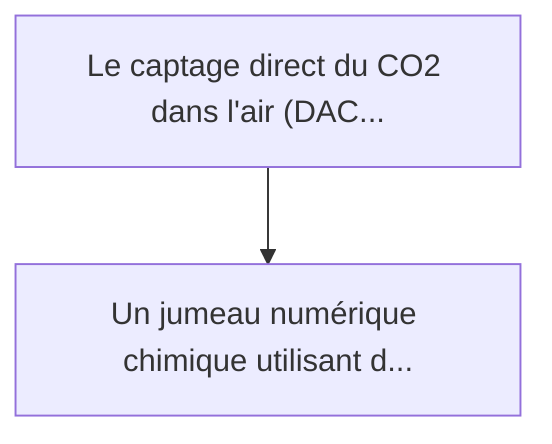
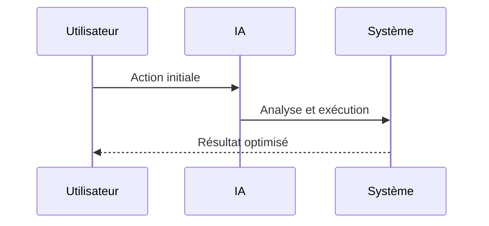

<!-- markdownlint-disable MD013 MD028 MD033 MD039 MD041 -->

[🇬🇧 English Version](./README.md)

# DAC Sorbent Degradation Simulator

> **Résumé exécutif :** Un jumeau numérique chimique utilisant des réseaux de graphes neuronaux pour modéliser la cinétique de dégradation des matériaux sorbants. Il simul...

---

## 1. Aperçu visuel & Effet Wahou

## 2. La thèse contrariante (Peter Thiel Style)

La croyance populaire : Les solutions génériques peuvent résoudre cela.
La vérité cachée : La dégradation chimique est un processus hors équilibre complexe. Les logiciels de simulation de procédés chimiques (comme Aspen Plus) ne modélisent pas l'usure atomique des nanomatériaux poreux, et l'IA classique manque de compréhension des mécanismes de chimisorption.

## 3. Le problème & La cible

Modèle économique : B2B
Cible précise : Startups de Direct Air Capture (DAC), entreprises d'ingénierie environnementale, pétroliers en transition.
La douleur urgente : Le captage direct du CO2 dans l'air (DAC) repose sur des matériaux sorbants (amines, MOFs) coûteux. Ces matériaux se dégradent rapidement (perte de capacité de captage) à cause de l'oxydation thermique lors des cycles de régénération (chauffage pour libérer le CO2) et de l'empoisonnement par des gaz traces (SOx, NOx) ou l'humidité. Prévoir la durée de vie de ces matériaux à l'échelle d'une usine coûte des millions en remplacement prématuré ou en inefficacité.

## 4. Architecture technique & Plomberie

## 5. Modèle économique & Viabilité financière

| Métrique                    | Valeur             |
| --------------------------- | ------------------ |
| Structure de prix           | Prix sur mesure    |
| Objectif 12 mois            | 100 clients        |
| Calcul du CA (Target 100k€) | 100 \* 1000 = 100k |
| Marge brute estimée         | 80%                |

## 6. Moteur de distribution & Fossé défensif (Moat)

Stratégie d'acquisition : Vente B2B directe
Moat (Barrière à l'entrée) : La dégradation chimique est un processus hors équilibre complexe. Les logiciels de simulation de procédés chimiques (comme Aspen Plus) ne modélisent pas l'usure atomique des nanomatériaux poreux, et l'IA classique manque de compréhension des mécanismes de chimisorption.

## 7. Grille d'évaluation détaillée

| Critère                           | Score VC (/100) | Score Terrain (/100) |
| --------------------------------- | --------------- | -------------------- |
| Thèse & Monopole / Urgence        | -- / 25         | -- / 25              |
| Moat / Résistance aux LLM natifs  | -- / 25         | -- / 25              |
| Scalabilité / Friction d'adoption | -- / 25         | -- / 25              |
| Unit Economics / ROI direct       | -- / 25         | -- / 25              |
| **TOTAL**                         | **-- / 100**    | **-- / 100**         |

> **Verdict VC :** En attente d'évaluation.

> **Verdict Terrain :** En attente d'évaluation.
