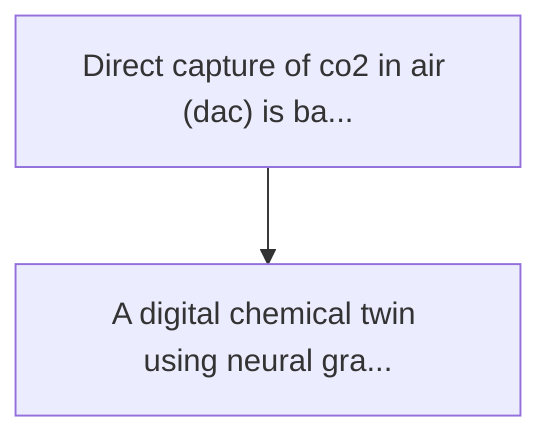
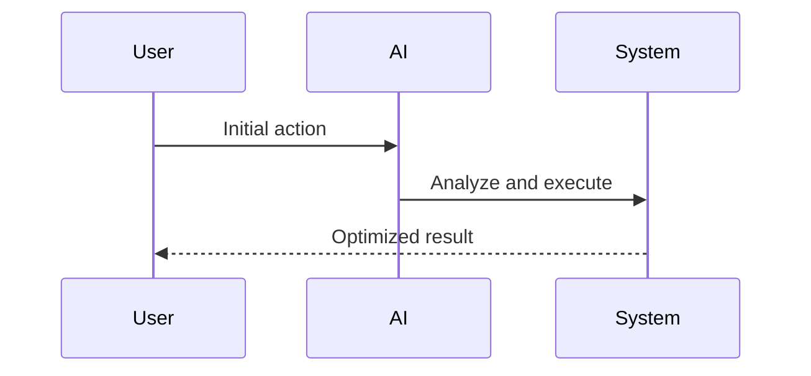

<!-- markdownlint-disable MD013 MD028 MD033 MD039 MD041 -->

[ 🇫🇷 Version Française ](./README.fr.md)

# Dac sorbent degradation simulator

> **Executive Summary:** A digital chemical twin using neural graph networks to model the degradation kinetics of sorbent materials. he's simulating...

---

## 1. Visual Overview & Wow Effect

## 2. Contrarian Thesis (Peter Thiel Style)

Popular Belief: Generic solutions can solve this.
Hidden Truth: Chemical degradation is a complex off-balance process. chemical process simulation software (such as aspen plus) does not model the atomic wear of porous nanomaterials, and classical ai lacks understanding of chimisorption mechanisms.

## 3. Problem & Target Market

Business Model: B2B
Target Audience: Startups from direct air capture (dac), environmental engineering companies, oil tankers in transition.
Urgent Pain Point: Direct capture of co2 in air (dac) is based on expensive sorbent materials (amines, mofs). these materials degrade rapidly (loss of capture capacity) due to thermal oxidation during regeneration cycles (heating to release co2) and poisoning by trace gases (sox, nox) or moisture. foreseeing the life of these materials on a factory-wide scale costs millions in premature replacement or inefficiency.

## 4. Technical Architecture & Infrastructure

## 5. Business Model & Financial Viability

| Metric                 | Value              |
| ---------------------- | ------------------ |
| Pricing Structure      | Custom Pricing     |
| 12-Month Target        | 100 customers      |
| Revenue Formula        | 100 \* 1000 = 100k |
| Estimated Gross Margin | 80%                |

## 6. Distribution Engine & Moat

Acquisition Strategy: Direct B2B Sales
Moat (Defensibility): Chemical degradation is a complex off-balance process. chemical process simulation software (such as aspen plus) does not model the atomic wear of porous nanomaterials, and classical ai lacks understanding of chimisorption mechanisms.

## 7. Detailed Evaluation Grid

| Criterion                   | VC Score (/100) | Market Score (/100) |
| --------------------------- | --------------- | ------------------- |
| Thesis & Monopoly / Urgency | -- / 25         | -- / 25             |
| Moat / LLM Immunity         | -- / 25         | -- / 25             |
| Scalability / UX Friction   | -- / 25         | -- / 25             |
| Unit Economics / ROI        | -- / 25         | -- / 25             |
| **TOTAL**                   | **-- / 100**    | **-- / 100**        |

> **VC Verdict:** Pending evaluation.

> **Market Verdict:** Pending evaluation.
