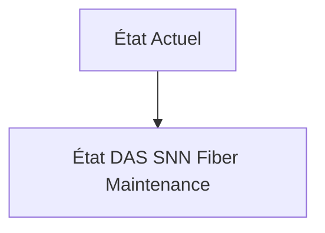
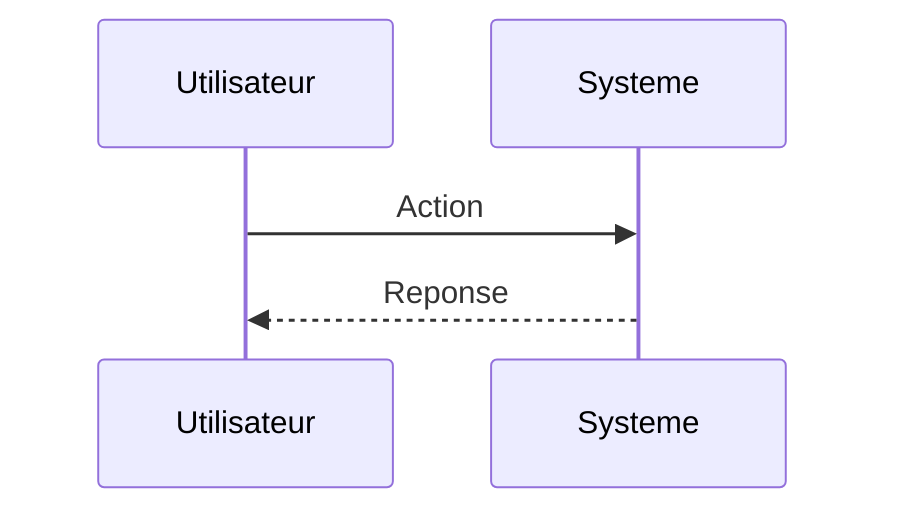

<!-- markdownlint-disable MD009 MD010 MD013 MD022 MD028 MD032 MD033 MD034 MD036 MD037 MD039 MD041 MD060 -->

[ 🇬🇧 English Version ](./README.md)

# DAS SNN Fiber Maintenance

> **Résumé exécutif :** Intégration de puces neuromorphiques (Spiking Neural Networks - SNN) directement à l'edge, connectées aux interrogateurs optiques. Les SNN excellent dans le traitement natif de séries temporelles asynchrones et bruitées (comme le signal DAS), consommant une fraction de l'énergie des GPU standards tout en filtrant le bruit environnemental et en classifiant les signatures sismiques spécifiques (pas humain vs machinerie lourde) en temps réel avec des micro-latences.

---

## 1. Aperçu visuel & Effet Wahou

## 2. La thèse contrariante (Peter Thiel Style)

**La croyance populaire :** Les solutions généralistes IA peuvent résoudre ce problème.

**La vérité cachée :** Uploader le flux continu non compressé du DAS vers le cloud pour une inférence par des modèles Transformers/CNN est impossible à l'échelle en termes de bande passante et de coût d'ingestion (S3). L'intelligence doit être à l'extrémité (edge) et traiter des impulsions acoustiques brutes, nécessitant un hardware spécifique (neuromorphic computing).

## 3. Le problème & La cible

**Modèle économique :** B2B

**Cible précise :** Opérateurs télécoms (Tier 1), gestionnaires de pipelines (pétrole/gaz), opérateurs de réseaux ferroviaires et sociétés de surveillance de frontières.

**La douleur urgente :** Le Distributed Acoustic Sensing (DAS) transforme n'importe quel câble de fibre optique existant en des milliers de capteurs de vibrations en mesurant la rétrodiffusion de Rayleigh. Cependant, générer des téraoctets de données acoustiques brutes par jour sur des milliers de kilomètres crée un cauchemar de traitement. Les fausses alertes constantes rendent le système inutilisable par des humains, empêchant la détection d'excavatrices menaçant les câbles, de fuites de pipelines ou d'intrusions sur les voies ferrées.

## 4. Architecture technique & Plomberie

## 5. Modèle économique & Viabilité financière

| Métrique                    | Valeur                        |
| --------------------------- | ----------------------------- |
| Structure de prix           | Abonnement SaaS               |
| Objectif 12 mois            | 10 clients                    |
| Calcul du CA (Target 100k€) | 10 clients \* 10k€/an = 100k€ |
| Marge brute estimée         | 80%                           |

## 6. Moteur de distribution & Fossé défensif (Moat)

**Stratégie d'acquisition :** Vente directe B2B

**Moat (Barrière à l'entrée) :** Manque de maturité de la chaîne d'outils de compilation pour SNN (comparé à PyTorch/CUDA). Nécessité d'intégrations matérielles sur mesure avec les fournisseurs d'interrogateurs optiques (les lasers).

## 7. Grille d'évaluation détaillée

| Critère                           | Score VC (/100) | Score Terrain (/100) |
| --------------------------------- | --------------- | -------------------- |
| Thèse & Monopole / Urgence        | -- / 25         | -- / 25              |
| Moat / Résistance aux LLM natifs  | -- / 25         | -- / 25              |
| Scalabilité / Friction d'adoption | -- / 25         | -- / 25              |
| Unit Economics / ROI direct       | -- / 25         | -- / 25              |
| **TOTAL**                         | **-- / 100**    | **-- / 100**         |

> **Verdict VC :** En attente d'évaluation.

> **Verdict Terrain :** En attente d'évaluation.
