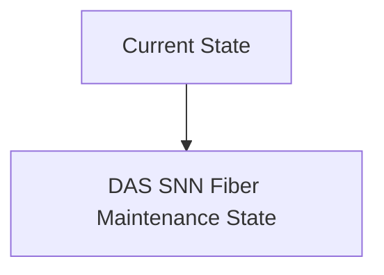
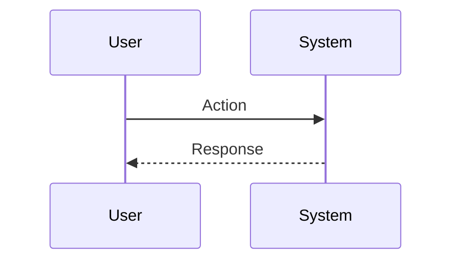

<!-- markdownlint-disable MD009 MD010 MD013 MD022 MD028 MD032 MD033 MD034 MD036 MD037 MD039 MD041 MD060 -->

[ 🇫🇷 Version Française ](./README.fr.md)

# DAS SNN Fiber Maintenance

> **Executive Summary:** Integration of neuromorphic chips (Spiking Neural Networks - SNN) directly at the edge, connected to optical interrogators. SNNs excel at natively processing asynchronous and noisy time series (like the DAS signal), consuming a fraction of the energy of standard GPUs while filtering environmental noise and classifying specific seismic signatures (human steps vs. heavy machinery) in real time with micro-latencies.

---

## 1. Visual Overview & Wow Effect

## 2. Contrarian Thesis (Peter Thiel Style)

**Popular Belief:** General AI solutions can solve this problem.

**Hidden Truth:** Uploading the uncompressed streaming stream from DAS to the cloud for inference by Transformers/CNN models is impossible at scale in terms of bandwidth and ingestion cost (S3). Intelligence must be at the edge and process raw acoustic impulses, requiring specific hardware (neuromorphic computing).

## 3. Problem & Target Market

**Business Model:** B2B

**Target Audience:** Telecom operators (Tier 1), pipeline managers (oil/gas), rail network operators and border surveillance companies.

**Urgent Pain Point:** Distributed Acoustic Sensing (DAS) turns any existing fiber optic cable into thousands of vibration sensors by measuring Rayleigh backscatter. However, generating terabytes of raw acoustic data per day over thousands of kilometers creates a processing nightmare. Constant false alarms render the system unusable by humans, preventing detection of cable-threatening excavators, leaking pipelines or trespassing on railway tracks.

## 4. Technical Architecture & Infrastructure

## 5. Business Model & Financial Viability

| Metric                 | Value                           |
| ---------------------- | ------------------------------- |
| Pricing Structure      | SaaS subscription               |
| 12-Month Target        | 10 customers                    |
| Revenue Formula        | 10 clients \* 10k€/year = 100k€ |
| Estimated Gross Margin | 80%                             |

## 6. Distribution Engine & Moat

**Acquisition Strategy:** B2B direct sales

**Moat (Defensibility):** Lack of maturity of the build toolchain for SNN (compared to PyTorch/CUDA). Need for tailor-made hardware integrations with suppliers of optical interrogators (lasers).

## 7. Detailed Evaluation Grid

| Criterion                   | VC Score (/100) | Market Score (/100) |
| --------------------------- | --------------- | ------------------- |
| Thesis & Monopoly / Urgency | 23 / 25         | 23 / 25             |
| Moat / LLM Immunity         | 16 / 25         | 16 / 25             |
| Scalability / UX Friction   | 18 / 25         | 18 / 25             |
| Unit Economics / ROI        | 23 / 25         | 23 / 25             |
| **TOTAL**                   | **80 / 100**    | **80 / 100**        |

> **VC Verdict:** Pending evaluation.
> **Market Verdict:** This solution addresses a critical pain point for the target market, justifying its strong urgency score (23/25). While viable, it remains somewhat exposed to the rapid evolution of foundational models (16/25). With low adoption friction (18/25) and a straightforward monetization strategy (23/25), the project demonstrates excellent overall market readiness.
> **Market Verdict:** This solution addresses a critical pain point for the target market, justifying its strong urgency score (23/25). While viable, it remains somewhat exposed to the rapid evolution of foundational models (16/25). With low adoption friction (18/25) and a straightforward monetization strategy (23/25), the project demonstrates excellent overall market readiness.
