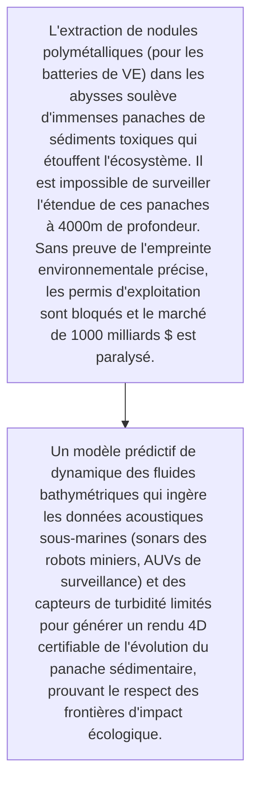
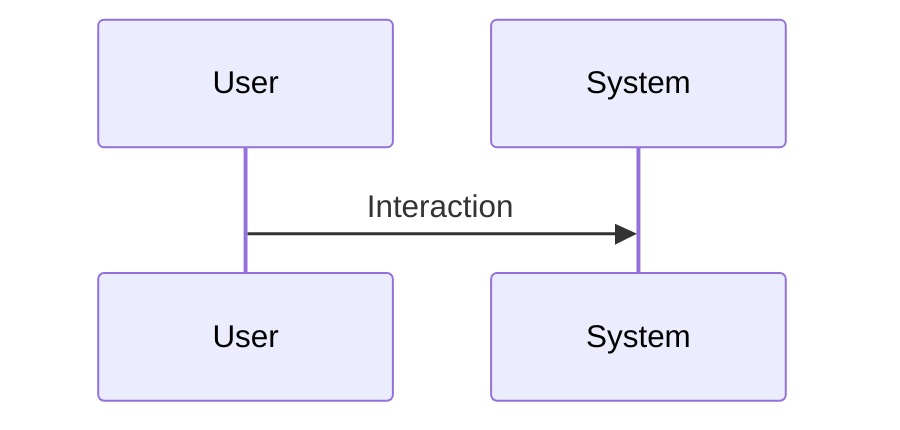

<!-- markdownlint-disable MD009 MD010 MD013 MD022 MD028 MD032 MD033 MD034 MD036 MD037 MD039 MD041 MD060 -->

[ 🇬🇧 English Version ](./README.md)

# Deep Sea Mining Plume Tracker

> **Résumé exécutif :** Un modèle prédictif de dynamique des fluides bathymétriques qui ingère les données acoustiques sous-marines (sonars des robots miniers, AUVs de surveillance) et des capteurs de turbidité limités pour générer un rendu 4D certifiable de l'évolution du panache sédimentaire, prouvant le respect des frontières d'impact écologique.

---

## 1. Aperçu visuel & Effet Wahou

## 2. La thèse contrariante (Peter Thiel Style)

- **La croyance populaire :** Les signaux de télémesure sous-marins sont extrêmement bruyants, parcimonieux, et retardés. Cela nécessite un solveur hydrodynamique spécifique aux très hautes pressions abyssales couplé à de l'IA pour interpoler la dispersion de particules avec une grande précision.
- **La vérité cachée :** Un modèle prédictif de dynamique des fluides bathymétriques qui ingère les données acoustiques sous-marines (sonars des robots miniers, AUVs de surveillance) et des capteurs de turbidité limités pour générer un rendu 4D certifiable de l'évolution du panache sédimentaire, prouvant le respect des frontières d'impact écologique.

## 3. Le problème & La cible

- **Modèle économique :** B2B2G
- **Cible précise :** Entreprises de minage en haute mer (TMC), Autorité Internationale des Fonds Marins (ISA), ONG environnementales, gouvernements.
- **La douleur urgente :** L'extraction de nodules polymétalliques (pour les batteries de VE) dans les abysses soulève d'immenses panaches de sédiments toxiques qui étouffent l'écosystème. Il est impossible de surveiller l'étendue de ces panaches à 4000m de profondeur. Sans preuve de l'empreinte environnementale précise, les permis d'exploitation sont bloqués et le marché de 1000 milliards $ est paralysé.

## 4. Architecture technique & Plomberie

## 5. Modèle économique & Viabilité financière

| Métrique                    | Valeur                                                          |
| --------------------------- | --------------------------------------------------------------- |
| Structure de prix           | [Prix / Modèle d'abonnement / Commission]                       |
| Objectif 12 mois            | [Nombre exact de clients/utilisateurs/transactions nécessaires] |
| Calcul du CA (Target 100k€) | [Formule mathématique exacte]                                   |
| Marge brute estimée         | [Marge en %]                                                    |

## 6. Moteur de distribution & Fossé défensif (Moat)

- **Stratégie d'acquisition :** [Viralité B2C, réseau C2C, acquisition B2B directe, adhésion dev M2M]
- **Moat (Barrière à l'entrée) :** Réglementation mondiale incertaine (moratoires sur le minage en haute mer), coût astronomique de la validation empirique (campagnes océanographiques), hostilité politique et publique majeure.

## 7. Grille d'évaluation détaillée

| Critère                           | Score VC (/100) | Score Terrain (/100) |
| --------------------------------- | --------------- | -------------------- |
| Thèse & Monopole / Urgence        | -- / 25         | 22 / 25              |
| Moat / Résistance aux LLM natifs  | -- / 25         | 23 / 25              |
| Scalabilité / Friction d'adoption | -- / 25         | 15 / 25              |
| Unit Economics / ROI direct       | -- / 25         | 20 / 25              |
| **TOTAL**                         | -- / 100        | **80 / 100**         |

> **Verdict VC :** En attente d'évaluation.
> **Verdict Terrain :** Urgence modérée mais valeur stratégique à long terme. L'immunité aux LLM est bonne, reposant sur des modèles spécifiques. L'adoption présente des frictions notables qui pourraient ralentir la monétisation initiale.
