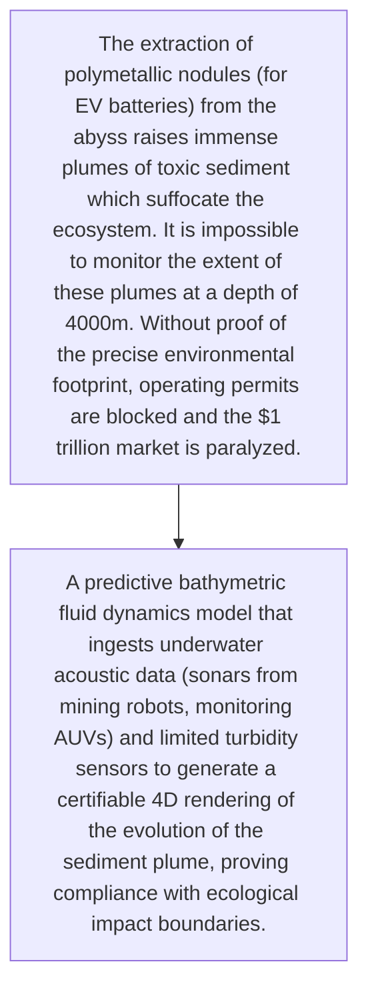
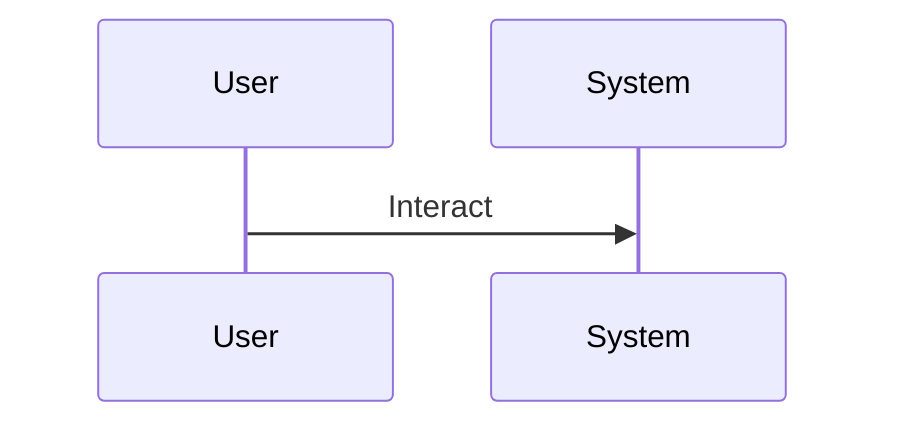

<!-- markdownlint-disable MD009 MD010 MD013 MD022 MD028 MD032 MD033 MD034 MD036 MD037 MD039 MD041 MD060 -->

[ 🇫🇷 Version Française ](./README.fr.md)

# Deep Sea Mining Plume Tracker

> **Executive Summary:** A predictive bathymetric fluid dynamics model that ingests underwater acoustic data (sonars from mining robots, monitoring AUVs) and limited turbidity sensors to generate a certifiable 4D rendering of the evolution of the sediment plume, proving compliance with ecological impact boundaries.

---

## 1. Visual Overview & Wow Effect

## 2. Contrarian Thesis (Peter Thiel Style)

- **Popular Belief:** Underwater telemetry signals are extremely noisy, sparse, and delayed. This requires a hydrodynamic solver specific to very high abyssal pressures coupled with AI to interpolate the particle dispersion with high precision.
- **Hidden Truth:** A predictive bathymetric fluid dynamics model that ingests underwater acoustic data (sonars from mining robots, monitoring AUVs) and limited turbidity sensors to generate a certifiable 4D rendering of the evolution of the sediment plume, proving compliance with ecological impact boundaries.

## 3. Problem & Target Market

- **Business Model:** B2B2G
- **Target Audience:** Deep sea mining companies (TMC), International Seabed Authority (ISA), environmental NGOs, governments.
- **Urgent Pain Point:** The extraction of polymetallic nodules (for EV batteries) from the abyss raises immense plumes of toxic sediment which suffocate the ecosystem. It is impossible to monitor the extent of these plumes at a depth of 4000m. Without proof of the precise environmental footprint, operating permits are blocked and the $1 trillion market is paralyzed.

## 4. Technical Architecture & Infrastructure

## 5. Business Model & Financial Viability

| Metric                 | Value                                     |
| ---------------------- | ----------------------------------------- |
| Pricing Structure      | [Price / Subscription Model / Commission] |
| 12-Month Target        | [Exact volume required for 100k ARR]      |
| Revenue Formula        | [Mathematical calculation]                |
| Estimated Gross Margin | [Margin %]                                |

## 6. Distribution Engine & Moat

- **Acquisition Strategy:** [Virality, network effect, direct sales, developer adoption]
- **Moat (Defensibility):** Uncertain global regulations (moratoriums on deep-sea mining), astronomical cost of empirical validation (oceanographic campaigns), major political and public hostility.

## 7. Detailed Evaluation Grid

| Criterion                   | VC Score (/100) | Market Score (/100) |
| --------------------------- | --------------- | ------------------- |
| Thesis & Monopoly / Urgency | -- / 25         | 22 / 25             |
| Moat / LLM Immunity         | -- / 25         | 23 / 25             |
| Scalability / UX Friction   | -- / 25         | 15 / 25             |
| Unit Economics / ROI        | -- / 25         | 20 / 25             |
| **TOTAL**                   | -- / 100        | **80 / 100**        |

> **VC Verdict:** Pending evaluation.
> **Market Verdict:** Moderate urgency but strong long-term strategic value. LLM immunity is good, relying on specialized models. Adoption presents notable friction that could slow initial monetization.
