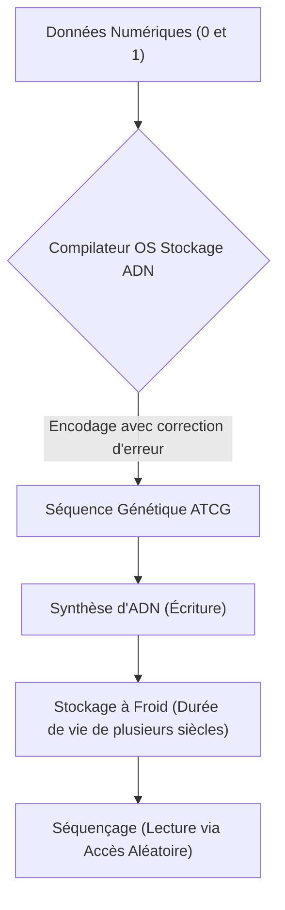
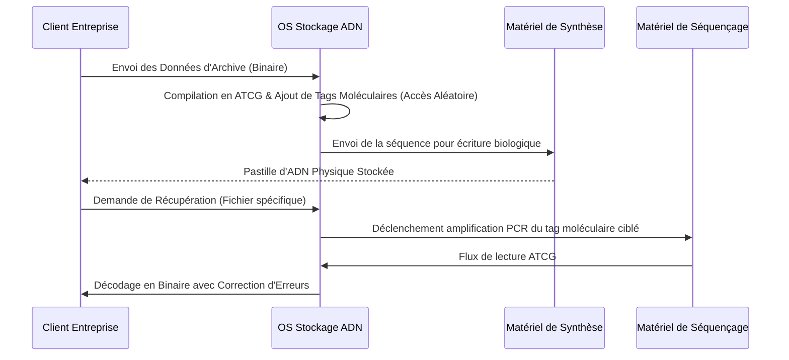

<!-- markdownlint-disable MD009 MD010 MD013 MD022 MD028 MD032 MD033 MD034 MD036 MD037 MD039 MD041 MD058 MD060 -->

[ 🇬🇧 English Version ](./README.md)

# DNA Cold Storage OS

> **Résumé exécutif :** Un système d'exploitation complet pour le stockage de données sur ADN, comprenant un compilateur spécialisé pour encoder le binaire en séquences ATCG et un système d'adressage moléculaire pour un accès aléatoire, résolvant ainsi la crise mondiale de l'archivage des données.

---

## 1. Aperçu visuel & Effet Wahou

## 2. La thèse contrariante (Peter Thiel Style)

**La croyance populaire :** Les bandes magnétiques (LTO) et les disques durs avancés évolueront indéfiniment pour répondre aux besoins mondiaux de stockage à froid.
**La vérité cachée :** Le stockage magnétique se dégrade physiquement en quelques décennies et consomme une quantité insoutenable d'espace et d'énergie ; l'ADN est le support de stockage d'informations le plus optimisé et ultra-dense de l'univers, nécessitant zéro énergie pour conserver les données pendant des millénaires.

## 3. Le problème & La cible

**Modèle économique :** B2B
**Cible précise :** Fournisseurs de cloud (Hyperscalers, AWS, Azure), archives nationales, grandes institutions financières et studios de cinéma (conservation à très long terme).
**La douleur urgente :** L'explosion exponentielle des données mondiales rend le stockage à froid traditionnel insoutenable, entraînant des coûts opérationnels massifs, une consommation immobilière gigantesque pour les data centers, et l'obligation perpétuelle et coûteuse de migrer les données tous les 10 ans pour éviter leur dégradation.

## 4. Architecture technique & Plomberie

## 5. Modèle économique & Viabilité financière

| Métrique                    | Valeur                                                                |
| --------------------------- | --------------------------------------------------------------------- |
| Structure de prix           | Frais de licence par téraoctet pour la compilation et la récupération |
| Objectif 12 mois            | 2 contrats PoC avec des Hyperscalers (à 50 000€/PoC)                  |
| Calcul du CA (Target 100k€) | 2 \* 50 000€ = 100 000€ de revenus annuels récurrents                 |
| Marge brute estimée         | 95% (Couche purement logicielle)                                      |

## 6. Moteur de distribution & Fossé défensif (Moat)

**Stratégie d'acquisition :** Ventes B2B de haut niveau axées sur des preuves de concept (PoC) avec les géants des infrastructures cloud et les archives gouvernementales.
**Moat (Barrière à l'entrée) :** Le défi mathématique unique consistant à mapper le binaire en séquences biologiques tout en prédisant et en corrigeant les erreurs de synthèse/séquençage. Cela nécessite une expertise interdisciplinaire profonde (bioinformatique, algorithmes de compression, biologie moléculaire) dont les géants de la tech standard sont dépourvus.

## 7. Grille d'évaluation détaillée

| Critère                           | Score VC (/100) | Score Terrain (/100) |
| --------------------------------- | --------------- | -------------------- |
| Thèse & Monopole / Urgence        | -- / 25         | -- / 25              |
| Moat / Résistance aux LLM natifs  | -- / 25         | -- / 25              |
| Scalabilité / Friction d'adoption | -- / 25         | -- / 25              |
| Unit Economics / ROI direct       | -- / 25         | -- / 25              |
| **TOTAL**                         | **-- / 100**    | **-- / 100**         |

> **Verdict VC :** En attente d'évaluation.
> **Verdict Terrain :** En attente d'évaluation.
