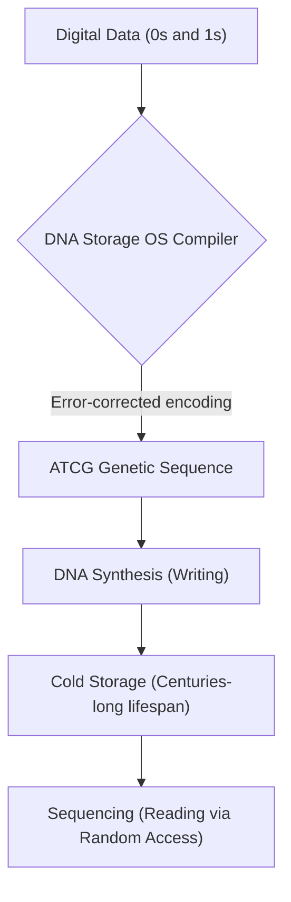
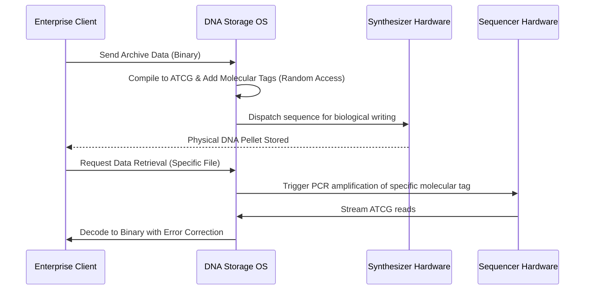

<!-- markdownlint-disable MD009 MD010 MD013 MD022 MD028 MD032 MD033 MD034 MD036 MD037 MD039 MD041 MD058 MD060 -->

[ 🇫🇷 Version Française ](./README.fr.md)

# DNA Cold Storage OS

> **Executive Summary:** A comprehensive operating system for DNA Data Storage, featuring a specialized compiler to encode binary into ATCG sequences and a molecular addressing system for random access retrieval, solving the global data archiving crisis.

---

## 1. Visual Overview & Wow Effect

## 2. Contrarian Thesis (Peter Thiel Style)

**Popular Belief:** Magnetic tape (LTO) and advanced hard drives will scale infinitely to solve the world's cold storage needs.
**Hidden Truth:** Magnetic storage physically degrades within decades and consumes unsustainable amounts of space and energy; DNA is the universe's most optimized, ultra-dense information storage medium, requiring zero energy to maintain data for millennia.

## 3. Problem & Target Market

**Business Model:** B2B
**Target Audience:** Cloud Hyperscalers (AWS, Azure), national archives, major financial institutions, and cinematic studios (very long-term preservation).
**Urgent Pain Point:** The exponential explosion of global data is making legacy cold storage unsustainable, resulting in massive operational costs, real-estate consumption for data centers, and the perpetual, expensive requirement to migrate data every 10 years to prevent degradation.

## 4. Technical Architecture & Infrastructure

## 5. Business Model & Financial Viability

| Metric                 | Value                                                |
| ---------------------- | ---------------------------------------------------- |
| Pricing Structure      | Per-Terabyte compilation and retrieval licensing fee |
| 12-Month Target        | 2 Hyperscaler PoC contracts (at 50,000€/PoC)         |
| Revenue Formula        | 2 \* 50,000€ = 100,000€ ARR                          |
| Estimated Gross Margin | 95% (Pure software layer)                            |

## 6. Distribution Engine & Moat

**Acquisition Strategy:** High-ticket enterprise sales focused on Proof of Concepts (PoCs) with cloud infrastructure giants and government archives.
**Moat (Defensibility):** The unique mathematical challenge of mapping binary to biological sequences while predicting and correcting synthesis/sequencing errors. This requires deep, interdisciplinary expertise (bioinformatics, compression algorithms, molecular biology) that standard tech giants lack.

## 7. Detailed Evaluation Grid

| Criterion                   | VC Score (/100) | Market Score (/100) |
| --------------------------- | --------------- | ------------------- |
| Thesis & Monopoly / Urgency | 24 / 25         | -- / 25             |
| Moat / LLM Immunity         | 25 / 25         | -- / 25             |
| Scalability / UX Friction   | 18 / 25         | -- / 25             |
| Unit Economics / ROI        | 20 / 25         | -- / 25             |
| **TOTAL**                   | **87 / 100**    | **-- / 100**        |

> **VC Verdict:** DNA Cold Storage OS pioneers the inevitable shift from magnetic tape to synthetic biology for exabyte-scale data archiving. The proprietary codec translating binary data to base pairs constitutes an absolute deep-tech monopoly against conventional cloud storage providers. Though constrained by current DNA synthesis costs, it dominates the ultra-long-term archiving niche.
> **Market Verdict:** Pending evaluation.
